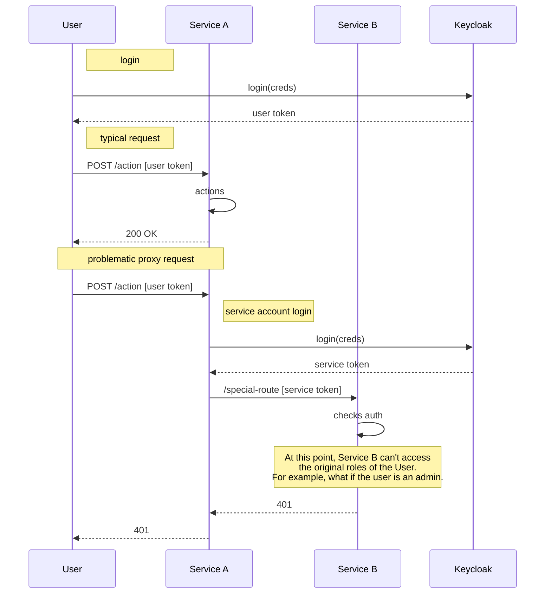

# User Proxy authentication

## Problem description

In Provena, services are deployed in a microservice type architecture. Sometimes, there are privileged operations which only certain 

## Implemented approach

## Technical notes
