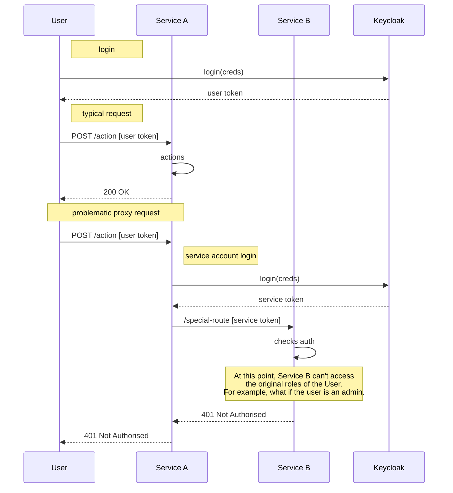
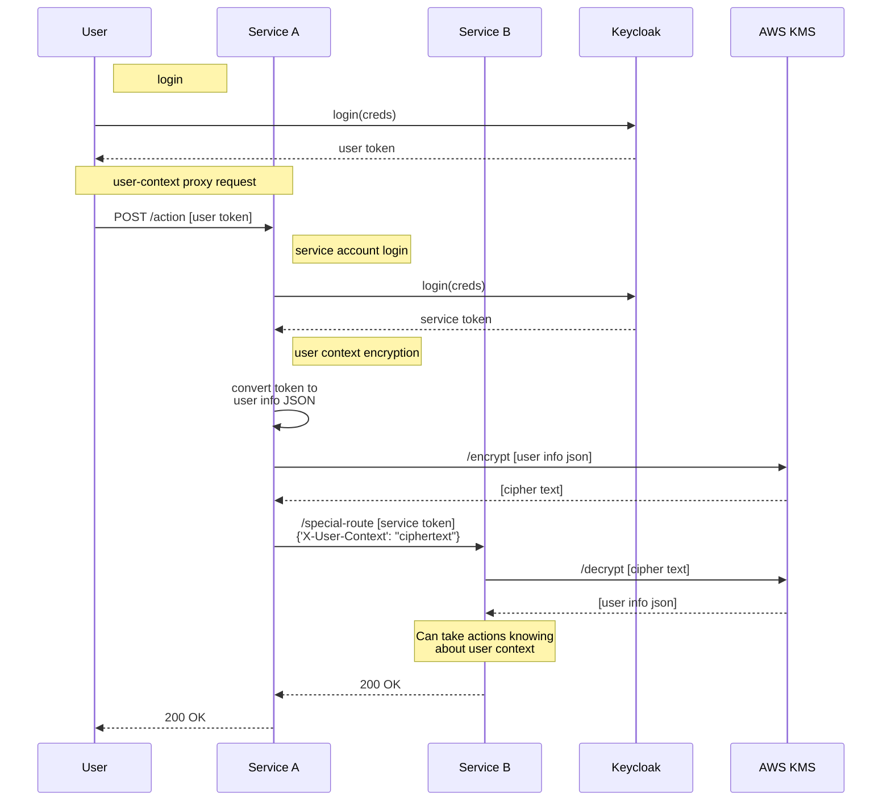

# User Proxy authentication

## Problem description

In Provena, services are deployed in a microservice type architecture. Sometimes, there are privileged operations which only other specific services should be able to invoke in a given service.

---

**Key problem**: when service A makes a service-only request to service B, it both needs to 1. use a JWT Bearer token which proves it _is_ service A and 2. pass through the user's roles and other information so that service B can enforce authorisation and other constraints correctly.

---

A pertinent example is creating a dataset. Currently, the `data-store-api` is responsible for this task. Consider the high-level steps needed to undertake this process

1. validate the item doesn't exist (requires fetching from the registry, through the `registry-api`)
2. validate the payload is valid
3. establish a suitable storage location and add to the dataset metadata this location (only the data store can do this)
4. create the item in the registry (requires a POST operation into the registry, through the `registry-api`)
5. seed the dataset location with a metadata file (requires S3 privileges which only the data store has)
6. launch a job (requires talking to the `job-api`)

So in this example, there are multiple inter-service communications. Consider our options for making this request

- pass the user's token through
  - this is used in certain parts of the system but it is not possible where the endpoint being targeted expects a service account role (e.g. it expects the data store API to be making the request, not any user)
- generate a service token from keycloak saying 'I am the data store API'
  - this is used in the system and is an effective approach for making this assertion securely, however consider the below issue...

If a service account token is generated, the user's roles are lost. For example, say a user wants to update a dataset. The registry is the best service to decide if this update should be allowed (e.g. it can check group roles/permissions, lock checks etc). However, this update operation is a service account only operation, so it must pass through a service account token. The registry API now sees a 'User' which is the 'data-store-api' - this user likely has high level privileges, so the `registry-api` will likely allow this operation to go ahead, irrespective of if the original user should be able to perform this operation.

This problem is demonstrated in the below sequence diagram

Here are some ideas to remedy this

1. add flags into the request payload which include overrides or other user auth information
   - not ideal as this would mean ensuring all proxy payloads are changed to meet this need, and it also means user info is likely to leak in logs, not super maintainable
1. add the user's token somewhere into the payload
   - this would raise questions like whether we check the token expiry, also could leak user info (since the token is not encrypted), it also means a user could more easily spoof a valid inter-service request if they somehow get the correct role
1. lookup the user's information dynamically based on minimum information such as the user's username
   - this is not a bad solution, but it is not very performant (as we need to do a network request to the keycloak server), and it would also require granting admin type access for the keycloak API to all the services which might need to know about the user - this is violating our plan for JWT's being sufficient information to validate a user request without additional external requests

Given the above, an approach where we a) don't need to interact with the Keycloak server b) don't need to uniquely add payload information for all the relevant info on all the models and c) don't leak user details to logs where possible is ideal. The solution implemented is below.

## Implemented approach

---

**Key solution**: when service A makes a service-only request to service B, it uses a symmetric encryption key to encrypt the user's info - this is placed on a header `X-User-Context`. Service B decrypts this user context and can use it, where needed, to make decisions about whether an action should be allowed, or other determinations.

---

## Technical details

The sequence diagram below shows this process in action

The symmetric encryption key is managed through AWS - this takes care of ensuring the key is managed securely, it can be automatically rotated etc.