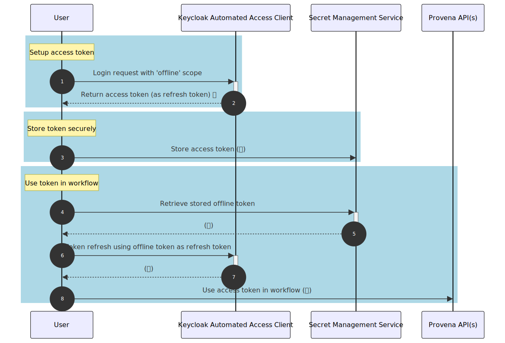

{: .no_toc }

<details  open markdown="block">
  <summary>
    Table of contents
  </summary>
{: .text-delta }
* TOC
{:toc}
____
</details>

# API Token Authorisation Flow

## Overview

The offline token workflow supports running authenticated Provena API actions without any user input. This makes the workflow suitable for **automated** workflows without user interaction.

The process to setup secure API access token access is more involved than other methods, but provides the most flexibility in accessing API resources.



## Process Summary

Authenticating to Provena APIs using a persistent API token involves three high level steps.

- Setup access token (1-2): run a once-off process in which you perform a standard login to generate a reusable, persistent access token
- Store token securely (3): transfer the generated token to a secure storage service where your automated workflow will be able to securely retrieve the secret
- Use token in workflow (4-8): retrieve and utilise the API token by generating fresh access tokens for use in Provena APIs

These steps are shown in the below sequence diagram.

<!--

SOURCE: removing '/' in the relations as required

sequenceDiagram
    participant U as User
    participant AC as Keycloak Automated Access Client
    participant SMS as Secret Management Service
    participant P as Provena API(s)

    autonumber

    rect rgb(173, 216, 230)
    Note over U: Setup access token
    U-/>>+AC: Login request with 'offline' scope
    AC-/->>-U: Return access token (as refresh token)

    end

    rect rgb(173, 216, 230)

    Note over U: Store token securely
    U->>SMS: Store access token (🔑)
    end

    rect rgb(173, 216, 230)
    Note over U: Use token in workflow
    U->>+SMS: Retrieve stored offline token
    SMS-/->>-U: (🔑)
    U->>+AC: Token refresh using offline token as refresh token
    AC-/->>-U: (🔑)
    U->>P: Use access token in workflow (🔑)
    end
-->

|                             API Token Authentication Workflow                              |
| :----------------------------------------------------------------------------------------: |
|  |

## Implementation Details

### Generating an API Access Token

The Provena source code repository ([GitHub](https://github.com/provena/provena)) provides a tool to help you generate an offline token.

To run this tool, you'll need to [clone the repo to your local environment](https://docs.github.com/en/repositories/creating-and-managing-repositories/cloning-a-repository). You can then navigate to the tool [admin-tooling/client-scripts](https://github.com/provena/provena/tree/main/admin-tooling/client-scripts). This folder contains [README.md](https://github.com/provena/provena/blob/main/admin-tooling/client-scripts/README.md) which includes more detailed instructions on running the offline token generation script.

Following the readme details, run the offline tokens script command, such as

```
python offline_tokens.py generate-offline-token PROD token.txt
```

The file `token.txt` will be populated with your reusable API access token. Be sure to not share this token with anyone (as it is tied to your user identity) and store it securely.

### Storing the access token

When using this token, you should be sure to store and retrieve it securely. While this document won't cover all recommendations for handling secrets securely, some recommendations include

- never store this secret in plain text
- never include this token in your git repo or in the workflow itself, instead
  - use environment variables to store the token in your workflow
  - use a 'secrets as a service' provider (e.g. AWS Secret Manager, GitHub secrets, Hashicorp Vault etc.) to store the token in an encrypted location, and retrieve it when the script is run

### Using an API Access Token

As per the workflow described above, once you have generated an API token, you can use it in automated workflows by making an access token refresh request, **with the API token included as your refresh token**.

We recommend using the below implementation directly in Python, or as a template for implementations in other languages.

## Implementation Examples

### Python

The [Provena Client Tools](https://github.com/gbrrestoration/mds-is-client-tools) Python library implements both the Device Auth Flow workflow (as in [Device Auth Flow](./device-auth-flow)), and the offline token workflow.

The source code for the tool is available [here](https://github.com/gbrrestoration/mds-is-client-tools/blob/main/src/mdsisclienttools/auth/TokenManager.py).

Some implementation notes:

- the `DeviceFlowManager` expects a `keycloak_endpoint` as an input argument - use `https://auth.{YOUR_PROVENA_URL}/auth/realms/{YOUR_REALM_NAME}`.
- the class `DeviceFlowManager` exposes a method `get_auth` which can be used directly with the Python `Requests` library - an example of using this method is provided as discussed below

An example instantiation is provided below:

```python
 manager = DeviceFlowManager(
        stage=env.stage,
        keycloak_endpoint=keycloak_endpoint,
        client_id=client_id,
        auth_flow=AuthFlow.OFFLINE,
        offline_token=YOUR_OFFLINE_TOKEN,
    )
```

For a more detailed example of using both the device auth flow and API Access token flow, see our [demo notebooks](https://github.com/provena/provena-example-notebooks/blob/main/python/example-model-workflow.ipynb)
