{: .no_toc }

  

    Table of contents
  

{: .text-delta }
* TOC
{:toc}
____

# Create/Manage Groups

This page documents how to administer [Groups](../groups) in a Provena server in order 
to [manage access](../registry/access-control). 

Groups are defined with a name and a set of users as members of the group. 
Groups can then be used in configuring access control to have read and/or write 
permissions on a resource. 

Currently groups apply to datasets in Provena. However, group access control functionality may be offered in other Provena components and resources in the future.

You will need to have an activated user account on Provena with the admin role assigned as a pre-requisite to creating/managing groups.

## Create a group

Navigate to the Provena landing portal.

|                           Provena landing portal                                 |
| :------------------------------------------------------------------------------: |
| 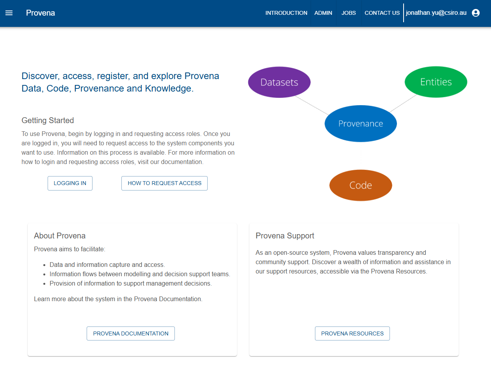 |

Click on the "Admin" link in the top navigation bar. You will need to have logged in as a user with the admin role. This will bring up the "Admin Console"

|                           Provena Admin Console                                  |
| :------------------------------------------------------------------------------: |
| 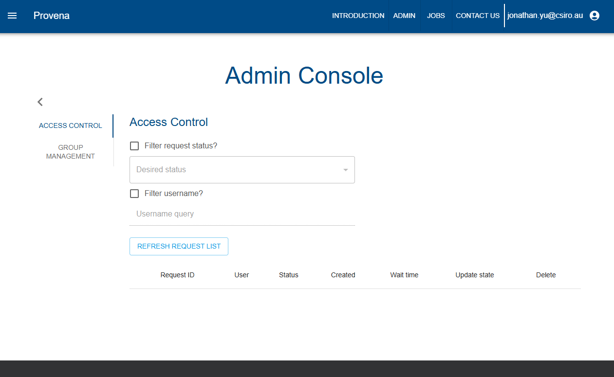 |

Click on "Group management".

|                           Group management console                               |
| :------------------------------------------------------------------------------: |
| 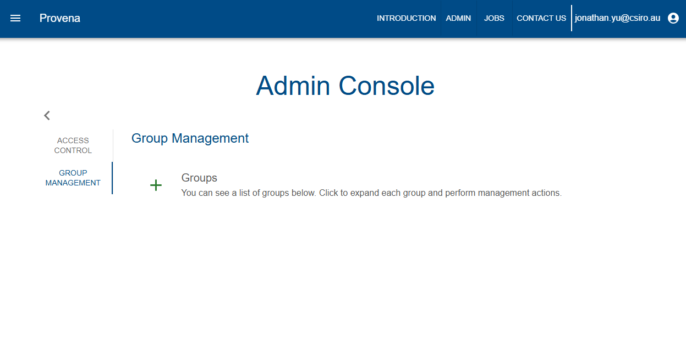 |

Click on the "+" button. 

Add group details including the ID (which must be unique), display name and a group description. 

|                              Add Group Dialog                                    |
| :------------------------------------------------------------------------------: |
| 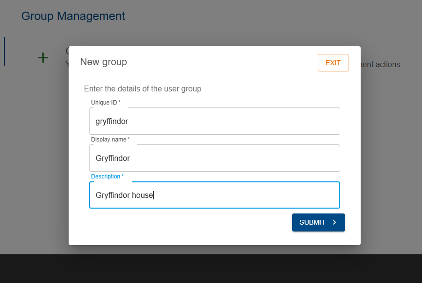 |

Click on the "Submit" button to add the group. The group will now appear in the Group Management section of the Admin Console.

|                          Group added and listed                                  |
| :------------------------------------------------------------------------------: |
| 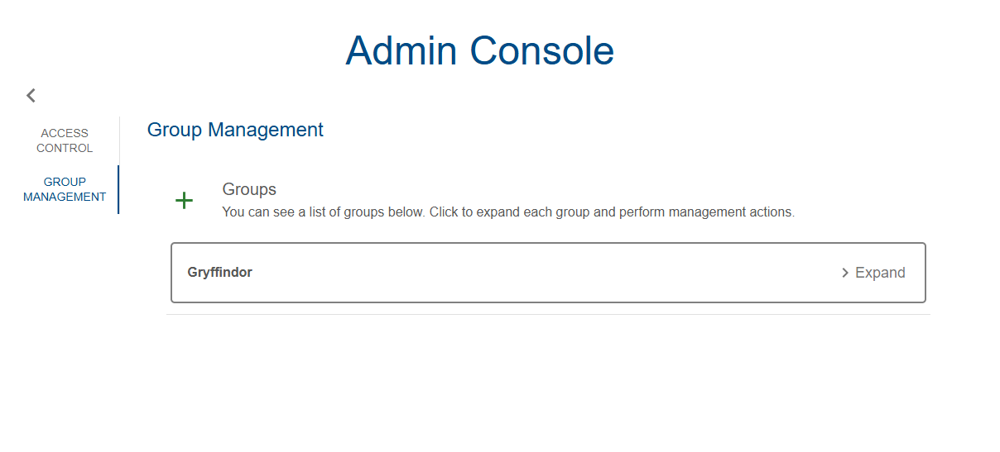 |

## Add users to a group

Select the group in the Group Management section of the Admin Console. Once selected, click on the "Add member" button. 

|                             Add member in Group admin console                    |
| :------------------------------------------------------------------------------: |
| 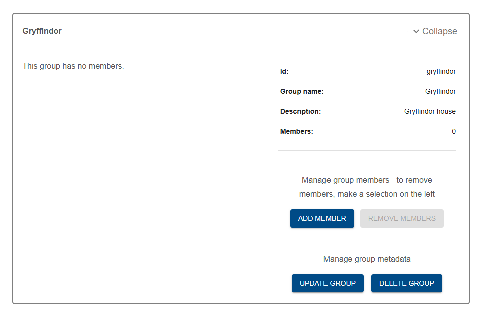 |

Add details for the user to add. The username must match with the user to be added. You can fill in the other fields optionally. In future, this information may be retrieved from the Provena server if known. For now, this is manually entered/updated.

|                           Add user to group  dialog                              |
| :------------------------------------------------------------------------------: |
| 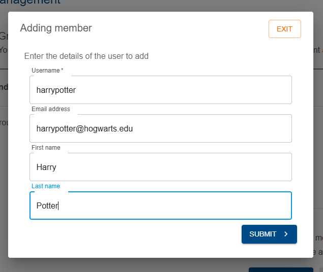 |

The user will be listed in the Users table in the Group admin page.

|                            User added to group                                   |
| :------------------------------------------------------------------------------: |
| 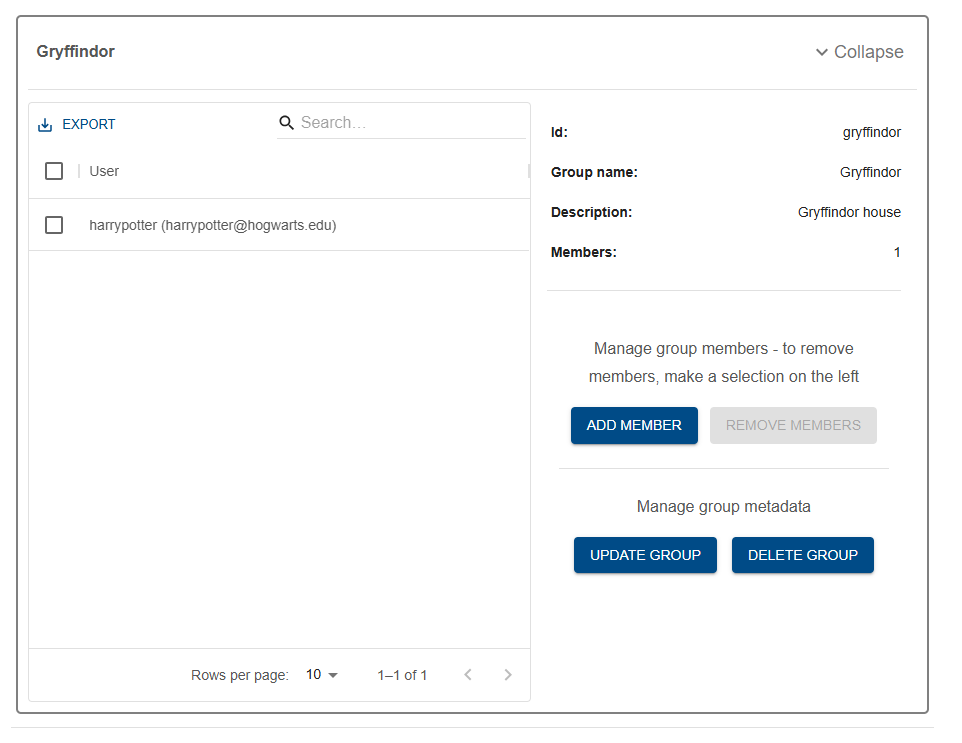 |

Additional users can be added with this flow. The figure below shows an update list of users in the 
Users table in the Group admin page.

|                         Other users added to group                               |
| :------------------------------------------------------------------------------: |
| 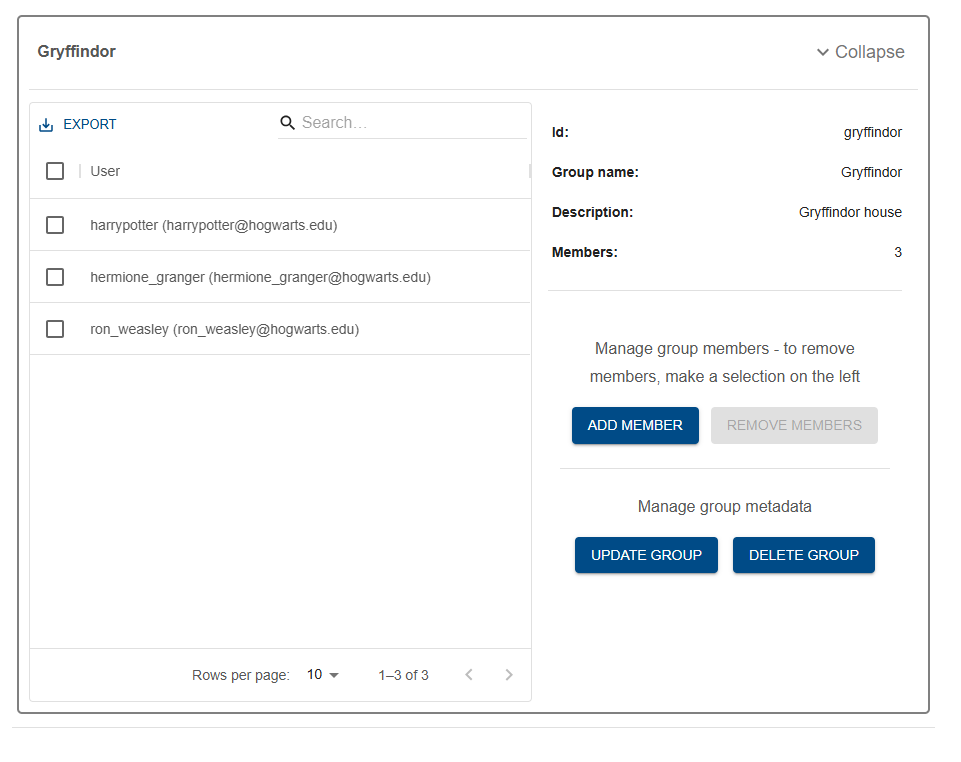 |

## Manage group

## Update group metadata

You can update the group metadata by clicking on "Update group" in the Group admin page. This provides the option for updating the Display name or Description.

|                                 Update group info                                |
| :------------------------------------------------------------------------------: |
| 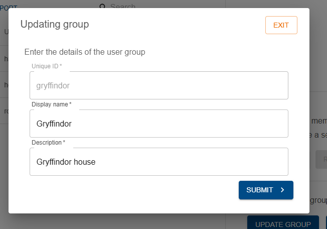 |

## Update user membership

Users can be added or removed from the group using the "Add member" and "Remove members" button. 

To remove users, select the checkbox for the user and click on the "Remove members" button. 

|                            Remove members                                        |
| :------------------------------------------------------------------------------: |
| 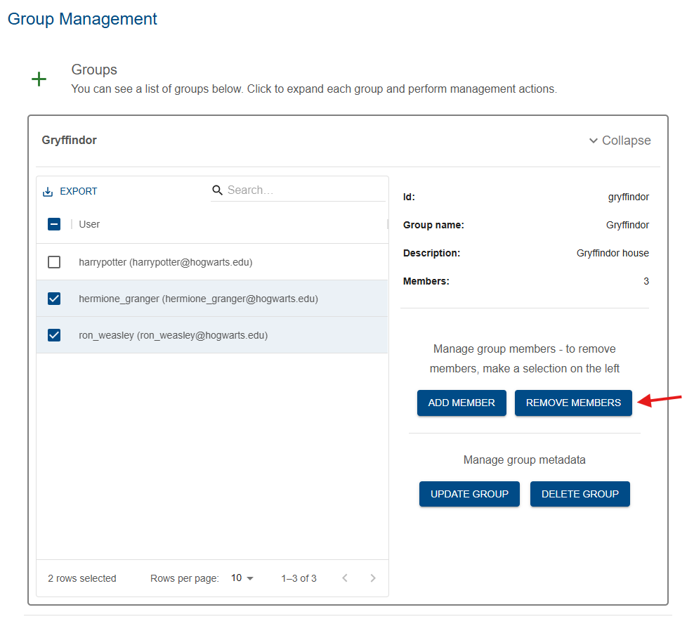 |

Confirming will remove the users from the group.

|                            Confirm remove members                                |
| :------------------------------------------------------------------------------: |
| 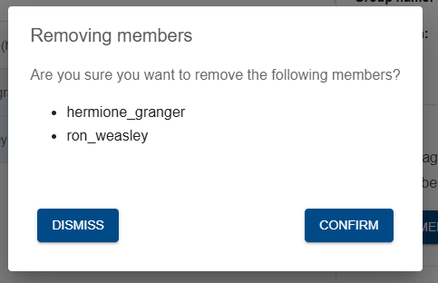 |

## Delete group

Click on the "Delete group" button. 

|                                 Delete group                                     |
| :------------------------------------------------------------------------------: |
| 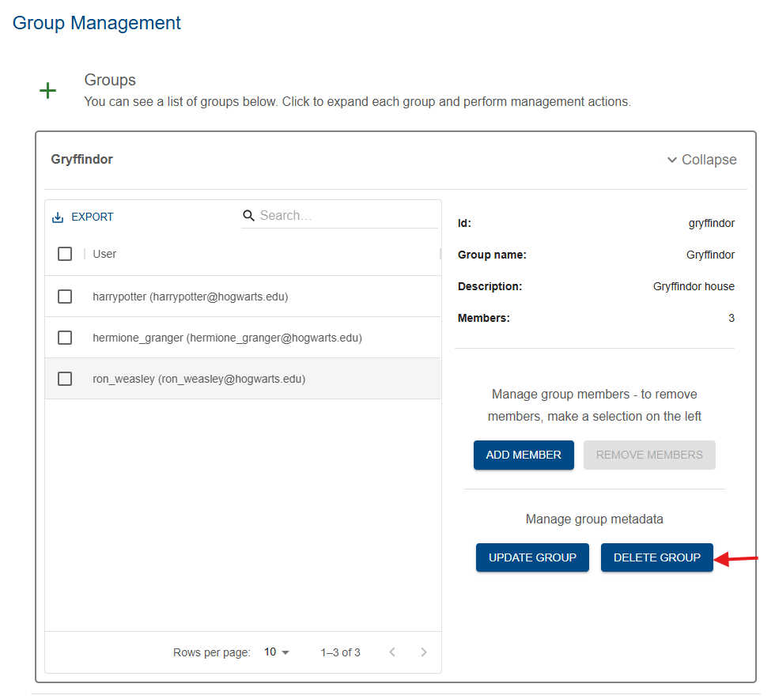 |

Confirming this will delete the group.

|                            Confirm delete group                                  |
| :------------------------------------------------------------------------------: |
| 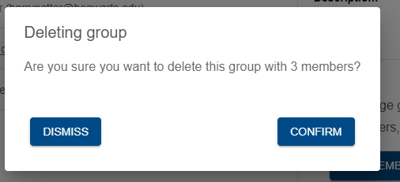 |

