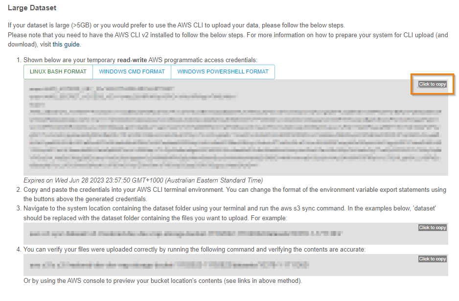

{: .no_toc }

# Data access to S3 with AWS CLI 

  

    Table of contents
  

{: .text-delta }
* TOC
{:toc}
____

### Setting up the AWS CLI v2
In order to use the AWS CLI for uploading (and downloading) you will need to install it first. Please see [this page](./setting-up-the-aws-cli.html){:target="\_blank"} for instructions on how to setup the AWS CLI v2 on your system.

### Uploading files
Once the AWS CLI is installed copy the AWS access credentials you require (LINUX, Windows CMD or Powershell) by clicking on the **Click to copy** button.  
Paste the credentials into your AWS CLI terminal.  

|                                 Uploading large files                                    |
| :---------------------------------------------------------------------------------:      |
|  |

Navigate to the location of your dataset on your computer using a terminal window and run the the AWS S3 sync command shown below. The XXXXX should be the folder where your dataset is and the number 10378-N-NNNNNN is the handle associated with the dataset that was minted when the user created the metadata record.
`aws s3 sync dataset/ s3://dev-rrap-storage-bucket/XXXXX/10378-N-NNNNNN/`   
Verify that the files were uploaded correctly by running the following command in the terminal window and verifying the contents are accurate:  
`aws s3 ls s3://dev-rrap-storage-bucket/XXXXX/10378-N-NNNNNN/`  

___
