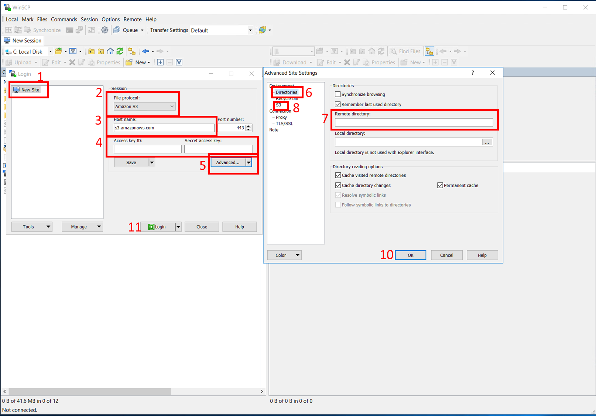
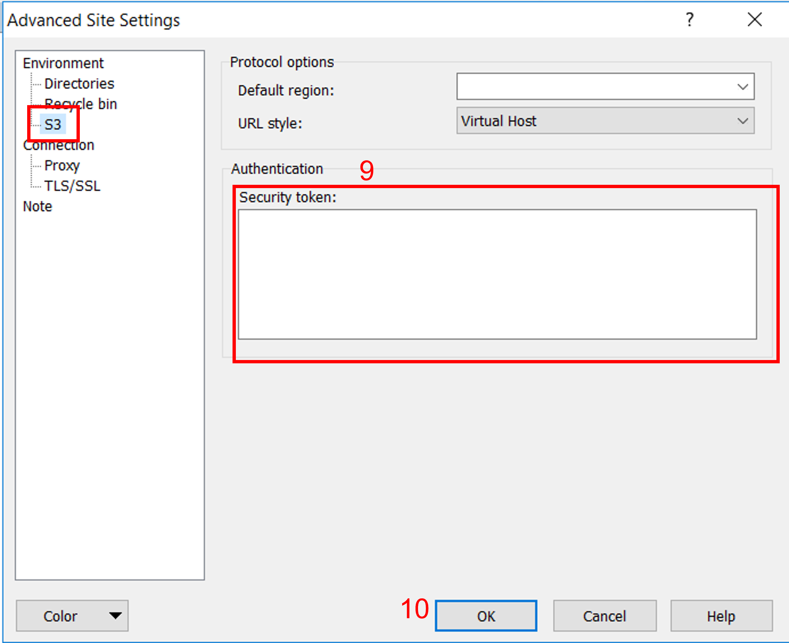
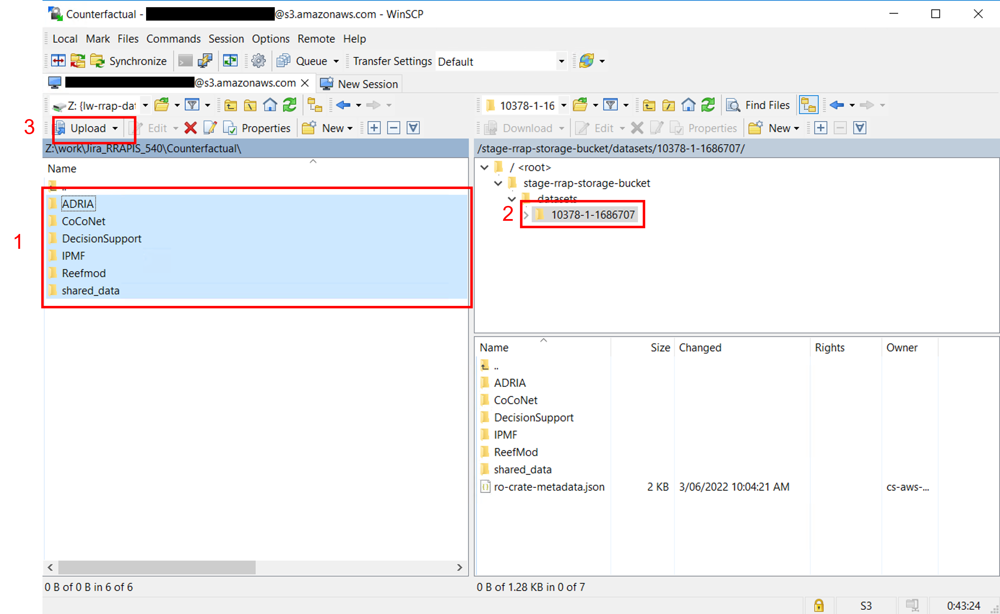
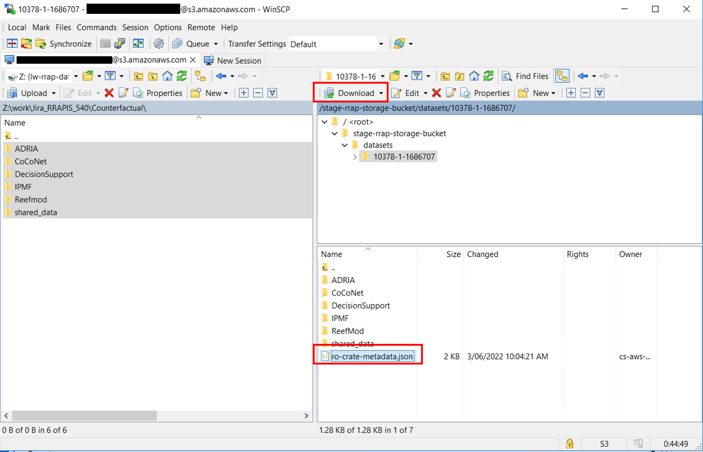

{: .no_toc }

# Data access to s3 with WinSCP

  

    Table of contents
  

{: .text-delta }
* TOC
{:toc}
____

## Overview

[WinSCP](https://winscp.net/eng/index.php){:target="\_blank"} is a client tool for Microsoft Windows. It allows for managing files between a local computer and remote servers. As Provena data is stored in AWS S3 buckets WinSCP can be used to transfer data to and from the data store.

---

## Authentication

---

### Required inputs to establish connection

You can obtain authentication parameters from a dataset record from within the [Provena Data Store](https://data.mds.gbrrestoration.org/datasets){:target="\_blank"}. Select a target preconfigure dataset and then the **'Upload Data'** tab. Then click the **'Generate Credentials'** button. You will notice that there are three parts to the credentials.

1. AWS_ACCESS_KEY_ID
1. AWS_SECRET_ACCESS_KEY
1. AWS_SESSION_TOKEN

Also on Step 4. you will notice a command similar to `aws s3 ls s3://rrap-storage-bucket/datasets/10378-1-#######/` from this command you will require just the data path including forward slashes `/rrap-storage-bucket/datasets/10378-1-#######/`. Replace the ## with your records handle id.

These are the requirements to establish a connection

---

## Establishing a connection to Data Store S3 with WinSCP

Open WinSCP and the Login dialog will appear, on the dialog enter the above credentials.

1. Make sure the **'New site node'** is selected
1. On the New site node, select `Amazon S3` as the **'File protocol'**
1. Check that the host name is: `s3.amazonaws.com` and the port number is `443 `
1. Enter your AWS user **'Access key ID'** and **'Secret access key'** values (without quote marks)
1. Click the **'Advanced'** button
1. Select **'Directories'**
1. Enter the above data path e.g. `/rrap-storage-bucket/datasets/10378-1-#######/` replace the # with your handle id
1. Select **'S3'**
1. Enter your '**AWS_SESSION_TOKEN'** as the **'Security Token'**
1. Click **'Ok'** on the Advanced Site Settings Dialog
1. Click **'Login'** on the Login Dialog

|                                      WinSCP Login                                       |
| :-------------------------------------------------------------------------------------: |
|  |

|                             WinSCP Login (Advance settings)                             |
| :-------------------------------------------------------------------------------------: |
|  |

---

## Uploading

1. Select folders or files for uploading
1. Select the destination folder on the remote server (This **MUST** be **YOUR** registered dataset)
1. Select **Upload**

|                                        Uploading                                        |
| :-------------------------------------------------------------------------------------: |
|  |

---

## Downloading

1. Select folder or file from the remote server
1. Ensure you have selected the local folder to receive the download
1. Select **Download**

|                                        Downloading                                        |
| :---------------------------------------------------------------------------------------: |
|  |
