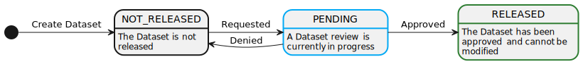
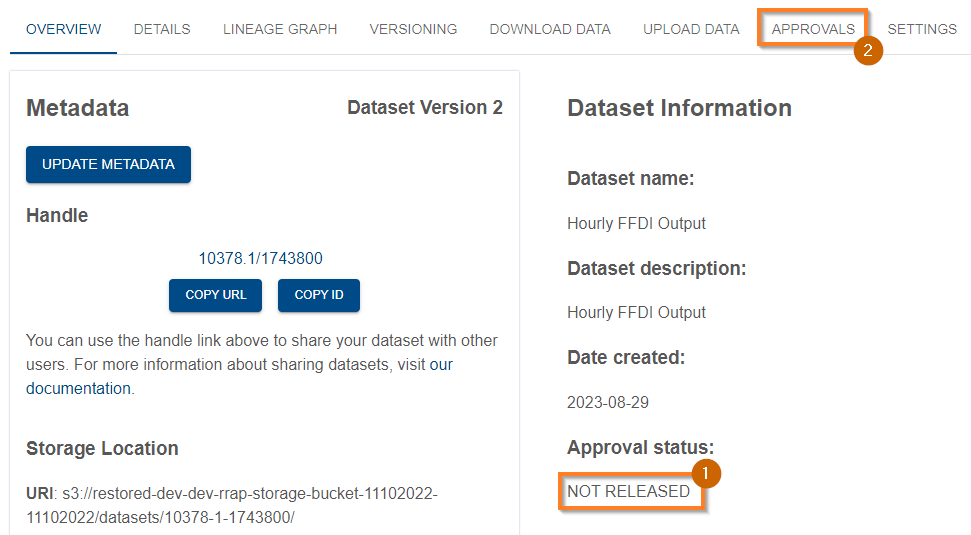
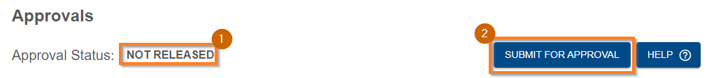
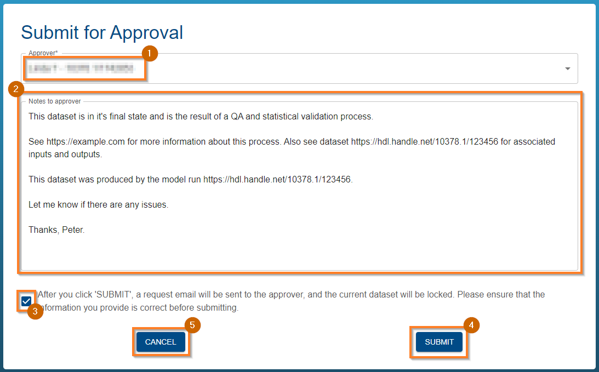
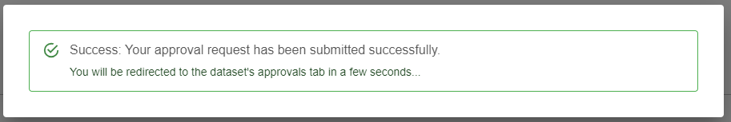
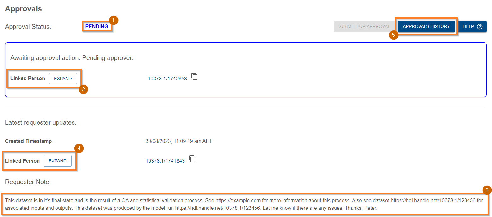
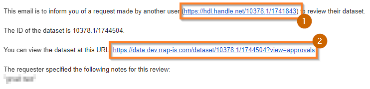
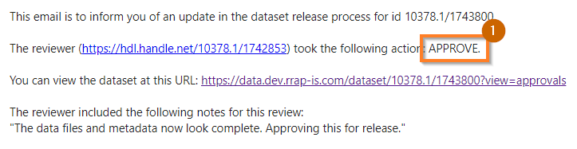
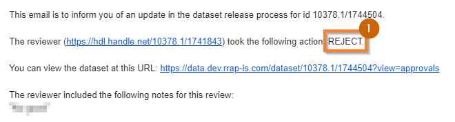

{: .no_toc }

# Dataset Approvals

  

    Table of contents
  

{: .text-delta }
* TOC
{:toc}
____

## Overview

The Provena Data Store enables users to request a review of dataset's for which they have [Admin Access](../registry/access-control#access-control-overview). The user who will perform the review must be selected from a fixed list of Dataset Reviewers.

The purpose of a review will vary significantly between organisations - Provena is not prescriptive about what such a review could include. For example, a dataset review process might include:

-   Quality assurance (QA)
-   Scientific review (e.g. process review, peer review etc)
-   Standards validation (e.g. metadata standards, quality standards, documentation)
-   Approval for public release

Provena will ensure that approved datasets, or datasets pending review, are locked down, meaning that the uploaded files cannot be modified or deleted.

If there is a need to modify files during or after approval, there are two options:

1. [Create a new version](../versioning/how-to-version-in-data-store) of the dataset and modify the files in the new version, or
2. Contact a system administrator and discuss manual remediation

### Release lifecycle

The lifecycle of a dataset during the review process is visualised below.

<!--
PlantUML Source:
---

@startuml

skinparam wrapWidth 150

state NOT_RELEASED ##[bold]
state PENDING ##[bold]03a9f4
state RELEASED ##[bold]2e7d32

NOT_RELEASED : The Dataset is not released
PENDING : A Dataset review is currently in progress
RELEASED : The Dataset has been approved and cannot be modified

[*] -> NOT_RELEASED : Create Dataset
NOT_RELEASED -> PENDING : Requested
PENDING -> NOT_RELEASED : Denied
PENDING -> RELEASED : Approved
@enduml
-->

|                                        Release Lifecycle                                         |
| :----------------------------------------------------------------------------------------------: |
|  |

## (Dataset Owner) How to request a dataset review

### Prerequisites

-   You must have a registered dataset in the Provena data store. It should be complete (meaning there are no expected changes to the data), and ready for review. For help registering a dataset, see [registering a dataset](./registering-a-dataset).
-   You must have [linked your identity to a Person in the registry](../getting-started-is/linking-identity)
-   You must have [Admin Access](../registry/access-control#access-control-overview) to the dataset (meaning you are either the owner, or have been granted equivalent access)

### Find and view your dataset

To begin, navigate to your dataset in the Provena Data Store. For help finding your dataset, see [discovering and viewing datasets](./viewing-a-dataset).

For example, you could search (1) for your dataset, and select it in the list (2).

|                                            Find Dataset                                             |
| :-------------------------------------------------------------------------------------------------: |
|  |

### View approval information

Once you are viewing your dataset details, you should validate the current status as "NOT_RELEASED" (1) and move to the approvals tab (2). If your dataset is in the "RELEASED" state, then your dataset is already approved and no action is required. If your dataset is in the "PENDING" state, then a review has already been requested. You can see [Understanding approval history](#understanding-approval-history) below for more information.

|                                            Approvals Tab                                             |
| :--------------------------------------------------------------------------------------------------: |
|  |

### Submit for approval

After moving to the approvals tab, you can verify the approval status (1) and click "Submit for Approval" (2) to start the request process.

|                                            Request Approval                                             |
| :-----------------------------------------------------------------------------------------------------: |
|  |

Doing so will open a new page, where you can select your Approver using the dropdown menu (1), and include any notes to assist the Approver in the review process (2). Once ready, click (3) to confirm your readiness to submit the request, and (4) to submit. If you want to cancel this process and return to the previous view, click (5) (noting that this information is not saved until submitted).

If your desired dataset reviewer is not available in the dropdown menu, please contact your system maintainer to have them added to the list. More information is available [below](#who-can-review-datasets).

<td></td>

|                                            Request Details                                             |
| :----------------------------------------------------------------------------------------------------: |
|  |

After clicking submit, a popup will appear notifying you of a successful request. After a few seconds, you will be redirected to the approvals tab of the dataset.

|                                        Request Success                                         |
| :--------------------------------------------------------------------------------------------: |
|  |

### Await review response

After being redirected to the approvals tab, you will see an updated display including

-   The approval status (1) "PENDING": this shows that the dataset is awaiting review
-   Requester note (2): This shows the notes associated with the latest review request
-   Details about the approver: You can click the expand button (3) to see more information about the approver
-   Details about the requester: You can click the expand button (4) to see more information about the requester
-   Approvals history (5): This button shows the full approvals history

|                                             Request Pending                                             |
| :-----------------------------------------------------------------------------------------------------: |
|  |

A email is automatically sent to the requested reviewer, notifying them of the request for review. The email includes a link to the requester (1), and a link to the approvals view of the requested dataset (2).

|                                        Request Email                                         |
| :------------------------------------------------------------------------------------------: |
|  |

For more information about performing a review, see [below](#dataset-reviewer-how-to-perform-a-dataset-review).

When the reviewer has approved, or denied the approval (see [release lifecycle](#release-lifecycle)), you will receive an email alerting you to this change.

For example, in this case the review was approved (1):

|                                        Approved Email                                        |
| :------------------------------------------------------------------------------------------: |
|  |

In the case where your review is denied, you will see an email like so - noting the reject action (1):

|                                       Rejected Email                                        |
| :-----------------------------------------------------------------------------------------: |
|  |

As noted in the [release lifecycle](#release-lifecycle), rejecting a pending request returns the dataset to the NOT_RELEASED state, meaning it can be requested again. You can follow the same steps to request review again after applying the changes recommended in the review. The notes provided by the reviewer can be seen both in the email above, and in the approvals tab of the dataset. To explore the full history of a dataset's approval actions (including requester and reviewer notes), see [understanding approval history](#understanding-approval-history).

<td></td>

## (Dataset Reviewer) How to perform a dataset review

### Prerequisites

-   You must be a listed approved dataset reviewer, first requiring that you have [linked your Person identity](../getting-started-is/linking-identity) (see [who can review datasets](#who-can-review-datasets) for more information)
-   You must have been requested as the reviewer for a dataset
-   You must have registry read permission (see [requesting access](../getting-started-is/requesting-access-is))
-   You must have metadata read access to the dataset (see [access control](../registry/access-control#overview))

### Notification of pending approval

As a dataset reviewer, there are two ways to discover pending approvals.

Firstly, you will receive an email when you are requested for review of a dataset.

The email includes a link to the requester (1), and a link to the approvals view of the requested dataset (2).

|                                        Request Email                                         |
| :------------------------------------------------------------------------------------------: |
|  |

Secondly, you can use the approvals tab to discover pending requests. See [below](#using-the-approvals-tab).

### Using the Approvals tab

### Performing a review

## Understanding approval history

TODO process here

## Who can review datasets?
