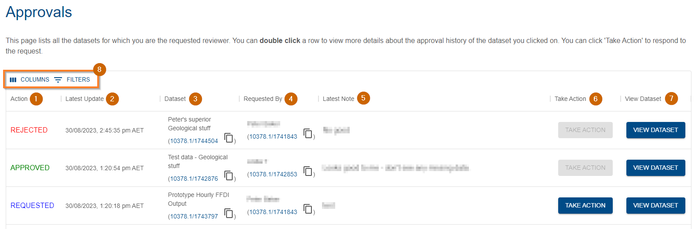
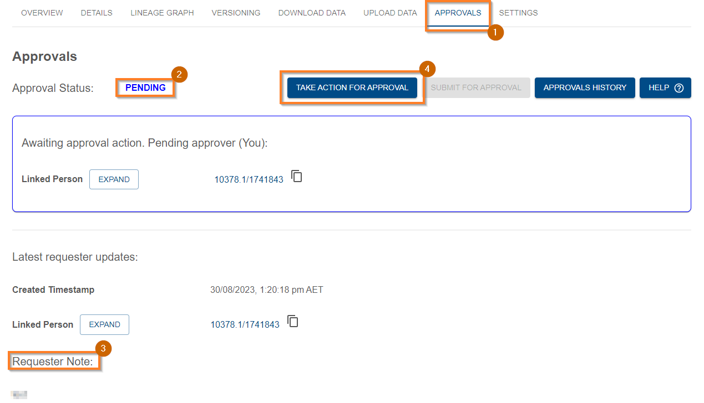
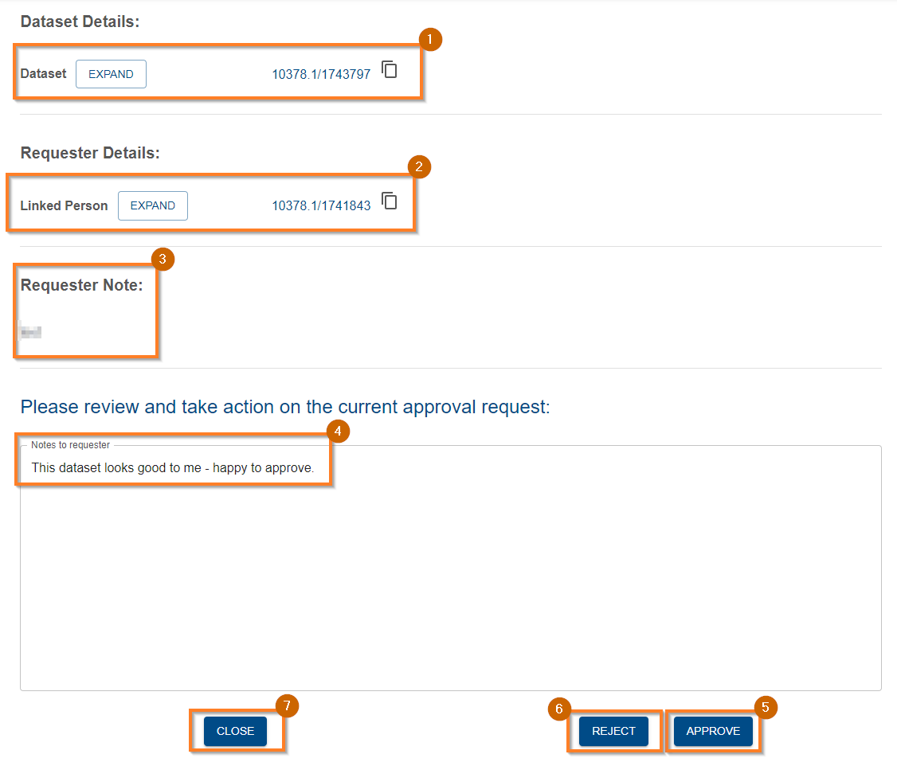
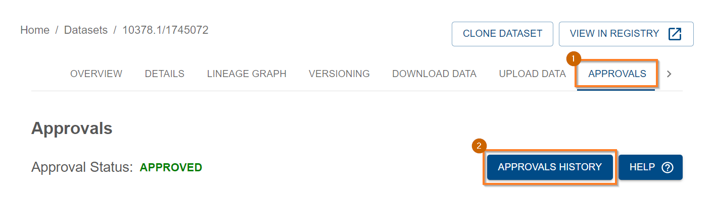
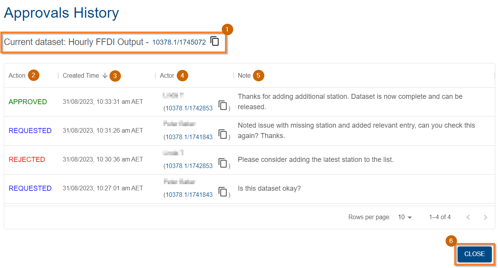

{: .no_toc }

# Dataset Approvals

  

    Table of contents
  

{: .text-delta }
* TOC
{:toc}
____

## Overview

The Provena Data Store enables users to request a review of dataset's for which they have [Admin Access](../registry/access-control#access-control-overview). The user who will perform the review must be selected from a fixed list of Dataset Reviewers.

The purpose of a review will vary significantly between organisations - Provena is not prescriptive about what such a review could include. For example, a dataset review process might include:

-   Quality assurance (QA)
-   Scientific review (e.g. process review, peer review etc)
-   Standards validation (e.g. metadata standards, quality standards, documentation)
-   Approval for public release

Provena will ensure that approved datasets, or datasets pending review, are locked down, meaning that the uploaded files cannot be modified or deleted.

If there is a need to modify files during or after approval, there are two options:

1. [Create a new version](../versioning/how-to-version-in-data-store) of the dataset and modify the files in the new version, or
2. Contact a system administrator and discuss manual remediation

### Release lifecycle

The lifecycle of a dataset during the review process is visualised below.

<!--
PlantUML Source:
---

@startuml

skinparam wrapWidth 150

state NOT_RELEASED ##[bold]
state PENDING ##[bold]03a9f4
state RELEASED ##[bold]2e7d32

NOT_RELEASED : The Dataset is not released
PENDING : A Dataset review is currently in progress
RELEASED : The Dataset has been approved and cannot be modified

[*] -> NOT_RELEASED : Create Dataset
NOT_RELEASED -> PENDING : Requested
PENDING -> NOT_RELEASED : Denied
PENDING -> RELEASED : Approved
@enduml
-->

|                                        Release Lifecycle                                         |
| :----------------------------------------------------------------------------------------------: |
|  |

## (Dataset Owner) How to request a dataset review

### Prerequisites

-   You must have a registered dataset in the Provena data store. It should be complete (meaning there are no expected changes to the data), and ready for review. For help registering a dataset, see [registering a dataset](./registering-a-dataset).
-   You must have [linked your identity to a Person in the registry](../getting-started-is/linking-identity)
-   You must have [Admin Access](../registry/access-control#access-control-overview) to the dataset (meaning you are either the owner, or have been granted equivalent access)

### Find and view your dataset

To begin, navigate to your dataset in the Provena Data Store. For help finding your dataset, see [discovering and viewing datasets](./viewing-a-dataset).

For example, you could search (1) for your dataset, and select it in the list (2).

|                                            Find Dataset                                             |
| :-------------------------------------------------------------------------------------------------: |
|  |

### View approval information

Once you are viewing your dataset details, you should validate the current status as "NOT_RELEASED" (1) and move to the approvals tab (2). If your dataset is in the "RELEASED" state, then your dataset is already approved and no action is required. If your dataset is in the "PENDING" state, then a review has already been requested. You can see [Understanding approval history](#understanding-approval-history) below for more information.

|                                            Approvals Tab                                             |
| :--------------------------------------------------------------------------------------------------: |
|  |

### Submit for approval

After moving to the approvals tab, you can verify the approval status (1) and click "Submit for Approval" (2) to start the request process.

|                                            Request Approval                                             |
| :-----------------------------------------------------------------------------------------------------: |
|  |

Doing so will open a new page, where you can select your Approver using the dropdown menu (1), and include any notes to assist the Approver in the review process (2). Once ready, click (3) to confirm your readiness to submit the request, and (4) to submit. If you want to cancel this process and return to the previous view, click (5) (noting that this information is not saved until submitted).

If your desired dataset reviewer is not available in the dropdown menu, please contact your system maintainer to have them added to the list. More information is available [below](#who-can-review-datasets).

<td></td>

|                                            Request Details                                             |
| :----------------------------------------------------------------------------------------------------: |
|  |

After clicking submit, a popup will appear notifying you of a successful request. After a few seconds, you will be redirected to the approvals tab of the dataset.

|                                        Request Success                                         |
| :--------------------------------------------------------------------------------------------: |
|  |

### Await review response

After being redirected to the approvals tab, you will see an updated display including

-   The approval status (1) "PENDING": this shows that the dataset is awaiting review
-   Requester note (2): This shows the notes associated with the latest review request
-   Details about the approver: You can click the expand button (3) to see more information about the approver
-   Details about the requester: You can click the expand button (4) to see more information about the requester
-   Approvals history (5): This button shows the full approvals history

|                                             Request Pending                                             |
| :-----------------------------------------------------------------------------------------------------: |
|  |

A email is automatically sent to the requested reviewer, notifying them of the request for review. The email includes a link to the requester (1), and a link to the approvals view of the requested dataset (2).

|                                        Request Email                                         |
| :------------------------------------------------------------------------------------------: |
|  |

For more information about performing a review, see [below](#dataset-reviewer-how-to-perform-a-dataset-review).

When the reviewer has approved, or denied the approval (see [release lifecycle](#release-lifecycle)), you will receive an email alerting you to this change.

For example, in this case the review was approved (1):

|                                        Approved Email                                        |
| :------------------------------------------------------------------------------------------: |
|  |

In the case where your review is denied, you will see an email like so - noting the reject action (1):

|                                       Rejected Email                                        |
| :-----------------------------------------------------------------------------------------: |
|  |

As noted in the [release lifecycle](#release-lifecycle), rejecting a pending request returns the dataset to the NOT_RELEASED state, meaning it can be requested again. You can follow the same steps to request review again after applying the changes recommended in the review. The notes provided by the reviewer can be seen both in the email above, and in the approvals tab of the dataset. To explore the full history of a dataset's approval actions (including requester and reviewer notes), see [understanding approval history](#understanding-approval-history).

<td></td>

## (Dataset Reviewer) How to perform a dataset review

### Prerequisites

-   You must be a listed approved dataset reviewer, first requiring that you have [linked your Person identity](../getting-started-is/linking-identity) (see [who can review datasets](#who-can-review-datasets) for more information)
-   You must have been requested as the reviewer for a dataset
-   You must have registry read permission (see [requesting access](../getting-started-is/requesting-access-is))
-   You must have metadata read access to the dataset (see [access control](../registry/access-control#overview))

### Notification of pending approval

As a dataset reviewer, there are two ways to discover pending approvals.

Firstly, you will receive an email when you are requested for review of a dataset.

The email includes a link to the requester (1), and a link to the approvals view of the requested dataset (2).

|                                        Request Email                                         |
| :------------------------------------------------------------------------------------------: |
|  |

Secondly, you can use the approvals tab to discover pending requests. See [below](#using-the-approvals-tab) for more information.

### Using the Approvals tab

The approvals tab is designed for dataset reviewers to quickly ascertain any outstanding pending reviews. It lists the most recent pending, requested or approved dataset reviews **for which you are the requested reviewer**.

The columns of this table are explained below:

1. The action most recently taken for this dataset (REJECTED \| APPROVED \| REQUESTED)
1. The timestamp of the most recent action on this dataset's approval process
1. The Name and ID of the dataset
1. The Name and [linked person](../getting-started-is/linking-identity) ID of the requester
1. The note corresponding to the latest action
1. If the dataset is in a pending state, you can press this button to perform the review
1. A quick link to view the dataset

You can also order by different columns by clicking on the column header, hide columns by clicking on "Columns" and filter by clicking on "Filters" in the tool menu (8).

To see the approval history of a dataset, you can double click it. See [understanding approval history](#understanding-approval-history) for more information about the history view.

|                                         Request Email                                         |
| :-------------------------------------------------------------------------------------------: |
|  |

### Performing a review

Once you have identified the dataset to be reviewed, and assessed the dataset as required, visit the approvals tab (1). You can see the PENDING status (2) and the notes from the requester (3). When ready to take action, click on (4) "Take action for approval".

|                                        Pending Approval                                         |
| :---------------------------------------------------------------------------------------------: |
|  |

After clicking take action, you will be redirected to the display shown below. You can view the metadata for the dataset being reviewed by expanding (1). You can view information about the requester by expanding (2). The supporting notes supplied by the requester can be viewed in (3). You can supply notes in the box (4), and then either approve (5) or reject (6) the review. If you would like to cancel the operation, click (7) to return to the dataset. After submitting a response, you will be redirected to the dataset approvals page.

<td></td>

|                                        Action Approval                                         |
| :--------------------------------------------------------------------------------------------: |
|  |

If you reject a review, the dataset will return to the NOT_RELEASED state. If you approve the dataset, it will enter the RELEASED state. See [release lifecycle](#release-lifecycle) for more information.

If you reject a dataset release, the requester can action your recommended changes by modifying the data and metadata of the dataset, and then re-request review.

## Understanding approval history

It can be useful to review the history of dataset approval actions for a dataset. To reach the approvals history you can either

a) View the dataset details, head to the approvals tab (1), and select "Approvals History" (2)

|                                      Finding History View                                      |
| :--------------------------------------------------------------------------------------------: |
|  |

b) Head to the Approvals tab, as a dataset reviewer, and double click on an entry.

Once you have navigated to the approval history view, you will see a table of actions. A typical example is shown below.

The dataset is identified (1), and the columns (2-5) provide information about the approval actions on this dataset. The actions are ordered, by default, from newest to oldest.

The image below describes a typical review workflow. The dataset owner requests a review, the reviewer denies the request specifying some required changes, the dataset owner makes then changes then requests another review, and the review is approved. The dataset is now locked down and cannot be modified.

The columns are described below:

-   (2) The action taken, either "REQUESTED", "APPROVED", or "REJECTED"
-   (3) The timestamp of this action, you can click the column header to reverse the sort order
-   (4) The person/actor who performed this action
-   (5) Any notes associated with this action

If you would like to close this view, press the close button (6) or press the escape key on your keyboard.

|                                    Approval History                                    |
| :------------------------------------------------------------------------------------: |
|  |

## Who can review datasets?
