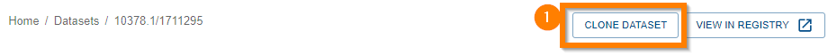

{: .no_toc }

  

    Table of contents
  

{: .text-delta }
* TOC
{:toc}
____

# Cloning Datasets



Cloning a dataset is the same as [cloning other Registry items](../registry/clone). However, you initiate the clone operation from the [Data Store](./overview).

If you have sufficient [permissions](../registry/clone#required-permissions), the "Clone Dataset" button will appear (1).

|                                  Clone Dataset Button                                   |
| :-------------------------------------------------------------------------------------: |
|  |

Cloning a Dataset is no different to cloning other [Registry](../registry/overview) entity types - the metadata details will be prefilled.

The same considerations apply as mentioned in [cloning registry items](../registry/clone).
