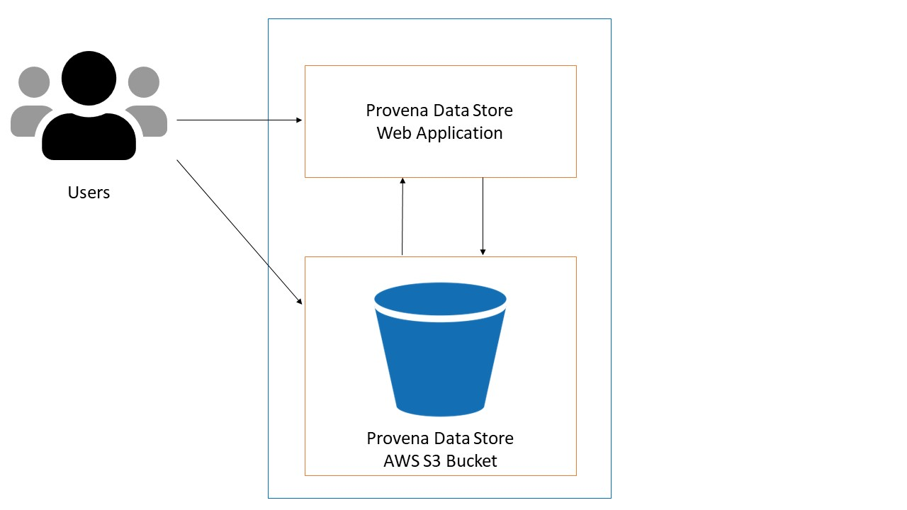

{: .no_toc }

# Data Store Overview

  

    Table of contents
  

{: .text-delta }
* TOC
{:toc}
____

## Overview

All datasets that are inputs or outputs for operational products can be registered and stored on Provena. It is expected that (but not essential) that the registration and storage will occur concurrently. The metadata required for each dataset is to be determined by teams or projects using Provena. It is expected that metadata will consist of 3 types of information:

-   Disciplinary (science) based metadata which will describe aspects of the data relevant to the research community.
-   Program based metadata containing key information from a program perspective.
-   Provenance metadata which will most likely include a unique identifier for the dataset, and a reference to the identifier of the process used to generate the dataset.

The Data Store facilitates registration and creation of datasets for a project. Uploaded data is stored in an AWS S3 bucket, which serves as a persistent storage repository.

|                                    Simple Data Store                                     |
| :--------------------------------------------------------------------------------------: |
|  |

## What can users do in the Data Store?

Users can login to Provena's Data Store to do the following.

[**Register datasets**](./registering-a-dataset){:target="\_blank"}: Create a dataset record for a dataset relevant to a project. Dataset records could either point to a dataset that is managed externally (e.g. institutional repositories) or a location in Provena's Data Store. Valid examples of dataset records include:

-   CSV files
-   a set of related NetCDF files

[**Upload files**](./uploading-dataset-files){:target="\_blank"}: Authorised users are able to upload files to a location registered in the Data Store. When a user registers a dataset, a digital identifier is minted for that dataset and a folder is created in the shared AWS S3 bucket. Users can then upload files to that location via AWS S3 tools. Learn more about Provena's Digital Identifiers [here](../digital-object-identifiers){:target="\_blank"}.

[**Discover datasets**](./viewing-a-dataset){:target="\_blank"}: Authorised users can access the Data store to search for datasets and view their details.

[**Review and approve datasets**](./dataset-approvals){:target="\_blank"}: Dataset owners can request review and approval by an approved dataset reviewer. Approved datasets cannot be modified.

[**Download and synchronise datasets**](./downloading-datasets){:target="\_blank"}: Authorised users are able to access files on the Data Store and download them to a local computing environment using AWS tools and the AWS web console. Users can also synchronise dataset folders to a local computing environment, which only downloads updated files optimising file transfer. This will allow users to share data and synchronise data updates.

**Automated archival**: Datasets that are registered and uploaded to the Data store will be archived using automation tools. Archival will allow Provena to manage these datasets for future reference.

Browse to the [Provena Landing Page](https://mds.gbrrestoration.org/){:target="\_blank"}
