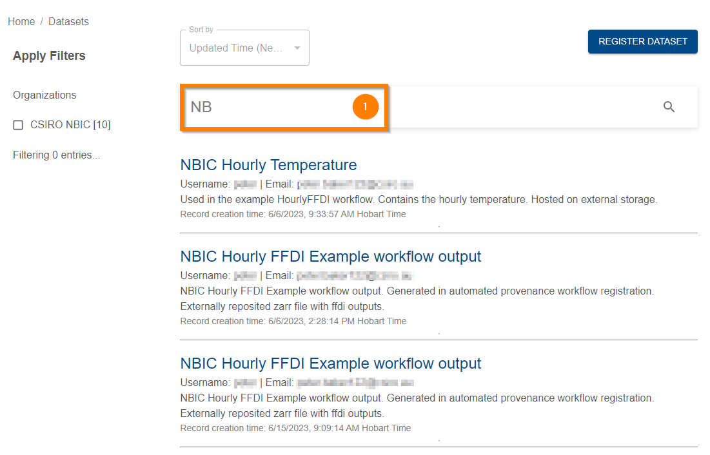
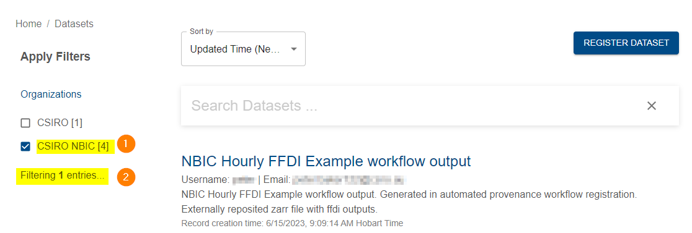
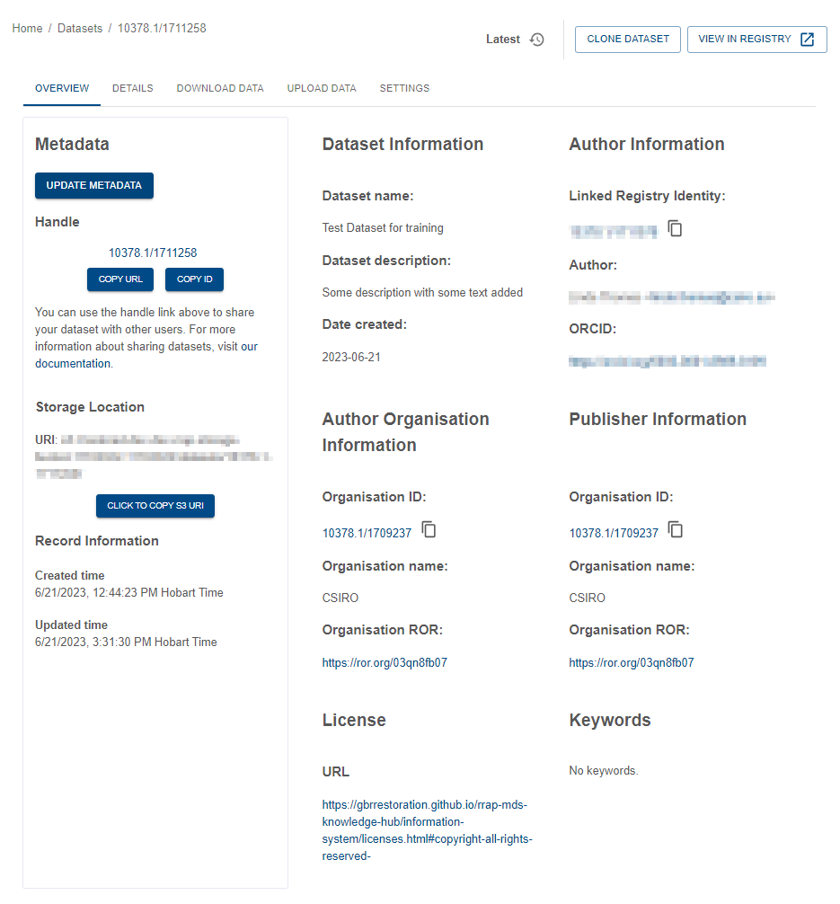

{: .no_toc }

# Discovering and viewing datasets

  

    Table of contents
  

{: .text-delta }
* TOC
{:toc}
____

## Discovering Datasets

You can find datasets a number of ways once you are logged into Provena's Data Store. To get started, navigate to the 'Explore Datasets' view.

You can reach this page by (1) Clicking on the **Explore datasets** button, or (2) entering information, such as the dataset name, in the **Search Datasets** field and clicking the magnifying glass button.

|                               Exploring the data store                                |
| :-----------------------------------------------------------------------------------: |
|  |

### Searching the data store

To search the data store, start entering a search query into the 'Search Datasets' input box (1):

|                                   Searching the data store                                   |
| :------------------------------------------------------------------------------------------: |
|  |

As you type, results will appear which match the search query.

If you would like to stop searching and return to sorting and listing - simply delete the search input.



### Sorting datasets

Various sorting options are available when you are listing datasets. If you are searching, the sorting options will be disabled.

To select a sorting option, use the sort drop down:

|                              Sorting items in the data store                               |
| :----------------------------------------------------------------------------------------: |
|  |

After selecting a different sort option, the list of datasets will be refreshed.

### Filtering by organisation

You can filter datasets by their organisation using the check boxes in the left hand panel (1). Only datasets which are affiliated with the selected organisations will be shown. The number of results that are currently being hidden by this filter is shown below (2). To stop filtering, deselect all the organisation check boxes.

|                                  Filtering by organisation                                   |
| :------------------------------------------------------------------------------------------: |
|  |

### Loading more results

While listing, sorting and filtering dataset results, you may be able to load additional datasets if not all results are being shown.

If you see the "Load More" button at the bottom of the list (1), click it to load more results.





|                                Loading more results                                |
| :--------------------------------------------------------------------------------: |
|  |

## Selecting a dataset

Once you have found the dataset you are looking for, click on the dataset name in the list and you will be taken to the dataset's metadata page.

|                                   Dataset metadata view                                   |
| :---------------------------------------------------------------------------------------: |
|  |

## Metadata

The metadata overview gives the basic information about the data that is stored in Provena. See [describing a dataset](../data-store/describing-dataset.html) for more information on metadata.

## Collaborating

You can share the dataset with others using the Handle link. Using the Handle link to share data is an easy way of sharing files as updates to the data can be made and the user with the link will always have access the most up to date data.
The Handle link is a persistent digital identifier for the dataset. See [About digital object identifiers](../digital-object-identifiers.html){:target="\_blank"} for more information.

To share, click on the **Copy URL** button (1). Then paste the link into an email, document etc... that is to be shared with other Provena users.

|                                         Dataset handle link                                          |
| :--------------------------------------------------------------------------------------------------: |
|  |



Underneath the Handle link, the **Storage Location** information relates to the storage location on the AWS S3 server. You can copy the S3 file path using the copy button (labelled 2 in above). The **Record Information** gives you the date and time of the creation of the metadata record, with any updates to the metadata record shown under **Updated time**.

On the right hand side of the page, you can see an overview of the metadata and can also [download the dataset](../data-store/downloading-datasets.html){:target="\_blank"}, [upload additional data](../data-store/registering-and-uploading-a-dataset.html){:target="\_blank"} and, if you have privileges, change the [access control](../registry/access-control.html){:target="\_blank"} of the dataset by clicking the corresponding tabs. The **JSON Metadata** can be expanded (so the information can be viewed or copied) by clicking on the **Expand details** button. To close, click the **Expand details** button again.
