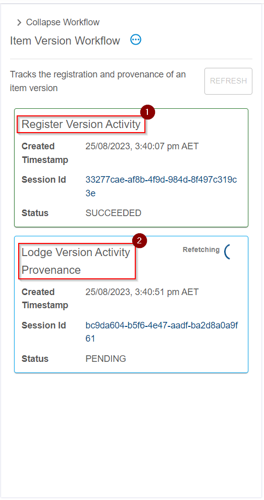

{: .no_toc }

# Jobs in Provena

  

    Table of contents
  

{: .text-delta }
* TOC
{:toc}
____

## Overview

During interaction with parts of Provena, **jobs** will be lodged and executed in the background.

This helps keep the system quick and responsive while enabling complex interactions to occur due to user actions.

## Types of jobs

-   **Creating a Registry Item**: When you [create an item](../registry/registering_and_updating) in the [registry](../registry/overview), if the item is in the [Entity](../provenance/overview/what-are-entities) category, a _Create Activity_ will be registered automatically which tracks the provenance for this item's registration. This process happens automatically in two stages; (1) the registration of a _Create Activity_ and (2) the lodging of this Activity's provenance, both steps are highlighted below:

|                                 Create Workflow                                  |
| :------------------------------------------------------------------------------: |
|  |

-   **Creating a new version of a Registry Item**: When you [version an item](../versioning/how-to-version) in the [registry](../registry/overview), a _Version Activity_ will be registered automatically which tracks the provenance for this item's versions. This process happens automatically in two stages; (1) the registration of a _Version Activity_ and (2) the lodging of this Activity's provenance, both steps are highlighted below:

|                                  Create Workflow                                  |
| :-------------------------------------------------------------------------------: |
|  |

-   **Registering Model Runs in bulk**: When registering model runs, you can register a collection of items. Doing so will launch a batch collection of jobs. Batch jobs are linked together and viewable by clicking on the entry in the job list. See [viewing your jobs](#viewing-your-jobs) for more information.

|                                   Create Workflow                                    |
| :----------------------------------------------------------------------------------: |
|  |

## Understanding the lifecycle of a job

Jobs in Provena experience several states during their life. These states are visualised below.





<!---
Diagram source - generated with PlantUML (note that I separated double arrows with a forwardslash)
- - -
@startuml

skinparam wrapWidth 150

state PENDING ##[bold]03a9f4
state DEQUEUED ##[bold]ff9800
state IN_PROGRESS ##[bold]01579b
state SUCCEEDED ##[bold]2e7d32
state FAILED ##[bold]d32f2f

PENDING : The Job is waiting for a worker
DEQUEUED : The Job has been removed from the queue by a worker
IN_PROGRESS : The Job is being executed by a worker
SUCCEEDED : The Job completed successfully
FAILED: The Job experienced an error during execution

[*] -> PENDING
PENDING -> DEQUEUED
DEQUEUED -/-> IN_PROGRESS
IN_PROGRESS -/-> SUCCEEDED
IN_PROGRESS -/-> FAILED

@enduml
-->

|                                   Job Lifecycle                                   |
| :-------------------------------------------------------------------------------: |
|  |

## Viewing your jobs

During normal system use, you should be able to proceed without worrying about the status of jobs. However, you may be interested in system activity, or need to debug issues.

There are two ways to view jobs associated with your activities.

### During a workflow

As mentioned above in [types of jobs](#types-of-jobs), there are two main workflows which generate jobs in the system - registry item creation and versioning.

These jobs include multiple stages which are connected as part of a 'workflow'. Provena includes the ability to visualise these connected workflows.

While viewing the [details of an item](../registry/exploring_the_registry#viewing-records) (in the Entity category), you may see an associated workflow, as shown below. The workflow is visualised on the right (1). The steps are shown as boxes, and there state displayed (2,3). You can collapse the view using the collapse button (4).

|                                 Workflow Page                                  |
| :----------------------------------------------------------------------------: |
|  |

### In the jobs panel

If you would like to review all of the jobs in your job history, you can click on the "Jobs" tab on any of the Provena web pages, as shown below (1).

|                                 Jobs Tab                                  |
| :-----------------------------------------------------------------------: |
|  |

Viewing this page will show you a list of jobs you have created during your system usage. You can see the type of job (1), the status (2) and the created time (3). To manually refresh the list, click (4). If there are more items available, you can click "Load More" (5).

|                                 Jobs List                                  |
| :------------------------------------------------------------------------: |
|  |

## What if something goes wrong?

## For the developers

### How do jobs run?

### How long do jobs take to start?

### Programmatic job access

### Can I create new types of jobs?
