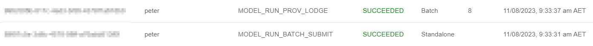

{: .no_toc }

# Jobs in Provena

  

    Table of contents
  

{: .text-delta }
* TOC
{:toc}
____

## Overview

During interaction with parts of Provena, **jobs** will be lodged and executed in the background.

This helps keep the system quick and responsive while enabling complex interactions to occur due to user actions.

## Types of jobs

-   **Creating a Registry Item**: When you [create an item](../registry/registering_and_updating) in the [registry](../registry/overview), if the item is in the [Entity](../provenance/overview/what-are-entities) category, a _Create Activity_ will be registered automatically which tracks the provenance for this item's registration. This process happens automatically in two stages; (1) the registration of a _Create Activity_ and (2) the lodging of this Activity's provenance, both steps are highlighted below:

|                                 Create Workflow                                  |
| :------------------------------------------------------------------------------: |
|  |

-   **Creating a new version of a Registry Item**: When you [version an item](../versioning/how-to-version) in the [registry](../registry/overview), a _Version Activity_ will be registered automatically which tracks the provenance for this item's versions. This process happens automatically in two stages; (1) the registration of a _Version Activity_ and (2) the lodging of this Activity's provenance, both steps are highlighted below:

|                                  Create Workflow                                  |
| :-------------------------------------------------------------------------------: |
|  |

-   **Registering Model Runs in bulk**: When registering model runs, you can register a collection of entries in one action. Doing so will launch a batch collection of jobs. Each job will [register a model run](../provenance/registering-model-runs/index) and lodge the associated provenance record. Batch jobs are linked together and viewable by clicking on the entry in the job list. See [viewing your jobs](#viewing-your-jobs) for more information.

|                                   Create Workflow                                    |
| :----------------------------------------------------------------------------------: |
|  |

## Understanding the lifecycle of a job

Jobs in Provena experience several states during their life. These states are visualised below.





<!---
Diagram source - generated with PlantUML (note that I separated double arrows with a forward slash)
- - -
@startuml

skinparam wrapWidth 150

state PENDING ##[bold]03a9f4
state DEQUEUED ##[bold]ff9800
state IN_PROGRESS ##[bold]01579b
state SUCCEEDED ##[bold]2e7d32
state FAILED ##[bold]d32f2f

PENDING : The Job is waiting for a worker
DEQUEUED : The Job has been removed from the queue by a worker
IN_PROGRESS : The Job is being executed by a worker
SUCCEEDED : The Job completed successfully
FAILED: The Job experienced an error during execution

[*] -> PENDING
PENDING -> DEQUEUED
DEQUEUED -/-> IN_PROGRESS
IN_PROGRESS -/-> SUCCEEDED
IN_PROGRESS -/-> FAILED

@enduml
-->

|                                   Job Lifecycle                                   |
| :-------------------------------------------------------------------------------: |
|  |

## Standalone and Batch jobs

Jobs in Provena can be of three types

-   completely standalone - standalone jobs do not create other jobs and are not associated in a batch collection
-   workflow jobs - a workflow job is part of a connected series of jobs. Jobs of this type create other jobs until the workflow is terminated automatically upon completion
-   batch jobs - a batch job was generated as a collection, and are associated with each other

You can view standalone jobs by using the [jobs panel](#in-the-jobs-panel). Workflow jobs can be viewed individually in the [jobs panel](#in-the-jobs-panel) or as a connected workflow in the [workflow visualiser](#during-a-workflow). Batch jobs can be viewed in the [jobs panel](#in-the-jobs-panel), and upon selection, will load a collection of the related tasks.

## Viewing your jobs

During normal system use, you should be able to proceed without worrying about the status of jobs. However, you may be interested in system activity, or need to debug issues.

There are two ways to view jobs associated with your activities.

### During a workflow

As mentioned above in [types of jobs](#types-of-jobs), there are two main workflows which generate jobs in the system - registry item creation and versioning.

These jobs include multiple stages which are connected as part of a 'workflow'. Provena includes the ability to visualise these connected workflows.

While viewing the [details of an item](../registry/exploring_the_registry#viewing-records) (in the Entity category), you may see an associated workflow, as shown below. The workflow is visualised on the right (1). The steps are shown as boxes, and there state displayed (2,3). You can collapse the view using the collapse button (4).

|                                 Workflow Page                                  |
| :----------------------------------------------------------------------------: |
|  |

This view is available from:

-   the overview tab of a registry item's detailed view (for Entity category items)
-   the overview tab of a dataset's detailed view in the data store

### In the jobs panel

If you would like to review all of the jobs in your job history, you can click on the "Jobs" tab on any of the Provena web pages, as shown below (1).

|                                 Jobs Tab                                  |
| :-----------------------------------------------------------------------: |
|  |

Viewing this page will show you a list of jobs you have created during your system usage. You can see the type of job (1), the status (2) and the created time (3). To manually refresh the list, click (4). If there are more items available, you can click "Load More" (5).

|                                 Jobs List                                  |
| :------------------------------------------------------------------------: |
|  |

Clicking on an item will take you to the detailed view for that job, allowing you to inspect the job information, inputs, outputs, status, and any error information in the event of a job failure. This view is shown below. (1) = Expand inputs. (2) = Expand outputs. (3) = Status of the job. (4) = Any information associated with the job state, this could include an error message if the job is in the "FAILED" state. (5) Return to the job list.

|                                 Job Details                                  |
| :--------------------------------------------------------------------------: |
|  |

If you click on a batch job (e.g. shown below)

|                                    Batch Example                                     |
| :----------------------------------------------------------------------------------: |
|  |

You will be taken to a job list which includes only items in that batch. Selecting a job from this view will take you to the detailed info for that job.

## What if something goes wrong?

If an error occurs, all job visualisations will include an error indication and status "FAILED". We recommend you visit your [job list](#in-the-jobs-panel) and click on the item to view the detailed information. You can then view the error information. If you cannot determine the cause of the error, please contact us.

## For the nerds

### How do jobs run?

The following steps occur to create and run a job

1. You use the UI or the API to run an operation which produces a job as a side effect (e.g. create, version, batch submit)
1. The API completes the synchronous parts of the operation, then requests that the Job API launch a task with a well known type, subtype, input and output interface
1. This publishes an event, which results in a database entry being created to track the status of the job. Additionally, a function runs asynchronously which runs a new worker task of the correct type (if there isn't already a sufficient number running)
1. While the worker is provisioned, the job remains pending
1. Once the worker starts, it reads the job from the queue, performs the required action, then reports the status (SUCCEEDED or FAILED) to the job database, and deletes the item from the queue

The user can poll the Job API to ascertain the status of the job (as identified by a session ID).

### How long do jobs take to start?

If there is already a worker running to process jobs, they can start almost immediately. If the system does not have running tasks (to save money), a task must be started. Tasks currently run using [AWS ECS](https://aws.amazon.com/ecs/) and incur a cold start time of around 30-40 seconds, on average. Once a job is running, it remains running until it has been idle for at least two consecutive minutes.

### Programmatic job access

You can view, monitor and lodge jobs through the Job API. The endpoint that this job is deployed to will depend on your organisation's deployment domain. The Job API has the prefix `job-api`.

### Can I create new types of jobs?

As a user of Provena, you cannot create new jobs. However, jobs are easy to build and configure. Please talk to the maintainer of your Provena deployment if you think you need a new job type.
