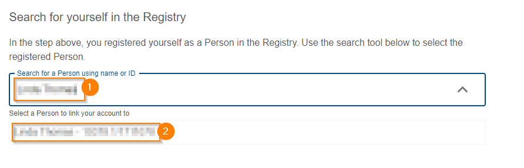
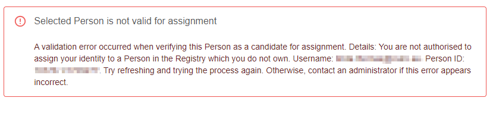
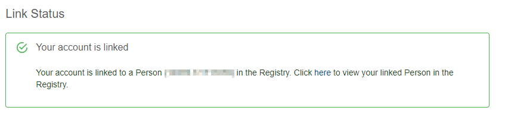

{: .no_toc }

# Linking user account to a Person in the Registry

  

    Table of contents
  

{: .text-delta }
* TOC
{:toc}
____

## Overview

Provena enables users to create and modify resources of various types in various ways. Some actions performed by a user in the system are persisted as part of data and workflow [provenance](../provenance/overview/what-is-provenance). It is helpful, when [exploring provenance](../provenance/exploring-provenance), to link to the [Agent](../provenance/overview/what-are-entities#2-what-entity-types-are-used-in-the-provena) (Person), associated with an activity.

In order to minimise repetitive data entry, we require that users, who intend to create or modify resources, perform a **one time** process which links the user's account with a registered [Person](../provenance/registering-model-runs/establishing-required-entities#person) in the [Registry](../provenance/registry/overview).

The overview of this process is as follows:

1. (If not already done) Register yourself as a [Person](../provenance/registering-model-runs/establishing-required-entities#person) in the [Registry](../provenance/registry/overview) - see [Registering yourself](#registering-yourself) below
2. Use the provided tools to link your user account to your Person in the registry - see [Linking from your account to your Person](#linking-from-your-account-to-your-person) below



## Registering yourself

### Ensure you have the necessary permissions

Before you can register yourself in the Registry, you must ensure you have **Entity Registry Write** permissions.

See [requesting access](./requesting-access-is) for more information.

### Ensure you aren't already registered

If you are uncertain as to whether you have already registered yourself in the Registry, start by [exploring the registry](../provenance/registry/exploring_the_registry). You can filter by "Person" subtype, and include your name as a search term to narrow the results.

If you are already registered, but you are not the owner of the record (see [access controls](../provenance/registry/access-control)), **please contact us**. If you are the owner of the record, you can make note of the existing Person, and proceed to the second step below - [linking from your account to your person](#linking-from-your-account-to-your-person).

### Go to the Person registration form

You can now visit the create a Person form in the registry.

[This link](https://registry.mds.gbrrestoration.org/registerentity?subtype=PERSON){:target="\_blank"} will take you straight to the new Person form.

If this link isn't working for you, please follow the instructions [here](../provenance/registering-model-runs/establishing-required-entities#how-to-register-a-person-entity) to register a Person.

|                                  Person Registration Form                                   |
| :-----------------------------------------------------------------------------------------: |
|  |

### Fill out form details

After visiting the link above, you should find that your details are prefilled.

The ORCID identifier cannot be prefilled - you may like to add that your profile - however it can be updated at any time.

For more information about the metadata fields, see [here](../provenance/registering-model-runs/establishing-required-entities#person).

Pay attention to the ethical approval step - please carefully read this statement before granting consent.

### Submit and validate

Once you are confident that

1. You are not registering a duplicate record
2. You have filled out the fields accurately
3. You have provided ethical consent

you can press Submit and register yourself as a Person.

## Linking from your account to your Person

To assist in the linking process, there is a specific page in the [Landing Portal](https://mds.gbrrestoration.org) to guide you through the process.

To go straight there, click [here](https://mds.gbrrestoration.org/profile?function=identity).

Otherwise, you can click the profile icon in the top right (1), then "identity" in the left hand panel (2). You will need to be [logged in](logging-in) to visit this page.

|                                       Identity Page                                       |
| :---------------------------------------------------------------------------------------: |
|  |

Use the search tool (1) to input your name. This will search the registry. You will see your newly registered Person in the list. Select the item in the list (2).

|                                   Search for yourself                                   |
| :-------------------------------------------------------------------------------------: |
|  |

If you are not appearing try:

1. Refreshing the page
2. Waiting a few minutes, refreshing and searching again
3. Double check spelling
4. Double check the Person registry item details (for typos or missing data)

If you cannot find yourself in the search results, please contact us.

After selecting yourself, a validation process will begin in the background.

If validation succeeds, you will be prompted to confirm the assignment (1) or clear your selection of Person (2).

|                                     Successful Validation                                      |
| :--------------------------------------------------------------------------------------------: |
|  |

If a validation error occurs, the error will be displayed. For example, the below error indicates that the selected Person is not owned by you, therefore disabling linking.

|                                       Failed Validation                                       |
| :-------------------------------------------------------------------------------------------: |
|  |

If you believe the validation error is incorrect, try:

1. Refreshing the page and trying again
2. Double checking you are selecting the correct search result - you can also validate this by comparing the ID with the Person in the registry

If you cannot determine the cause of the issue and/or fix it yourself, please contact us to provide assistance.



Once you are confident you have selected the correct Person, you can click the "Assign to me" button. The page will take a few moments and refresh itself, showing you this message indicating a successfully linked identity.

|                                Successfully Linked                                 |
| :--------------------------------------------------------------------------------: |
|  |

## FAQ

### Why can't I link to a Person?

There are a few requirements which could stop you from linking to a Person:

-   you do not own the Person record - ownership is determined by who created the record
-   you are already linked to a Person - you can only be linked to a single Person
-   the selected Person ID was invalid (i.e. the entry does not exist in the system, it's metadata contents are invalid, or other issues). If you experience this problem, please contact us.

### What do I do if someone else registered me in the system?

In general - we do not recommend that you register another user's Person in the system. This is for a few reasons:

-   as mentioned above, the other user will not be able to link to that identity as they are not the record owner
-   registering a Person is subject to ethical considerations which requires explicit consent - the burden of proof for having gained consent is on the registrant of the Person
-   currently, there is no purpose to registering a Person in the system other than yourself

If someone has registered you in the system, you have a few options:

-   if you did provide consent for this registration, please contact us and we can assist you to gain admin access to this record and link to it
-   if you did not provide consent for this registration, please contact us and we can delete the record and contact the creator to understand why it was created

### What do I do if I sign into the system with multiple accounts?

It is possible for multiple users to link to the same Person identity. This means that if you sign in with multiple user accounts with different usernames, you could theoretically link both accounts to the same Person. However, a record can only have a single owner, meaning that the non registrant account would not be able to link to the records. Admins can override this requirement - please contact us if you have a valid need to use multiple accounts. In most cases we recommend you only use a single account in the system.

### What will happen if I don't link to a Person?

All actions which are classified as creation or modification will be blocked. You will see errors such as this:

|                                   Required Person Link                                   |
| :--------------------------------------------------------------------------------------: |
|  |

These errors currently can appear when:

-   registering, updating or cloning a dataset
-   registering, updating or cloning (non Person) Registry entities
-   using the CSV Provenance tool to lodge model run records

### Why can't we perform this process automatically?

While it would be technically possible to register a Person on your behalf when you first login, we believe that this violates our requirement to seek consent for a Person's registration in the system. We also believe that there may be situations where the user's login account details (email, name etc) are not the preferred contact details when users discover your actions in Provenance records. By separating the two identities, you can clearly understand what information is visible to other users (and [control this](../provenance/registry/access-control)), and maintain this persistently identified information through time.
