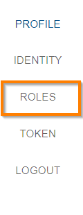
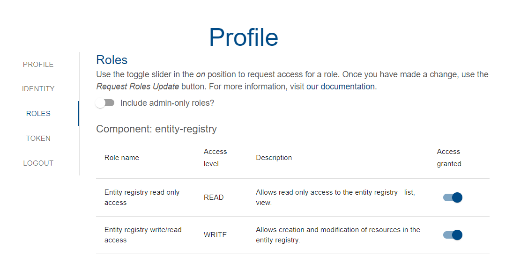
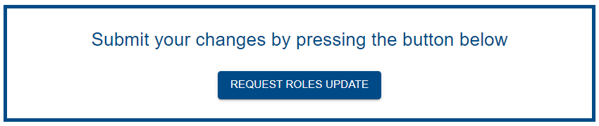
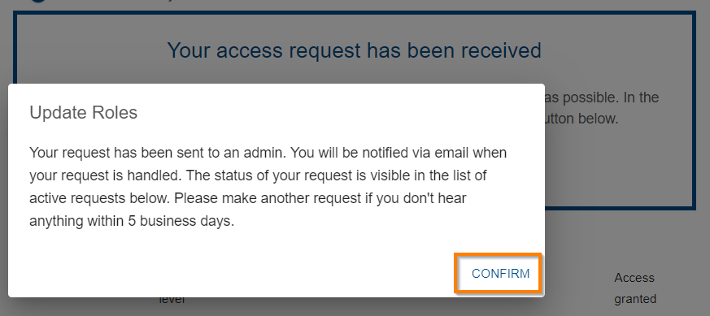
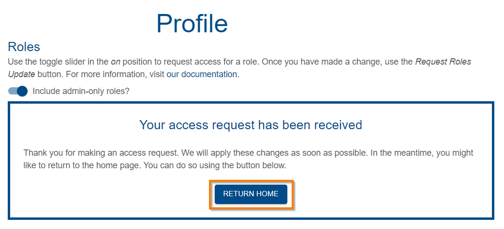

{: .no_toc }

# Requesting access to Provena applications

  

    Table of contents
  

{: .text-delta }
* TOC
{:toc}
____

## User Roles

You will need to be granted roles to be able to perform tasks in Provena. Once you are logged in on the Provena [landing page](http://provena.io){:target="\_blank"}, select the **User profile icon**, highlighted below.

|                               User Profile Icon                                |
| :----------------------------------------------------------------------------: |
|  |

You then select the **Roles** tab on the left hand side of your profile page.

|                                   Roles tab                                    |
| :----------------------------------------------------------------------------: |
|  |

## Access levels

The roles page allows you to request levels of access (read only, read and write, administration) to particular parts of the information system.

|      Component      |             Role name             | Access level |                                                                                                            Description                                                                                                             |
| :-----------------: | :-------------------------------: | :----------: | :--------------------------------------------------------------------------------------------------------------------------------------------------------------------------------------------------------------------------------: |
| **Entity registry** | Entity registry read only access  |     READ     |                                                                                    Allows read only access to the entity registry - list, view.                                                                                    |
|                     | Entity registry write/read access |    WRITE     | Allows write level access to the entity registry - all actions except deletion. This enables the registration of records of **all types** including **Datasets** (in the Data Store) and **Model Runs** (in the Provenance Store). |

Below is an image of the Profile page with the access levels shown. To request access to a role, slide the appropriate toggle slider to the right. By default, only standard user roles are shown. If you need to request administrative permissions, use the "Include admin-only roles" slider at the top of the page.

|                                   User Roles                                    |
| :-----------------------------------------------------------------------------: |
|  |

Once you have completed selecting the roles you require, click the **Request Roles Update** button.

|                                    User Roles Request                                    |
| :--------------------------------------------------------------------------------------: |
|  |

You then confirm the request by clicking the **Confirm** button.

|                                 User Roles Confirmation                                  |
| :--------------------------------------------------------------------------------------: |
|  |

You go back to the to Provena's home page by clicking the **Return Home** button.

|                                   Return home                                    |
| :------------------------------------------------------------------------------: |
|  |
