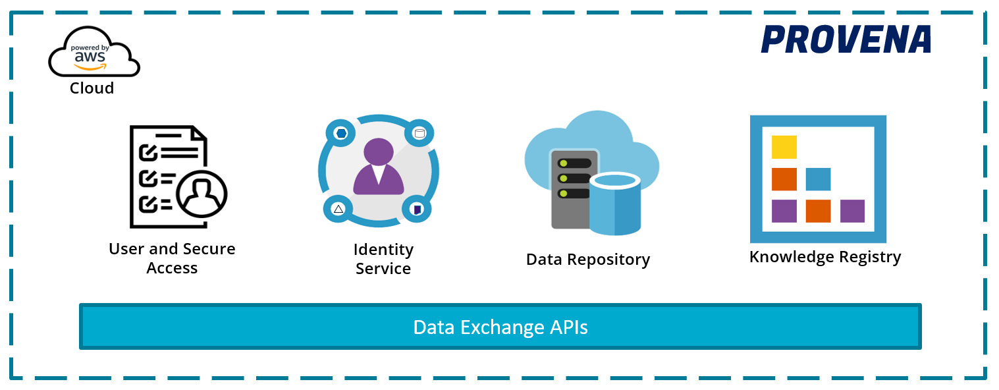

Provena is a cloud-based knowledge management system that enables users to register, manage, and publish knowledge artefacts 
used and generated within a scientific or modelling workflow. 
It includes a sophisticated provenance capability to capture individual simulation or model run records, their results, 
and associated data to enable traceability and repeatability. 

Features:
- **General Purpose Data store**: Enabling the registration, storage, discovery and access to key datasets via integrated cloud-based platform (AWS S3). 
- **Provenance management system**: Enables capture, querying and visualisation of provenance information and metadata for modelling and simulation workflows. 
- **Knowledge Registry**: Facilitates registration and management of entities and supporting metadata. Items registered in the registry are minted  persistent and resolvable identifiers, which can be used in provenance records. Linking up each of these elements provides a provenance chain between activities, entities and people which can be queried. 
- **Powered by graph database technology**: Provena uses an optimised query engine implementing a graph database to enable provenance specific query capabilities that supporting queries such as inspecting all upstream lineage activities and inputs from a single output dataset. 
- **Cloud-based**: Deploy an instance which suits your requirements to your organisation’s AWS account
- **Designed with APIs in mind**: Provena features a set of APIs that powers Provena Web Applications as well as providing users with programmatic access to Provena functionality. This enables access to Provena infrastructure via a user’s coding environment, e.g. Jupyter notebooks.
- **Open-source**: Provena is available via an open-source licence (BSD 3-clause) allowing your project to deploy an instance with freedom to operate.
- **Theming and branding**: Configure and customise a Provena instance with your organisational branding and styling.

