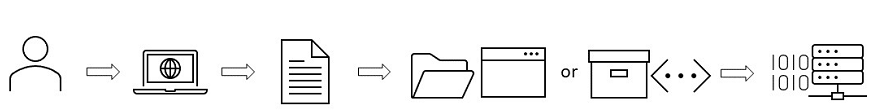
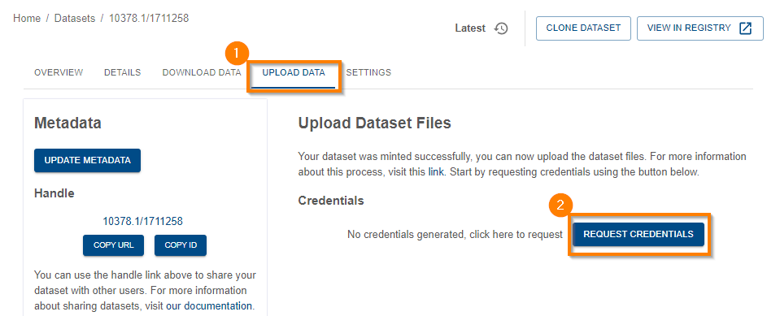
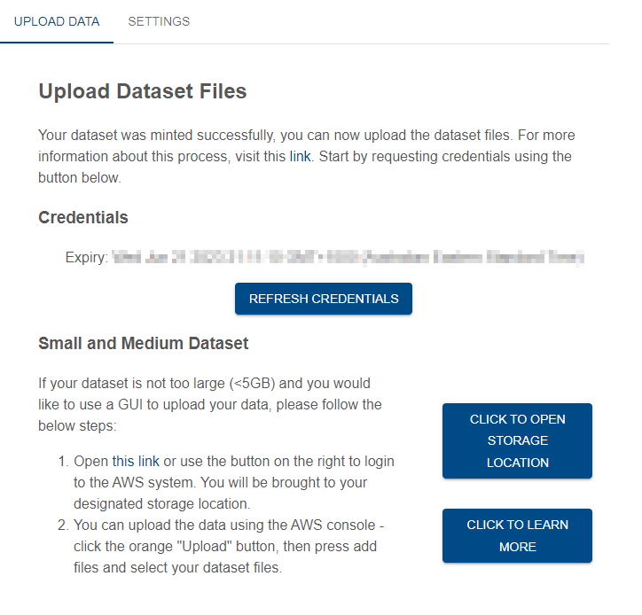

{: .no_toc }

# Uploading dataset files

  

    Table of contents
  

{: .text-delta }
* TOC
{:toc}
____

## Overview of the process

The diagram below outlines the steps undertaken when registering and uploading dataset files.  
_Note: draft figure_

_A User logs into the RRAP information system & selects DATASTORE then REGISTER DATASET from the website. A metadata form prefilled with the User’s name & email address opens and the User fills out information relating to the data being uploaded (see [Filling out form fields](../data-store/registering-a-dataset.md#filling-out-form-fields){:target="\_blank"} for more detailed information). After the metadata form is completed the User uploads the dataset by one of these [methods](#uploading-dataset-files){:target="\_blank"}, depending on the size of the file(s). The data is assigned its own unique PID (Persistent Identifier). The data is securely stored on an AWS S3 server, ready for future reference and usage._
 

---

## Appropriate access

To upload dataset files, two access types are required:

-   Role level access: you must have **write** access to the Entity Registry - see [requesting access](../getting-started-is/requesting-access-is.html){:target="\_blank"} for information on how to request access. If you registered the dataset, you will already have this access.
-   Resource role access: datasets are registered resources in the [Registry](../provenance/registry/overview) - uploading dataset files requires the 'Dataset Data Write' role. If you are the owner of this dataset, you will already have this role. For more information about access control for registered entitites, see [access control](../provenance/registry/access-control).

## File types and maximum file size

The M&DS IS Data Store can store a variety of data files e.g. text, csv, netCDF, word documents, images, video etc... Users can upload files or folders using either the AWS web console (GUI), AWS command line interface (AWS CLI) or a program like [WinSCP](../data-store/WinSCP-data-access.md){:target="\_blank"}.

While the AWS CLI can handle large files (>100GB) and the AWS Console GUI can handle up to 160GB uploads, please contact the RRAP M&DS IS team if you know you will be uploading large or numerous files. For technical information about the storage limitations of the S3 service (which the data store is built on) you can review the AWS FAQ [here](https://aws.amazon.com/s3/faqs/#:~:text=How%20much%20data%20can%20I%20store%20in%20Amazon%20S3?){:target="\_blank"}.

The maximum individual file size that can be uploaded is 5TB.

---

## Uploading dataset files



Dataset files can be uploaded once the metadata record is created. You can choose between using a GUI or command line. The AWS web console (GUI) can be used for files/folders up to 5GB in size. Larger files should be uploaded using a program like WinSCP or the AWS CLI v2.

### Uploading data via AWS Web Console (small to medium files)

To start the upload process, click on the **Upload data** tab.

Request credentials by clicking the **Request Credentials** button.

|                                    Uploading small to medium files                                    |
| :---------------------------------------------------------------------------------------------------: |
|  |

Next, open the link to AWS system, by either clicking on the **Click to open storage location** button or the link in the text. You will then be taken to the AWS S3 bucket location which will house the dataset files. The associated metadata record will be seen as a ro-create-metadata.json file.

|                                    Uploading small to medium files                                    |
| :---------------------------------------------------------------------------------------------------: |
|  |

In the AWS environment:

-   Click the orange **Upload** button.
-   Click on **Add files** or **Add folder** depending on what you want to upload. Navigate to where the files are in your system and select them.
-   Click OK. The files should appear in the **Files and folders** section in the AWS environment.
-   Click on the orange **Upload** button at the bottom of the screen to complete the process.
-   Click **Close** to return to the S3 bucket.
-   Close the browser to exit.

You can add additional files to the dataset by repeating the steps above. 
For further information, see the AWS uploading objects documentation [here](https://docs.aws.amazon.com/AmazonS3/latest/userguide/upload-objects.html).

---

### Uploading files via WinSCP

If you would prefer to use WinSCP to upload files of any size, instructions on how to do this are [here](./WinSCP-data-access.html){:target="\_blank"}.

---

### Uploading files via the AWS Command Line Interface (AWS CLI)

If you would prefer to the AWS CLI to upload files of any size, instructions on how to use the AWS CLI are [here](./AWSCLI-data-access.html){:target="\_blank"}.



Please see [this page](./setting-up-the-aws-cli.html){:target=\_blank"} for instructions on how to set up the AWS CLI on your system.
