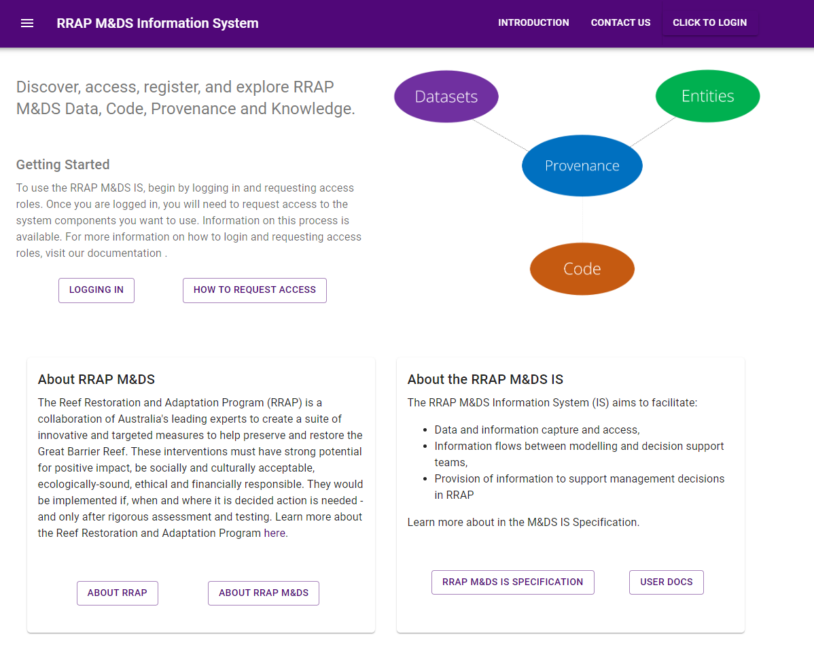
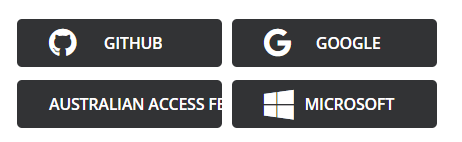
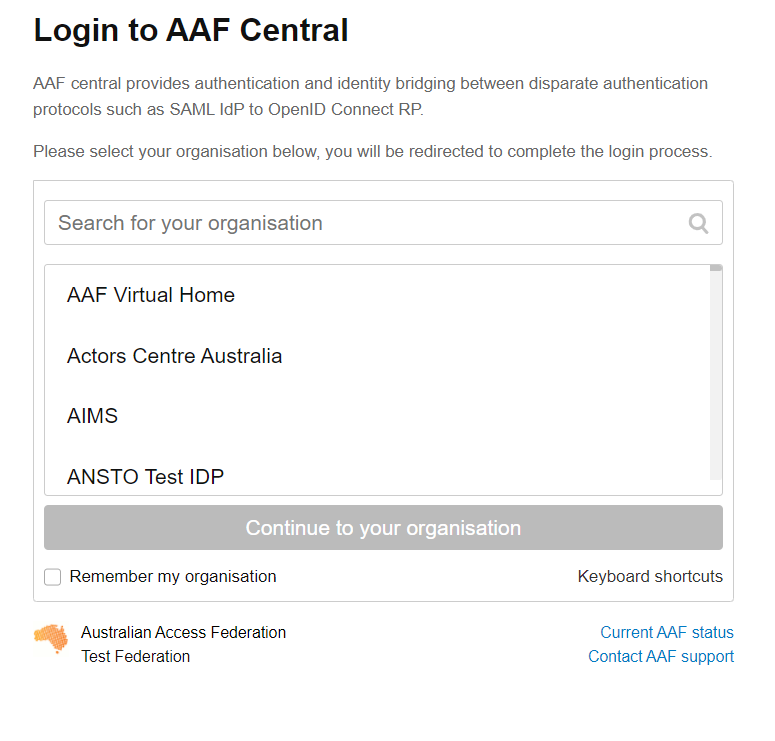

{: .no_toc }

# Logging in to M&DS IS

  

    Table of contents
  

{: .text-delta }
* TOC
{:toc}
____

## Access

The M&DS IS is a suite of applications for data and information capture and access. Two access types are required:

1. M&DS IS access
    - Access to M&DS Components, including the Entity Registry, Data Store and Provenance Store
1. AWS access
    - Access to S3 bucket (Amazon Simple Storage Service), for downloading or uploading dataset files
    - AWS Access is provided automatically through temporary credentials where required

## Accessing RRAP-M&DS Information System

To log into the RRAP M&DS Information system, click on the **Click to login** button on the top right on the home page.
**Note that your name and email address will be collected.**

|                      RRAP M&DS Information System home page                       |
| :-------------------------------------------------------------------------------: |
|  |

From here you will be able to select from a list of identity providers to log into the RRAP M&DS IS.

|                           Existing account access option                           |
| :--------------------------------------------------------------------------------: |
|  |

### (Recommended) Australian Access Federation (AAF)

Click the **Australian Access Federation** option which will take you to the AAF Central login page

|                                AAF Access dialog                                 |
| :------------------------------------------------------------------------------: |
|  |

Search and select your organisation then select **Continue to your organisation**. You will then sign in with your usual organisation credentials, you will be redirected back to RRAP M&DS IS if successful.

### GitHub

Click the **GITHUB** option which will take you to your GitHub login screen, enter your GitHub credentials and click **Sign in**. You will be redirected back to RRAP M&DS IS if successful.

### Google

Click the **Google** option which will take you to your Google login screen, enter your Google credentials and click **Sign in**. You will be redirected back to RRAP M&DS IS if successful.

### Microsoft

Click the **Microsoft** option which will take you to your Microsoft login page. You will be redirected back to RRAP M&DS IS if successful.

## Access Roles

After signing in for the first time you will need to request access to appropriate roles. To perform this task please see [Requesting Access](requesting-access-is.md#user-roles){:target="\_blank"}.
