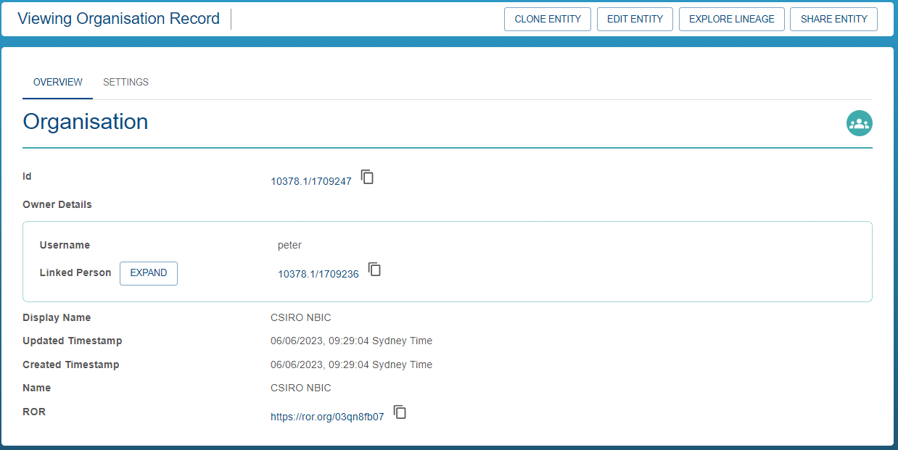
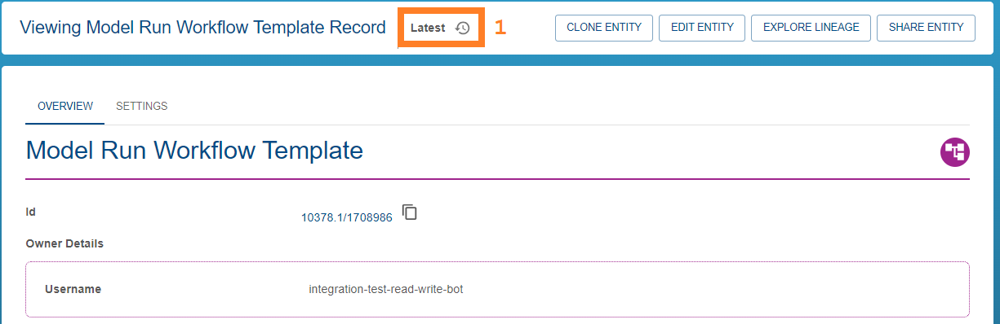
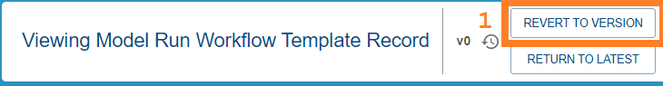
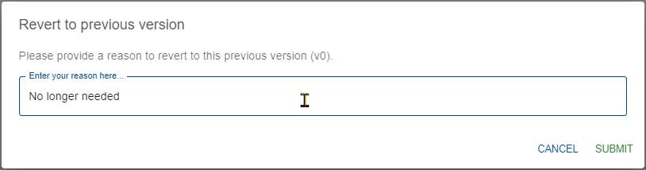

{: .no_toc }

  

    Table of contents
  

{: .text-delta }
* TOC
{:toc}
____

# Item History

When registry items are updated (see [updating entities](./registering_and_updating#updating-an-entity)), a reason is provided by the user and the change made at that time is recorded.

This enables users with metadata read permission for the registry entry (see [access control](./access-control) for more info) to view not only the latest iteration of the registry entry, but also previous versions.

When [exploring the registry](./exploring_the_registry) and [viewing an item's details](./exploring_the_registry#viewing-records), if an item has previous iterations, you can view them and revert to them (if you have permission). This process is described in the sections below.

## Which registry items have history?

Only items which have been modified at least once will display history controls.

For example, the following item has no previous version:

|                                      No Versions                                       |
| :------------------------------------------------------------------------------------: |
|  |

Where as the item below does:

|                                      Previous Versions                                       |
| :------------------------------------------------------------------------------------------: |
|  |

## Viewing previous versions

### Required Permissions

-   Registry Read (general user permission)
-   Metadata Read (item specific permission)

### Process

If the item has previous versions (see [above](#which-registry-items-have-history)), then you can use the history control tool to view the previous versions. Click the history button (1) to open the version selector:

|                                     History Button                                      |
| :-------------------------------------------------------------------------------------: |
|  |

This will open a dialog which allows you to select a previous item version.

|                                      Version Selector                                       |
| :-----------------------------------------------------------------------------------------: |
|  |

-   (1) Is a unique identifier for this historical version of the item - you may find this useful when referring to previous versions of a registry item - for the most part you can ignore this value
-   (2) The date and time at which this update was performed
-   (3) The username of the IS user who performed this update
-   (4) The reason provided by the user as to why the update was performed

Note that the version currently being displayed is highlighted **bold** (5). The first entry in the list is the latest/current version.

To view the metadata of a previous version, select it in the list (1) and click submit (2):

|                                      Change Version                                       |
| :---------------------------------------------------------------------------------------: |
|  |

When submitted, you will be returned to the item detail view, with the details matching the previous iteration of the record.

You will notice that the history control tool will have changed. It can look slightly different depending on your permissions for this item.

If you **cannot edit the item**, you will see the following options:

|                              History Tool No Edit Permission                               |
| :----------------------------------------------------------------------------------------: |
|  |

If you **have permission to edit the item** you will see the following options:

|                                  History Tool With Edit Permission                                  |
| :-------------------------------------------------------------------------------------------------: |
|  |

The _revert to version_ option is covered in the [section below](#reverting-to-previous-versions). The _return to latest_ button simply restores your record view to the latest version.

## Reverting to previous versions

### Required Permissions

-   Registry Write (general user permission)
-   Metadata Write (item specific permission)

### Process

After changing to a different historical version of an item (see [above](#viewing-previous-versions)), if you have the appropriate permissions for the item, you will see the _revert to version_ button (1)

|                                      Revert to version button                                       |
| :-------------------------------------------------------------------------------------------------: |
|  |

Clicking this button will show a dialogue which prompts you for a reason (1). This reason should justify why this revert operation was necessary, explaining the change for future users. When you are happy with the reason provided, click submit (2).

|                                      Revert version dialog                                       |
| :----------------------------------------------------------------------------------------------: |
|  |

Once the update is complete, you will be returned to the detailed item view at the new latest version. You can see in the item history that a new version is created which includes your provided reason:

|                                      New Version                                       |
| :------------------------------------------------------------------------------------: |
|  |

### Exceptions

Some registry item types either don't have history enabled, or require modifying the item history from a different website.

-   **Datasets** - datasets do have history enabled, but you need to perform any updates or reversions from the [data store](../../data-store/index). If you try to revert a dataset from the registry, a dialog will appear which provides a link to that version of the dataset in the data store.

|                                    Reverting a dataset                                    |
| :---------------------------------------------------------------------------------------: |
|  |

-   **Model Runs** - model runs currently cannot be updated and therefore do not have any history. Consequently, you cannot revert to a previous version of a model run.
