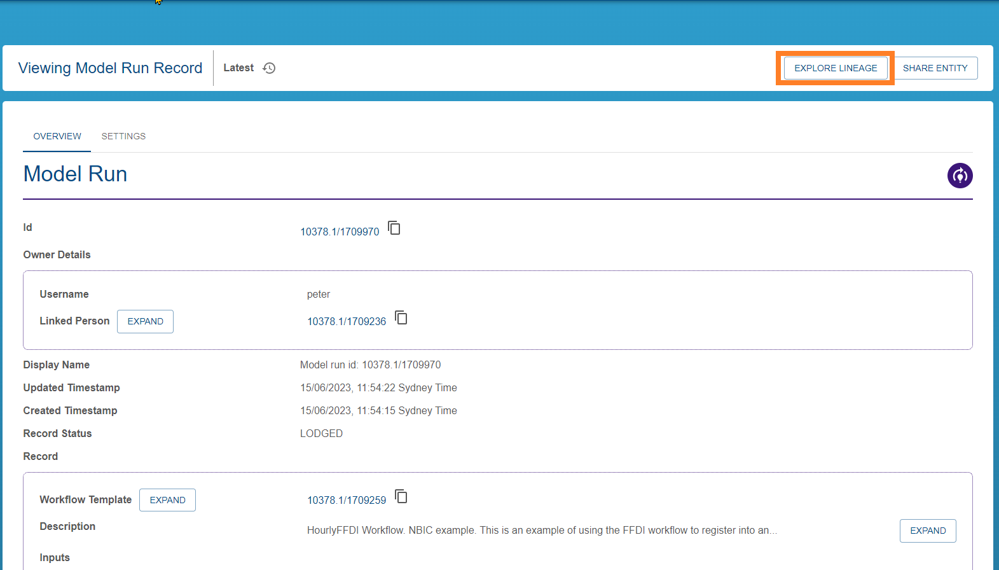

{: .no_toc }

# Discovering Records

  

    Table of contents
  

{: .text-delta }
* TOC
{:toc}
____

## Finding records

To explore the lineage of records in the [registry](../../registry/overview), the record must first be discovered.

There are two methods to discover explorable records:

1. Receive a shared link to an existing record - see [sharing an entity](../../registry/sharing_an_entity). Clicking a shared link will bring you to the registry view of the item. For example: 
2. Use the [registry](../../registry/overview) to list, filter and search for registered entities. See [exploring the registry](../../registry/exploring_the_registry) for more information.

### Finding model run records

[Registered model run records](../registering-model-runs/index) records are good candidates for provenance exploration as they are complex collections of connected entities. They may form a good starting point if you would like to explore provenance.

To discover model run records - visit the [registry](../../registry/overview), [explore the records](../../registry/exploring_the_registry), [filtering](../../registry/exploring_the_registry#listing-sorting-and-filtering-entities) by "Model Run".

## Exploring record lineage in the Provenance Store

Once you have reached the registry landing page for the registered item, you can view and explore the provenance graph by selecting "Explore Lineage". This will redirect you to the provenance store exploring lineage view, starting at the specified item. For guidance in how to explore the lineage graph, see [exploring record lineage](./exploring-record-lineage).

|                                        Moving to the Provenance Store                                        |
| :----------------------------------------------------------------------------------------------------------: |
|  |
