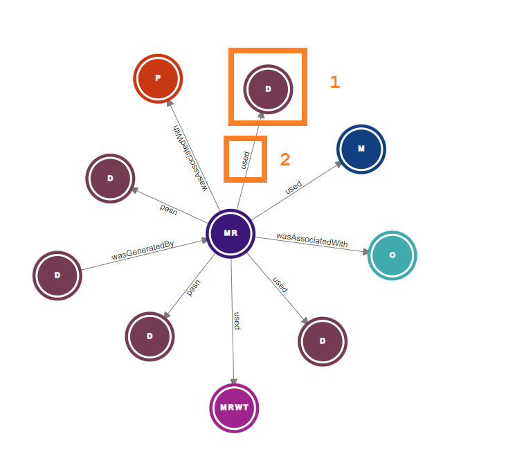
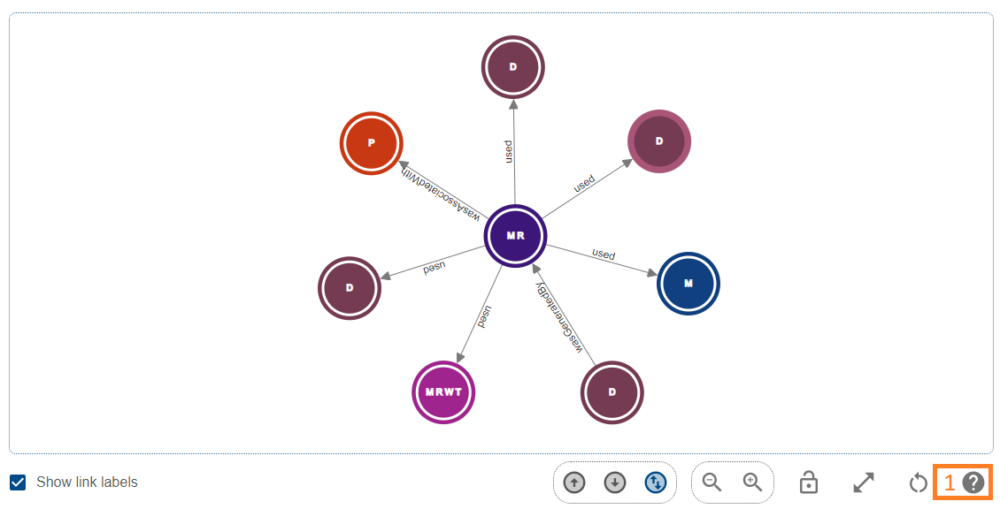
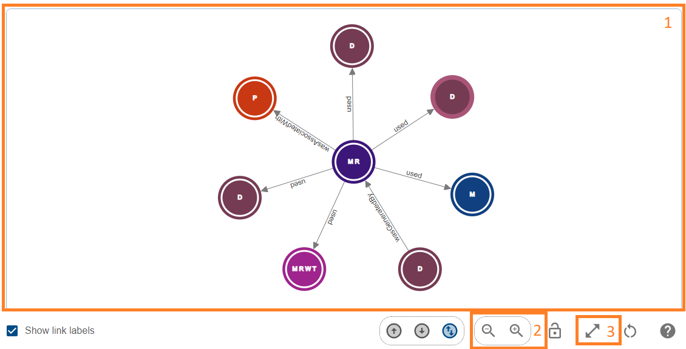
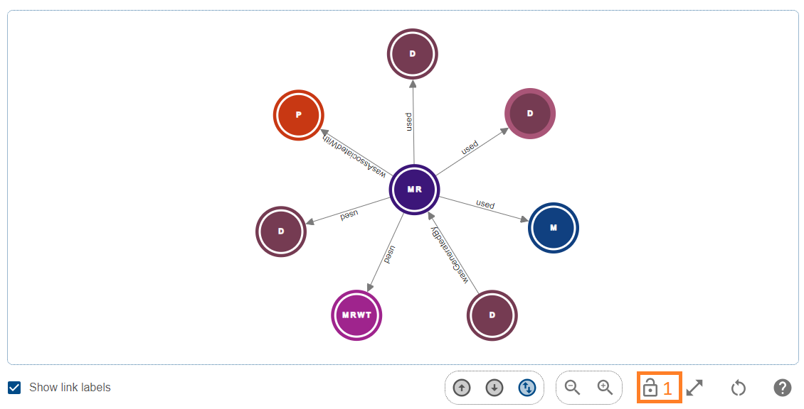
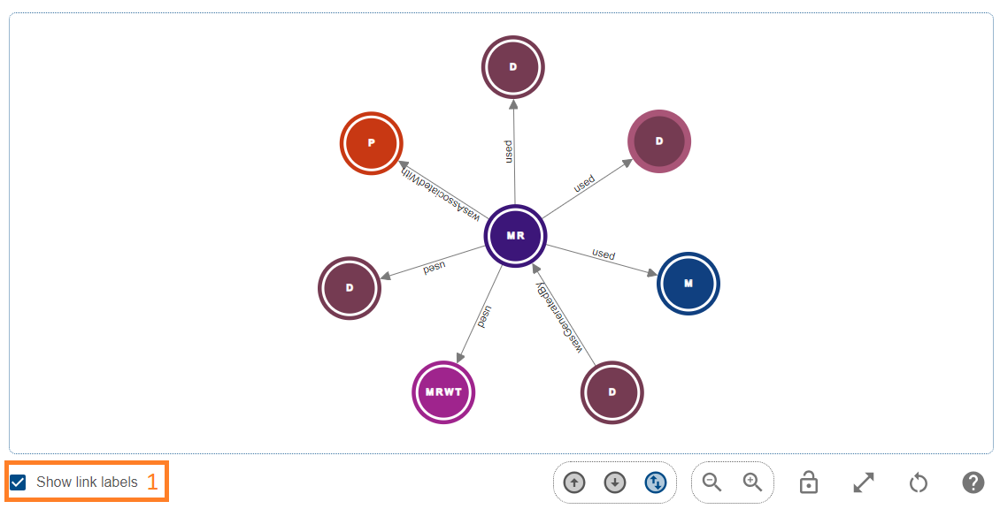
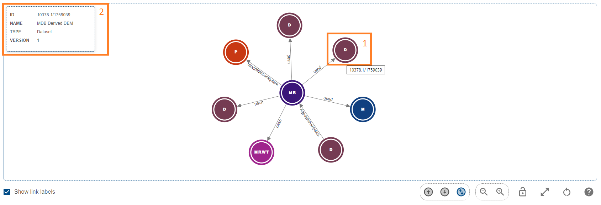
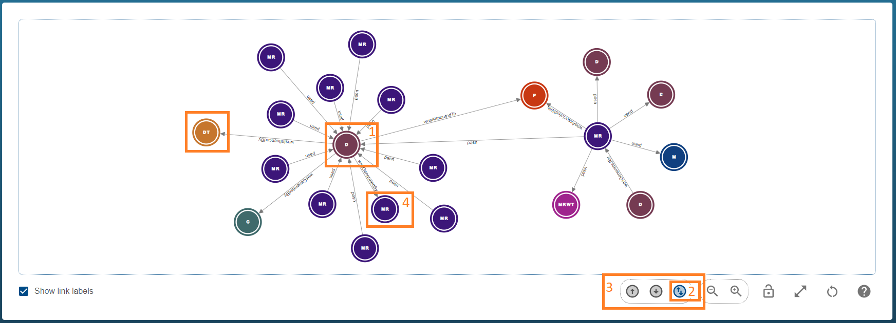
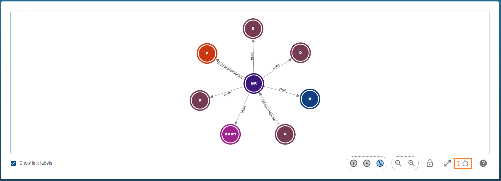
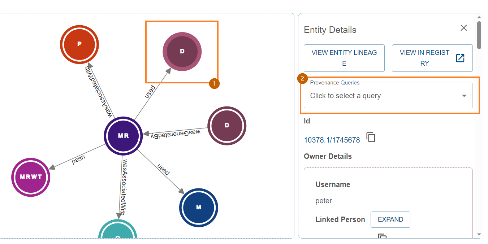

{: .no_toc }

# Exploring Record Lineage

  

    Table of contents
  

{: .text-delta }
* TOC
{:toc}
____

Once you have [discovered a record](./discovering-records), you can use the provenance store's graph explorer to visualise, traverse and interrogate the lineage of the record.

This page will provide conceptual and practical advice on how to use this tool.

The sections are outlined below

-   [What is the provenance graph](#what-is-the-provenance-graph) - explains what a Provena provenance graph is
-   [Understanding the provenance graph explorer](#understanding-the-provenance-graph-explorer) - provides an overview of the provenance graph explorer tool - showing the components of the tool, the page layout, and basic controls
-   [Interacting with the provenance graph](#interacting-with-and-traversing-the-provenance-graph) - provides a more detailed view of how to interact with the graph and it's elements, including exploring and traversing
-   [Common issues and FAQ](#common-issues-and-faq) - provides examples of where things can go wrong, what common errors mean, and other FAQs

# What is the provenance graph

In Provena, authorised users can register records in the [Registry](../registry/overview). Users can register [Model Runs](../registering-model-runs/registration-process/overview) which connect various registered entities - representing an activity, performed at a point in time, which possibly consumes inputs and produces (or contributes to) outputs. The collection of this chain of activities collectively forms [workflow provenance](../overview/what-is-provenance).

In the Provena, users can explore an interactive visualisation of registered provenance. The connections between registered entities are represented as links between nodes in a graph. In the image of a provenance graph below, a node (1) represents an item registered in the Registry. The directional link between nodes (2) represents a connection in the underlying provenance data. The connection is labelled (2) - this label describes the type of relationship between the registered entities.

|                                         Parts of the graph                                         |
| :------------------------------------------------------------------------------------------------: |
|  |

## Provenance relationships

The names and meanings of the relationships are described below:

-   A - **used** -> B - The "used" relationship means that the activity A consumed, referenced or relied on the resource B. For example, a model run 'uses' input datasets.
-   A - **wasGeneratedBy** -> B - The "wasGeneratedBy" relationship means that the entity A exists because of the activity B. For example, a model run produces output datasets.
-   A - **wasAssociatedWith** -> B - The "wasAssociatedWith" relationship means that the activity A was associated with an agent B. An agent refers to a participant or actor in a process (e.g. a Person or Organisation). Association could imply attribution or responsibility. For example, a model run is associated with a Person and, optionally, an Organisation.
-   A - **wasAttributedTo** -> B - The "wasAttributedTo" relationship means that the entity A exists because of the activities associated with the agent B. For example, a dataset produced as an output of a model run is attributed to the Person which ran the model.
-   A - **wasInfluencedBy** -> B - The "wasInfluencedBy" relationship means that the entity A was significantly informed by, or possibly exists because of, B. For example, a dataset in a model run must satisfy a dataset template - we say that the dataset 'wasInfluencedBy' the dataset template.
-   A - **hadMember** -> B - The "hadMember" relationship means that the entity A is composed, at least in part, of B. For example, we say that a model run workflow template has a dataset template as a member.

For more detailed information about the meaning of these relationships, see [the PROV Ontology](https://www.w3.org/TR/prov-o/).

# Understanding the provenance graph explorer

The provenance graph explorer interactively visualises the provenance graph, as described above. In this section we will provide an overview of the parts of the explorer.

The explorer is composed of two sections - the top and bottom.

## The top section

The top section of the provenance explorer tool (shown below) provides detailed information about the "Root Record" (1), as well as a Legend (2) for the graph. The "Root Record Details" panel can be scrolled if all details are not visible. If you would like more information about a particular type of registered item, you can click the Legend entry (3) which links to the documentation of that type.

|                                        Overview of the top section                                        |
| :-------------------------------------------------------------------------------------------------------: |
|  |

The **root record** is the "starting point" of the exploration - the central node in the provenance graph. Later, we will see [how to change the root node](#understanding-and-changing-the-root-node).

## The bottom section

The bottom section of the provenance explorer tool (shown below) is the main interactive visualisation of the provenance graph.

The graph contains nodes (1) and links (2). The meaning of these nodes and links was defined [above](#provenance-relationships). The right hand panel (3) contains details about the currently selected node. If no node is currently selected, the panel will be hidden. Nodes can be selected with a single click (see the [interacting section](#interacting-with-and-traversing-the-provenance-graph) for more detailed instructions). This panel is scrollable. The graph provides a set of controls (4 and 5). These controls will be explained in the [interacting section](#interacting-with-and-traversing-the-provenance-graph) below.

|                                        Overview of the bottom section                                        |
| :----------------------------------------------------------------------------------------------------------: |
|  |

You can always come back to this page by using the help button, highlighted below (1).

|                                               Getting Help                                               |
|   :------------------------------------------------------------------------------------------------------: |
|  |

# Interacting with and traversing the provenance graph

The provenance graph explorer is an interactive visualisation with various controls. We will explore these controls in three sections.

## Controlling and navigating the graph

This section covers how to

-   [Pan, zoom and resize the graph](#panning-zooming-and-resizing)
-   [Move, lock and unlock nodes](#moving-locking-and-unlocking-nodes)
-   [Disable or enable link labels](#disabling-or-enabling-link-labels)

### Panning, zooming and resizing

To move around the graph and zoom in and out, you can use the mouse. You can only control the graph when your mouse is within the graph window, highlighted below (1).

To pan around the graph, click and drag with the left mouse button on a blank space in the graph window (1).

To zoom in and out, scroll the mouse wheel up and down, or use the zoom buttons highlighted below (2).

If you would like the graph to occupy the full height of the screen (hiding the [top section](#the-top-section)), you can click the expand icon (3), and click it to again to collapse the graph to the default view.

|                                          Panning and Zooming                                          |
| :---------------------------------------------------------------------------------------------------: |
|  |

### Moving, locking and unlocking nodes

The provenance graph automatically arranges nodes by running a physics simulation for a period of time after the initial loading of data, or when new data is loaded (see [traversing the graph](#traversing-and-exploring-the-graph)).

However, if you are not happy with the automatic layout of the nodes, you can override this by dragging nodes manually.

To drag a node, simply left click and drag on the node.

When you let go of a node, it's position will not change again. This node is considered **locked**.

To **unlock** all nodes in the graph, use the open padlock icon (1) which appears in the toolbar when at least one node is locked.

|                                           Unlocking Nodes                                           |
| :-------------------------------------------------------------------------------------------------: |
|  |

### Disabling or enabling link labels

In some cases, it might be simpler to view the connections of the graph without the [relationship](#provenance-relationships) labels. You can untick "Show link labels" (1) to change the visualisation to hide the labels. Simply tick it again to revert to the default view. In the example below, link labels have been disabled.

|                                               Link Labels                                                |
| :------------------------------------------------------------------------------------------------------: |
|  |

## Investigating and interrogating the graph

This section covers how to

-   [Understanding the visualisation](#understanding-the-visualisation)
-   [See a summary of a node by hovering](#viewing-node-summary)
-   [View the details of a node](#viewing-node-details)

### Understanding the visualisation

There are two important details shown about a node at all times:

1. The colour - the colour of a node defines it's [type](../overview/what-are-entities) (as per the Legend in the [top section](#the-top-section))
2. The acronym - each node has a short acronym in it's center which refers to the type (as per the legend)

If this information is not sufficient, you can quickly view a summary of key node details or view the full node details. Both processes are described below.

### Viewing node summary

To view a summary of a node's key details, simply hover over the node with your mouse. While the mouse remains in the node (1), a popup (2) will appear in the upper left hand corner of the graph window. This summary shows the [persistent identifier](../../digital-object-identifiers), name and type of the registry item. The summary will not appear while [nodes are being dragged](#moving-locking-and-unlocking-nodes).

|                                       Summary on mouse hover                                       |
| :------------------------------------------------------------------------------------------------: |
|  |

### Viewing node details

If the details included while hovering are insufficient, you can simply click once with the left mouse button on the node, revealing the right hand details panel (1). To collapse the panel, click the close button (2), the "View selected entity" button will be explained [below](#understanding-and-changing-the-root-node).

|                                         Viewing node details                                         |
| :--------------------------------------------------------------------------------------------------: |
|  |

## Traversing and exploring the graph

This section will provide an overview of [important terms and concepts](#important-terms-and-concepts-for-provenance-exploration) for exploring provenance as well as practical advice on how to explore the graph:

-   [Expand the graph by exploring](#expanding-the-graph-by-exploring)
-   [Reset the graph](#resetting-the-graph)
-   [Change the root node of the graph](#understanding-and-changing-the-root-node)
-   [Advanced Provenance Queries](#advanced-provenance-queries)
### Important terms and concepts for provenance exploration

For an overview of the data models which describe provenance in the system, see the [provenance overview](../overview/what-is-provenance).

There are some important concepts to understand before we discuss how to explore the graph.

**Lineage**: The lineage of a Registry Item refers to the 'upstream' and 'downstream' connections of an entity (defined below). When we refer to the 'lineage of an entity', this refers to all connections explorable starting at that node. This is a very broad description (in a highly connected graph the lineage of a resource could be enormous) - we like to refine this term into 'upstream' and 'downstream'.

**Upstream**: The upstream lineage of a Registry Item refers to the nodes which are connected to this entity when traversing in the upstream direction. The upstream direction is defined conceptually as the lineage of nodes 'contributing to', 'occurring before' or 'producing' this node. In practical terms, the upstream direction explores the [PROV-O relationships](#provenance-relationships) in the same direction as the arrow. For example, starting at a model run, and exploring the 'used' relationship 'upstream' would reveal input datasets which contributed to the existence of the model run.

**Downstream**: The downstream lineage of a Registry Item refers to the nodes which are connected to this entity when traversing in the downstream direction. The downstream direction is defined conceptually as the lineage of nodes 'resulting from', 'occurring after' or 'produced by' this node. In practical terms, the downstream direction explores the [PROV-O relationships](#provenance-relationships) in the opposite direction as the arrow. For example, starting at a model run, and exploring the 'wasGeneratedBy' relationship 'downstream' would reveal output datasets which were produced or contributed to by the model run.

**Exploration depth**: Exploration depth refers to the number of relationships traversed to reach a node from a given starting point. This could be in the upstream or downstream direction.

**Root node**: The root node of a provenance graph is simply a starting point from which we can explore connected nodes. Controlling the root node is explained [below](#understanding-and-changing-the-root-node).

**Provenance query**: The primary method of exploring and expanding the provenance graph is through 'queries'. A query is a request to explore relationships in a specified direction beginning at a specified node within a specified maximum depth.

---

In light of the above, we can explain the initial state of the graph as follows: _"Perform upstream and downstream queries of depth 1 starting at the root node, and visualise the result"_.

### Expanding the graph by exploring

To explore to a greater depth than the initial view, you can request an upstream and downstream query from a specified starting node to be merged into the existing graph.

To explore from a node, **double click the node**. A loading icon will appear in the bottom section of the graph while the upstream and downstream queries are made. This query is usually quick and the results will be merged into the existing graph. If there are no new nodes connected to the requested node, the graph will not change.

In the below _before_ and _after_ graphs, we can see that a model run record is being visualised. The record shows some input and output datasets and associations (i.e. a person and organisation). We may wish to understand the lineage of the dataset being used in this model run. To do so, we double click on it (1).

This results in the _after_ graph. We can see some highlighted new nodes. In particular, there is now a model run which produced the input dataset (2) displayed - this is a good example of upstream lineage. If you wanted to understand more about the history of the item, you could continue exploring, for example, by expanding the model run (2) with a double click.

|                                                   Before                                                    |
| :---------------------------------------------------------------------------------------------------------: |
|  |

|                                                   After                                                    |
| :--------------------------------------------------------------------------------------------------------: |
|  |

### Resetting the graph

If you would like to reset your graph to the starting view, you can use the reset button (1) below. If you have dragged nodes (and therefore locked their positions), resetting the graph will **not** unlock them. You can use the unlock button to do so. See [unlocking nodes](#moving-locking-and-unlocking-nodes).

|                                            Reset Graph                                             |
| :------------------------------------------------------------------------------------------------: |
|  |

### Understanding and changing the root node

The root node of the provenance graph explorer refers to the starting point of the graph. Being a registered entity in the [Registry](../registry/overview) means that the root node is identified by a [persistent identifier](../../digital-object-identifiers).

The root node's record details are always displayed in the [top section](#the-top-section), alongside the graph legend. If you have expand the graph, hiding the root record details, you can expand it by pressing the expand button, as detailed in [resizing the graph](#panning-zooming-and-resizing).

If you are exploring a provenance graph, observe that the URL includes the `rootId` query string e.g. `https://.../record/view?rootId=102.100.100/1234`. This means that if you share this URL, with an authorised user of the system, they will see the same starting point in their exploration.

To change the root node you can either

1. restart exploration from a different point in the registry, see [discovering records](./discovering-records#exploring-record-lineage-in-the-provenance-store) for more information, or
2. use the "View Selected Entity" button to reload the provenance graph explorer, focused on the selected node.

To use the "View Selected Entity" button, first select the node to show it's [detailed view](#viewing-node-details), then click the "View Selected Entity" button (1). This button will be disabled if the selected node is the same as the current root node.

|                                     Changing the selected root node                                      |
| :------------------------------------------------------------------------------------------------------: |
|  |

### Advanced Provenance Queries

In addition to interrogation of provenance via normal queries facilitated by the manual expansion of entities, the Provenance System supplies special querying capabilities for automatically discerning affected downstream or upstream Datasets and Agents. These special queries can explore at a greater depth, and filter by relationships and types. There are four types of special queries:

**Affected Downstream Datasets**: Expands all nodes in the downstream direction to find any affected Datasets.  
**Contributing Upstream Datasets**: Expands all nodes in the upstream direction to find any contributing Datasets.  
**Affected Downstream Agents**: Expands all nodes relationships in the downstream direction to find any affected Agents.  
**Contributing Upstream Agents**: Expands all nodes relationships in the upstream direction to find any contributing Agents.  

#### How to Perform a Special Query

These queries can be made from a starting node by single clicking and using the "Provenance Queries" drop down (which appears on the right panel) to select the desired query. For example, selecting a Dataset used as Input to a Model Run, and querying for "Contributing Upstream Datasets" will return all the upstream lineage of connected datasets that were (by definition of upstream) occuring before, or used to produce or contribute towards this input dataset. The below images illustrate how to perform this activity in the Provenance System. 

|                                       Finding the Advanced Queries                                       |
| :------------------------------------------------------------------------------------------------------: |
|         |

|                  Result from Contributing Upstream Datasets query on Model Run                           |
| :------------------------------------------------------------------------------------------------------: |
|  |

# Common issues and FAQs

## Why is there a 401 error when viewing a node's details

It is not uncommon to see the following error message when exploring the provenance graph:

|                                                Details 401 Error                                                |
| :-------------------------------------------------------------------------------------------------------------: |
|  |

This error message occurs when the provenance graph tries to retrieve the metadata of an item for which the user does not have the required permissions to view. See [controlling access](../registry/access-control) for more information about access in the registry. The graph will still allow you to [explore the record](#traversing-and-exploring-the-graph), however, you will not be able to view any details of the item beyond it's identifier and type.

If you believe the system should be granting access to an item, but isn't, try refreshing the page. If this doesn't fix it, please use the contact us form in the top panel to report an issue.

## Why do I have insufficient permissions to view entity record details

If you receive the following error message, it means the system believes you do not have the correct permissions to read from the registry. See [requesting access](../../getting-started-is/requesting-access-is) for more information.

|                                                   Insufficient Permissions                                                   |
| :--------------------------------------------------------------------------------------------------------------------------: |
|  |

If you think the error is incorrect, you should first try refreshing the page. If that doesn't fix the issue, try logging out and back in. If you still experience this issue, follow the process in [requesting access](../../getting-started-is/requesting-access-is) to request access. Otherwise, please report an issue using the Contact Us link in the top panel.

## Why is the graph display empty

An empty graph can be caused by a few issues

**There are no connections from the given starting point** - if you are trying to explore the lineage of a node which is not linked to any other entities, the following message is shown. This behaviour is expected - there is no graph to view.

|                                             Empty provenance graph                                              |
| :-------------------------------------------------------------------------------------------------------------: |
|  |

**An issue fetching or loading the graph** - if you are experiencing an empty graph without any explanation or clear error messages, try refreshing the page. If that doesn't fix the issue, try using the graph reset button [explained here](#resetting-the-graph). If neither approach fixes the issue, please use the contact us button in the top panel to report the issue. Please note the root node ID in the report.
