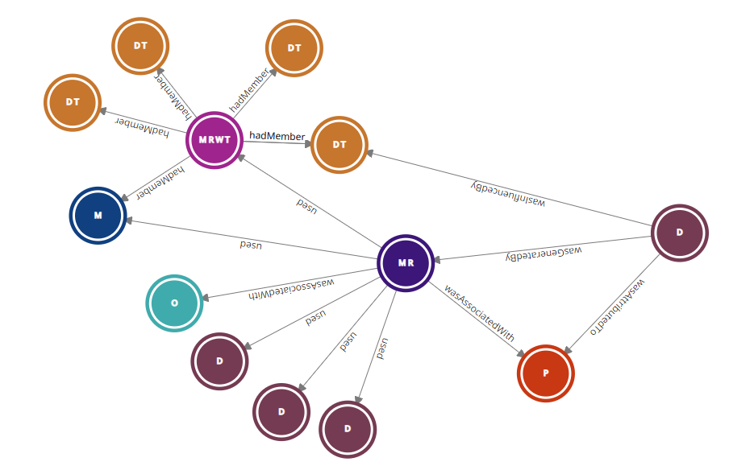
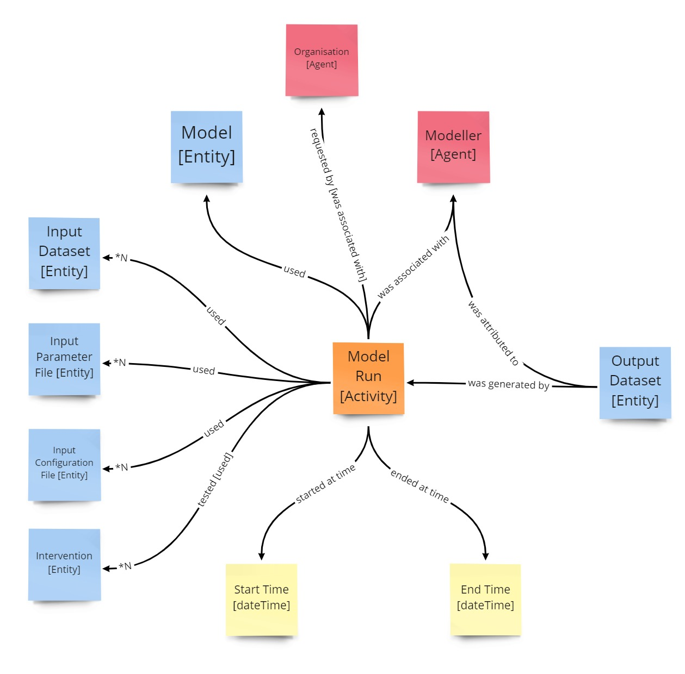

# What are entities?

## 1. Overview

In Provena, entities are things that are recorded in the Provena Registry. Registration of entities is fundamental to establishing stable provenance. It establishes a record for each entity used or generated in producing or delivering an artifact in a provenance record.

In Provena, each registered item (entity) is allocated a unique and persistent identifier (ID) upon successful registration. These IDs provide a mechanism for 2 things:

1. It allows information to be attached to each entity in a defined way
2. Entities are able to link to other entities (i.e. object cross-references rather than just text descriptions)

In addition to this, the persistent IDs for each entity in Provena is able to be hyperlinked and looked up in the IS via the web.

These registered entities can then referenced in provenance records, e.g. a provenance record about a model run references a computational model that was used, the agent or person who ran the model, a list of input datasets, and the output dataset/results. The ability to refer to entities reduces manual error and duplication of descriptions, as they can be reused and simply referred to.

Registering provenance records using cross-references to the registered entity provides the IS with the ability to create provenance graphs. Provenance graphs provide a representation of the provenance data, where nodes in the graph are entities, and links between the nodes are associations and relationships between them. An example of a provenance graph is shown below relating the Model Run record (MR) with input and output datasets (D) from that model run as well as the Agent/Person who ran it (P):

|                                   Provenance graph example                                    |
| :-------------------------------------------------------------------------------------------: |
|  |

Provenance graphs provide users with a way to explore, query and traverse lineage of entities like datasets to the parent activities and entities upstream. Provena provides tools for navigating provenance graphs.

## 2. What entity types are used in the Provena?

### 2.1. Underlying conceptual model

The underlying conceptual model for entities in Provena uses PROV-O. As depicted in the image below, 3 core concepts are defined:

-   Entity
-   Agent
-   Activity

"An entity is a physical, digital, conceptual, or other kind of thing with some fixed aspects; entities may be real or imaginary" [1]. An _Entity_ represents a thing in the world. An entity may be derived from other entities, and may be generated by an _Activity_ that used a set of entities.

An _Activity_ "is something that occurs over a period of time and acts upon or with entities; it may include consuming, processing, transforming, modifying, relocating, using, or generating entities". [1]

"An _Agent_ is something that bears some form of responsibility for an activity taking place, for the existence of an entity, or for another agent's activity [1]. This may be a person or a piece of software that is executed and associated with the activity that generates the Entity. It provides a way to attribute the activity and generation of the Entity to that agent. The _Agent_ class could be considered as a sub-class of Entity, however, for the purposes of the IS and PROV, we treat it as an Abstract type at the same level as Entity and Activity.

### 2.2. Provena Conceptual Model

In Provena, the PROV-O model is extended to enable capture of provenance information relating to model run workflows and other related information (input data, associated modellers, outputs data, modelling software/processes) (see figure below).

|                               Provenance model used in Provena using PROV-O                               |
| :----------------------------------------------------------------------------------------------------: |
|  |

The specialised types used in Provena are provided below:

| Type     | Sub-type                                                                                                          | Description                                                                                                                                                                                                                                             |
| -------- | ----------------------------------------------------------------------------------------------------------------- | ------------------------------------------------------------------------------------------------------------------------------------------------------------------------------------------------------------------------------------------------------- |
| Entity   | [Dataset Template](../registering-model-runs/model-workflow-configuration#dataset-template)                       | A defined template of a dataset and its anticipated set of resources.                                                                                                                                                                                   |
| Entity   | [Dataset](../../data-store/describing-dataset)                                                                    | Structured collection of data/files associated with a body of work.                                                                                                                                                                                     |
| Entity   | [Model Run Workflow Template](../registering-model-runs/model-workflow-configuration#model-run-workflow-template) | A defined template of a model run workflow and its associated set of input and output templates, and annotations.                                                                                                                                       |
| Agent    | [Organisation](../registering-model-runs/establishing-required-entities#organisation)                             | "An organization is a social or legal institution such as a company, society, etc." [1]                                                                                                                                                                 |
| Agent    | [Person](../registering-model-runs/establishing-required-entities#person)                                         | "Person agents are people" [1]                                                                                                                                                                                                                          |
| Activity | [Model Run](../registering-model-runs/registration-process/overview#model-run-overview)                           | A computational modelling activity that estimates, simulates and/or calculates an outcome based on a model (simplification or abstraction of a perceived real world phenomena), and defined processes and inputs (e.g. datasets, and model parameters). |

## 3. References

1. W3C, PROV-O: The PROV Ontology, [https://www.w3.org/TR/prov-o/](https://www.w3.org/TR/prov-o/)
