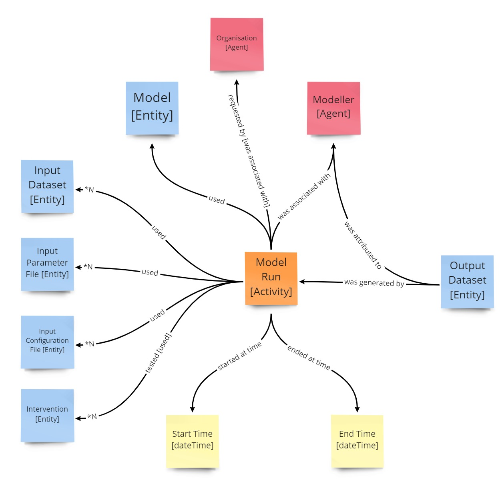

# What is provenance?

## Introduction

"Provenance refers to the sources of information, such as entities and processes, involved in producing or delivering an artifact" [1]. Entities include datasets, It records what processing and datasets were used to create this result. "Provenance answers the questions of why and how the data was produced, as well as where, when and by whom" [2]. 

In the context of modelling and producing data and information to support decisions, capturing provenance in a standardised form enables:
* Traceability and potential reproducibility of data, model runs, results, workflows and decisions
* The building of trust though explicit transparency of processes leading to decisions, and
* Analysis of workflows identifying benefits, risk and optimisation opportunities

## The Provenance Approach in Provena

To enable high-quality decisions, a key part of Provena is to capture provenance information. Provenance information is that metadata that records details of activities such as the knowledge generation activity in Provena (e.g. a model run) and respective inputs and outputs from those activities. A *Provenance Record* of the knowledge generation activity provides transparency of the activity and facilitates the option to reproduce/repeat the knowledge generation activity. Knowledge artefacts and their knowledge generation activities may need to be audited and/or reviewed during a decision-making process or a review in the future, with potential challenges to the integrity of those entities and activities. Therefore, an important capability for Provena is being able to review the knowledge generation activities, and their outputs and inputs via the provenance records of those activities.

In Provena, the [PROV-O standard, a W3C Recommendation](https://www.w3.org/TR/prov-o/), is used as a conceptual model to capture and support interchange of provenance information in heterogeneous and distributed environments like Provena. 

According to PROV-O, provenance is information about entities, activities and agents (i.e. people) involved in producing a piece of data or a thing. The PROV-O core structure describes how these components are related by defining the following four property types: wasGeneratedBy, wasAssociatedWith, wasAttributedTo and used. 

The figure below shows how Provena implements PROV-O to capture provenance information relating to model run workflows and other related information (input data, associated modellers, outputs data, modelling software/processes).

| Provenance model used in Provena using PROV-O |
|:-:|
||

See also:
* [ARDC's guide on Data Provenance](https://ardc.edu.au/resource/data-provenance/)

## Next steps

* [What are entities?](./what-are-entities.html)
* [Exploring provenance](../exploring-provenance/) 

## References

1. W3C, [What is Provenance](https://www.w3.org/2005/Incubator/prov/wiki/What_Is_Provenance), Sourced from  (Accessed 22 November 2022)
2. ARDC, [Data Provenance](https://ardc.edu.au/resource/data-provenance/), [https://ardc.edu.au/resource/data-provenance/](https://ardc.edu.au/resource/data-provenance/) (Accessed 22 November 2022)
 