{: .no_toc }

  

    Table of contents
  

{: .text-delta }
* TOC
{:toc}
____

# Editing model runs

During the registration of model runs, it is possible that an error was made, such as

- incorrect attribution of the model run
- not including important associations such as with Studies or Organisations
- including unwanted or incorrect associations
- incorrect or missing metadata

For this reason, Provena includes the ability to edit existing model run records.

<td>{% include warning.html content="The ability to edit existing model run records introduces a risk: updated provenance may invalidate effected downstream consumers. For example, say your model run claims to produce 'Dataset A', then a downstream modeller links to this dataset that was produced as an input in their model run. You then update your model run to instead produce 'Dataset B'; the downstream modeller is now referencing an 'orphaned' dataset. For this reason, we advice minimising the editing of provenance records, particularly structural changes such as changing links to datasets or other connected entities."%}</td>

## How to edit an existing model run record

Editing an existing model run record is a simple process which can be performed using the user interface.

If you would like to perform bulk updates, we would recommend using the [API](../../API-access/overview) or the [Provena Python Client](https://github.com/provena/provena-python-client).

## Prerequisites

To update a model run record, you must have the appropriate 'metadata-write' access to this record. If you are the owner of this record, you will have sufficient access. If the record is someone else's they will need to have shared it with you. To understand more about access, see [here](../../registry/access-control).

## Identify your model run record

To get started, you'll need to identify which model run record you would like to edit. If you know the [identifier](../../digital-object-identifiers) of your record, you can note this down and use it directly. If you know the name of the model run record, you can move on to the next step and use this as a search term. Otherwise, you will need to [explore the registry to find your model run record](../exploring-provenance/discovering-records).

## Navigate to the edit model run record tool

Visit the Provenance Store by navigating to the landing page of your Provena deployment, then using the hamburger menu (1) in the top left to navigate to the Provenance Store (2).

|                                       Getting to the Prov Store                                        |
| :----------------------------------------------------------------------------------------------------: |
| 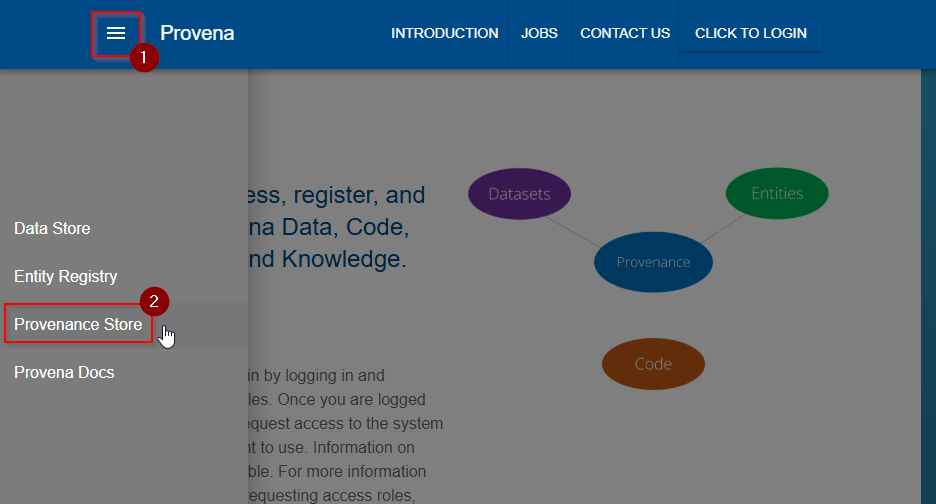 |

Then navigate to the Registration Tools (1) (after which you may be prompted to [sign in](../../getting-started-is/logging-in)), then to the 'Update model run' tool (2).

|                                       Finding the update tool                                        |
| :--------------------------------------------------------------------------------------------------: |
| 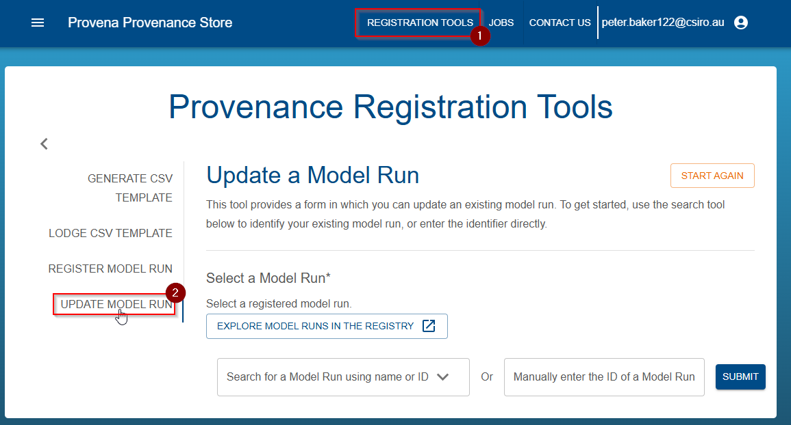 |

## Select your model run record

You will now see the "Select a Model Run" tool. You can select a model run using two approaches - you can search for a model run or enter it's identifier directly. These methods are described in the following two sections.

### Search for your model run

If you do not know the identifier, but you know other identifying words in the Model Run such as it's name, or description, you can enter search terms in to the Search Box (1), selecting a suitable result (2) when it appears.

|                                    Searching for a model run                                    |
| :---------------------------------------------------------------------------------------------: |
| 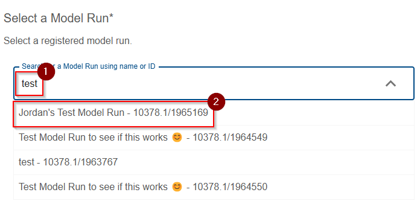 |

After selecting the model run, you should see a green tick indicating success, as shown below.

|                                       Successful selection                                       |
| :----------------------------------------------------------------------------------------------: |
| 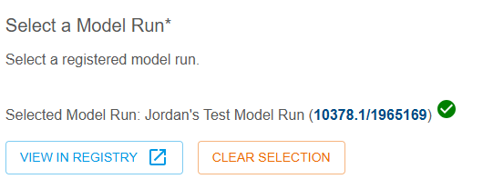 |

### Enter an identifier for the model run

If, instead, you know the [identifier](../../digital-object-identifiers) of your record, you can enter it directly into the manual entry input box (1) then hit submit (2).

|                                   Direct entry of identifier                                    |
| :---------------------------------------------------------------------------------------------: |
| 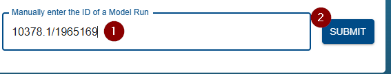 |

After selecting the model run, you should see a green tick indicating success, as shown below.

|                                       Successful selection                                       |
| :----------------------------------------------------------------------------------------------: |
|  |

## Provide a reason for the change

Once you have selected a record, you will need to provide a reason for this change in the resulting input box below the selection tool.

Enter a reason into the box (1), then proceed to the next step.

|                                       Providing a reason                                        |
| :---------------------------------------------------------------------------------------------: |
| 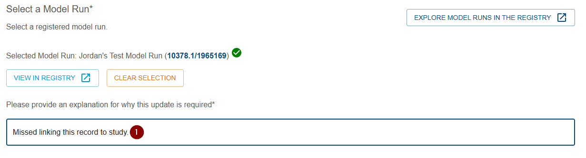 |

## Edit details using the form

The primary step in updating a model run is to use the provided form to update the model run's details.

The fields and tools will be familiar to you as a user of the [Registry](../../registry/overview), however, below are included some common examples of updates you might undertake.

### Adding, removing or changing a study link

The following section of the form is the Study selection tool.

|                                           Study select tool                                            |
| :----------------------------------------------------------------------------------------------------: |
| 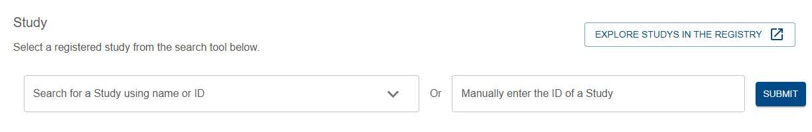 |

It follows the same principles as the Model Run selection tool previously shown, except it selects from Studies.

If you would like to add a selection, then simply enter the search term and choose the result or enter the ID, and submit.

If you would like to remove a section, click the 'Clear Selection' button.

If you would like to change the selection, click the 'Clear Selection' button, then select a new Study.

### Adding, removing or changing a Modeller or Organisation association

The following section of the form is where you specify associations for this model run record.

|                                       Associations select tool                                        |
| :---------------------------------------------------------------------------------------------------: |
| 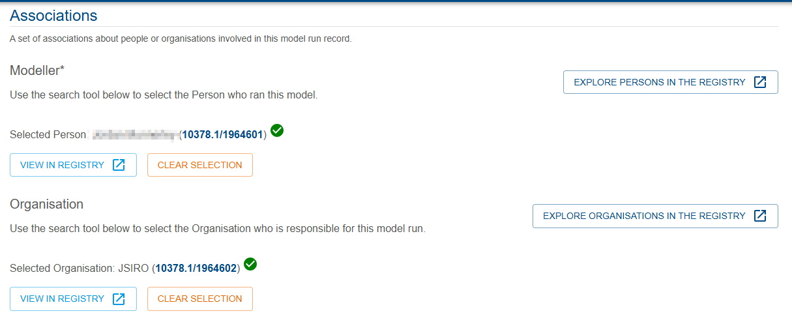 |

You can add, remove, or modify, these associations in the same manner as Studies above.

<td></td>

### Adding or changing model run annotations

Model runs can have optional or required annotations included. If you would like to edit these annotations, use the annotations tool at the bottom of the form.

To include or exclude annotations altogether, use (1).

To update an annotation, use (2) and (3) to select the key and value respectively.

To remove an annotation, use the minus button (4).

To add an annotation, use the plus button (5).

When completed, ensure all annotations have a complete key and value field.

|                                           Annotations tool                                           |
| :--------------------------------------------------------------------------------------------------: |
| 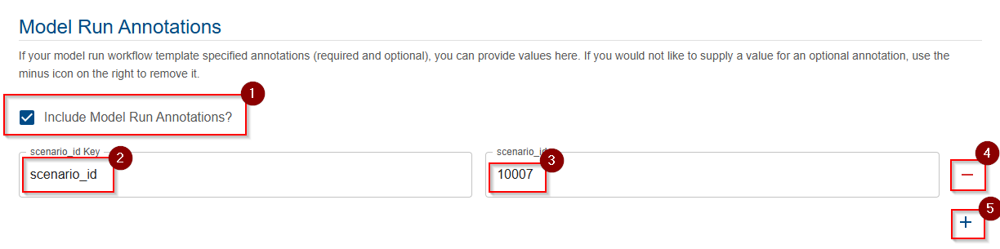 |

## Submit your change and await results

When you have finished editing your model run record, press the Submit button at the end of the form. This will submit a job to the [job system](../../getting-started-is/jobs) which will perform the provenance update. In the meantime, you can view the status of the task in the panel which appears.

If you see this failed status alert, this is because the job is not yet available, just press blue refresh button in the top right of the error message, and this will typically resolve.

|                                             Failed status                                              |
| :----------------------------------------------------------------------------------------------------: |
| 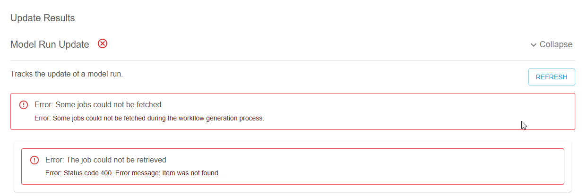 |

Once the job is visible, it will have a pending status, meaning it is awaiting a worker to complete it.

|                                             Pending status                                              |
| :-----------------------------------------------------------------------------------------------------: |
| 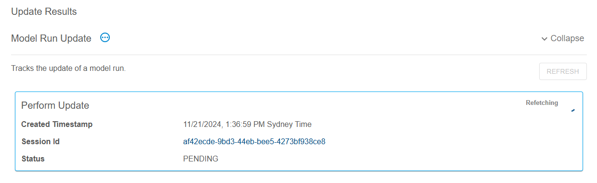 |

It will then move through the `IN_PROGRESS` stage to eventually `SUCCEEDED`. If an error occurs, you can view it by clicking on the failed job's box which will take you to the job results page.

|                                             Success status                                              |
| :-----------------------------------------------------------------------------------------------------: |
| 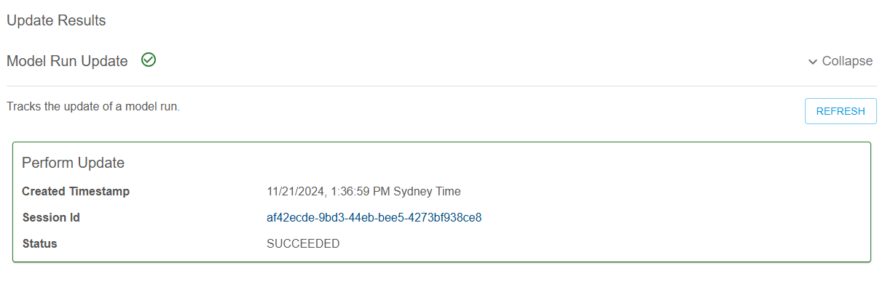 |

You can then [explore provenance](../exploring-provenance/exploring-record-lineage) to see the resulting change to your record.
