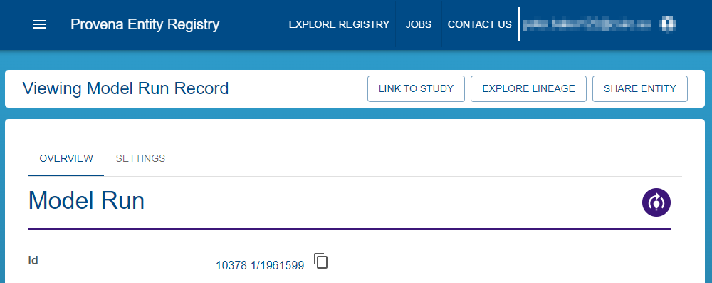
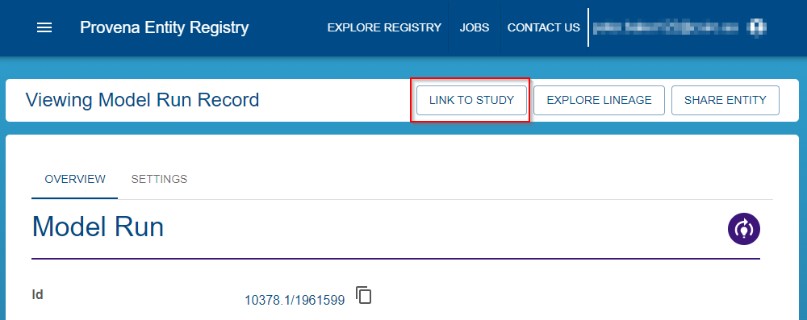
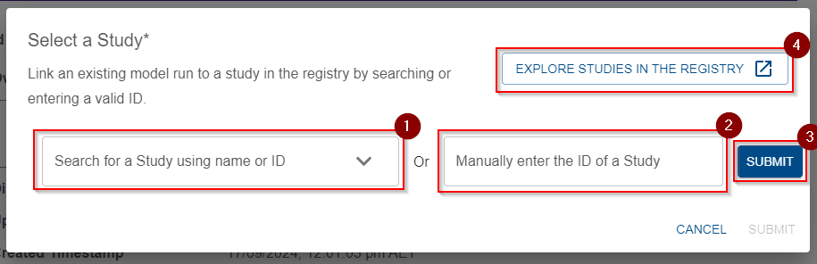
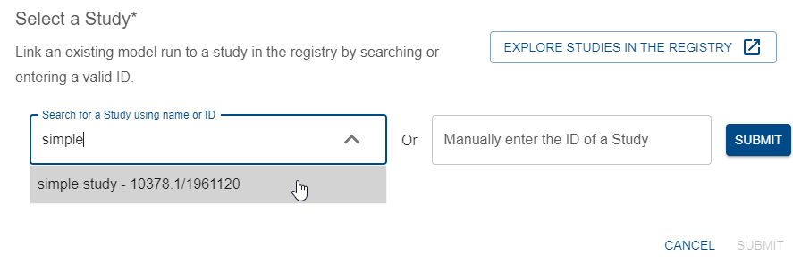
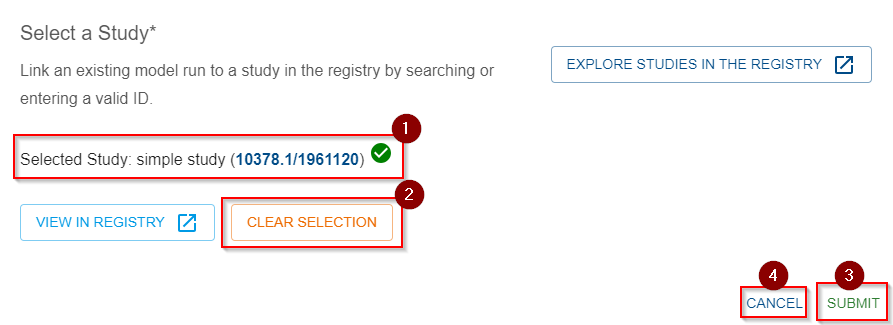
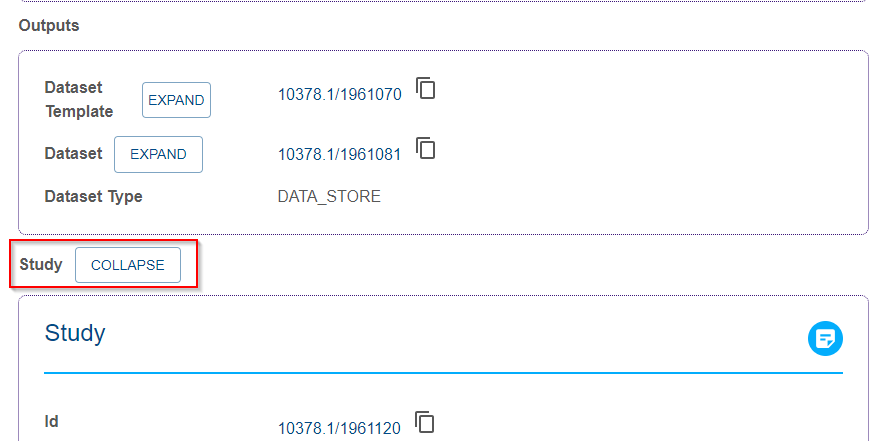

{: .no_toc }

  

    Table of contents
  

{: .text-delta }
* TOC
{:toc}
____

# Adding a study link to an existing record

Sometimes, model runs which are part of a [Study](../establishing-required-entities#study) are registered before the Study is ready, or this link is missed during registration. Provena allows you to add a link to a Study on an existing model run, as long as

- the model run is registered and available in the [Registry](../../../registry/overview)
- the model run does not already have a linked Study - this field is described in [model run fields](./overview#model-run-record-fields)
- the study to be linked is registered in the Registry and you [have permission to edit it's metadata](../../../registry/access-control)

## How to link a model run to a study

This process is quick and easy provided that the above pre-requisites are in place.

The process involves

- navigating to your model run in the Registry
- using the 'Link to study' tool

### Find your model run in the Registry

Following the instructions [here](../../exploring-provenance/discovering-records), find your existing model run in the Registry, your page should look like this:

|                                            Model run details page                                             |
| :-----------------------------------------------------------------------------------------------------------: |
|  |

### Use the 'Link to study' tool

In the below image, you will see this highlighted button.

|                                               Link button                                               |
| :-----------------------------------------------------------------------------------------------------: |
|  |

If you cannot see this button, it means that the registered model run is already linked to a Study or you do not have permission to perform this action.

Once you can see the button, click it, and you will see the following popup dialog:

|                                            Popup details                                            |
| :-------------------------------------------------------------------------------------------------: |
|  |

This dialog requests that you identify the Study you would like to link to this model run. To do so, you can search (1), or enter the [Handle ID](../../../digital-object-identifiers) of the registered Study (2). After entering the manual ID, you can submit it by pressing enter or (3). If you would like to [explore the Registry](../../../registry/exploring_the_registry) to find your study, you can use the deep link (4) which will take you to a filtered view of only Studies in the Registry.

For example, we search for a study called "Simple study", and select it from the drop down:

|                                          Search for study                                          |
| :------------------------------------------------------------------------------------------------: |
|  |

Then, you will see the following view

|                                          Confirm selection                                          |
| :-------------------------------------------------------------------------------------------------: |
|  |

The green tick (1) indicates that this selection is valid. If you would like to clear this selection, press (2). If you are ready to submit this link, hit (3). If you would like to cancel the operation, press (4).



Submission should be quick, and you will be returned to the details page, where you can see the new link:

|                                               New study link                                               |
| :--------------------------------------------------------------------------------------------------------: |
|  |

If you experience any errors, it's always worth refreshing the page and trying again, otherwise, contact your system administrator.


