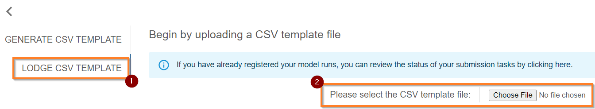
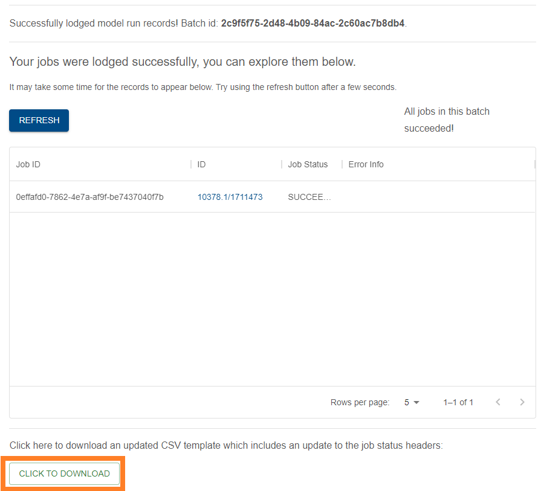

{: .no_toc }

  

    Table of contents
  

{: .text-delta }
* TOC
{:toc}
____

# Register model run records by CSV Templates

## Overview

The Provenance Store user interface facilitates the registration of provence through the filling and ingestion of CSV templates. These CSV templates are autogenerated from Model Run Workflow Template entities defined in the entity registry.

## Where to do this

There is a "Provenance Registration Tools" button located on the Provenance Store's home page. You can also select Registration Tools located on the top horizontal bar next to the Contact Us button. 

|                                               Accessing Provenance Tooling                                               |
| :----------------------------------------------------------------------------------------------------------------------: |
|  |

## How to register Provenance by CSV

### Create a CSV template (Step 1)

The first step is to obtain a CSV template. As the templates are autogenerated from Model Run Workflow Template entities in the registry, you must first register a Model Run Workflow Template entity. See [here](../model-workflow-configuration#model-run-workflow-template) for help.

### Download the CSV template (Step 2)

Upon successfully creating a Model Run Workflow Template in the entity registry, it's corresponding CSV template will automatically appear in the Provenance Registration Tool when viewing the "Generate CSV Template" side tab (1). You can search for it using its associated ID or name (2). When you have found it, select it (3), and then select "click to download" (4) located at the bottom of the tool box.

|                                                 Download CSV Template                                                 |
| :-------------------------------------------------------------------------------------------------------------------: |
|  |

### Fill in the CSV template (Step 3)

Opening the template, we see the fields to be filled in listed across the top as headers. Each row that is filled in corresponds to a single Model Run.
Fields beginning with underscores are automatically filled in by the Information System so must not be manually filled in. 

The following provides a brief description on the default fields required by the Provenance System:

**Description**: A brief description of the Model Run.

**Agent ID**: The ID of agent responsible for running the model run. This is the ID of the person/organisation in the entity registry. To obtain an ID for a person, first try [searching](../../registry/exploring_the_registry.md) for them in the registry, if they don't exist, they will need to be registered to create an ID for them. See [here](../establishing-required-entities.md#what-entities-are-required-to-register-provenance) for help on establishing the required entities and [How do I register a model run workflow template?](../../registering-model-runs/model-workflow-configuration#how-do-i-register-a-model-run-workflow-template).

**Requesting Organisation ID**: The ID of the organisation requesting the Model Run. Again, this ID refers to the ID of the organisation in the Entity Registry. To obtain an ID for an organisation, try [searching](../../registry/exploring_the_registry.md) for them first, if they don't exist, they will need to be registered to create an ID for them See [here](../establishing-required-entities.md#what-entities-are-required-to-register-provenance) for help on establishing the required entities and [How do I register a model run workflow template?](../../registering-model-runs/model-workflow-configuration#how-do-i-register-a-model-run-workflow-template).

**Execution Start/End Time**: The respective start and end time of the model run execution.

The format for these a profile of ISO8601 (called RFC 3339) in which a space is optionally allowed to separate the date and time instead of a "T". Additionally, the IS will also accept "/" in the date section, and will allow for the timezone and seconds to be omitted. If the timezone is omitted, UTC will be assumed by the system. If seconds, are omitted, the IS will record 00 for this value. E.g. inputting 2022-11-28 12:23 will go be assumed to equal 2022-11-28 12:23:00+00:00.

Some example formats (for which a 'T' can also be used to separate the date and time):
- YYYY-MM-DD HH:MM:SS+HH:MM
- YYYY/MM/DD HH:MM:SS+HH:MM
- YYYY-MM-DD HH:MM:SS
- YYYY/MM/DD HH:MM:SS
- YYYY-MM-DD HH:MM
- YYYY/MM/DD HH:MM

**Dataset ID for Template XXXXX.X/XXXXXXX**: This refers to the ID of the Dataset being used to fill the template. This requires output datasets to be registered in the datastore to obtain an ID for them.  See [registering a dataset](../../../data-store/registering-a-dataset) for help.

**Annotations**: A collection of required or optional annotation keys provided at model run time. See [model workflow configuration](../../registering-model-runs/model-workflow-configuration#model-run-workflow-template) for more info.

**Resources**: This refers to the path to the resource from within the dataset. E.g., "data/connectivity/file.txt". Please see [How do I register a dataset template?](../../registering-model-runs/model-workflow-configuration#how-do-i-register-a-dataset-template) for information on resources. 

### Uploading the CSV (Step 4)

Once you have filled in at least one row of the dataset template (corresponding to a single run) you can upload this to the provenance store to "lodge" the run and register its provenance.

In the Provenance Registration Tools window, select the Lodge CSV Template (1) from the left side panel.
Select "Choose file" (2) to select the file to upload. Click upload (3) if you're happy with your selection, or Reset (4) if not. Click upload (3) and observe the number of new and existing records detected in the CSV (5). To finalise the upload, press "submit" (6) and the CSV will be lodged and the IS will begin to process the records.

|                                            Upload CSV Template (1-2)                                             |
| :--------------------------------------------------------------------------------------------------------------: |
|  |

|                                            Upload CSV Template (3-4)                                             |
| :--------------------------------------------------------------------------------------------------------------: |
|  |

|                                                Upload CSV Template (5-6)                                                 |
| :----------------------------------------------------------------------------------------------------------------------: |
|  |

### Confirming Success (Step 5)

Upon upload, you will be taken to the following screen where a batch ID (1) is provided for this upload. Press refresh (2) to get a live update of the provenance system processing your model runs. There will be a job ID (3) for each new model run (row) in the CSV template you uploaded, and each newly recorded Model Run is generated a unique ID (4). You can view the Job Status (5) and Error information (6) if any errors occurred during the process.

|                                                   Finishing the Upload                                                   |
| :----------------------------------------------------------------------------------------------------------------------: |
|  |

### Re-downloading to get an updated template (Step 6)



After just uploading a CSV with model runs, re-download it using the button below the list of its jobs. This is to obtain the template updated with the job ID's of recorded runs so they are not duplicated in future submissions. You can also re-download it using [Step 2](#download-the-csv-template-step-2) or using the Job History view (see below).

|                                Re-downloading a lodged Template for future additions                                 |
| :------------------------------------------------------------------------------------------------------------------: |
|  |

### Viewing Job History (Step 7)

The Job History Side tab (1) allows you to view your history of using the CSV ingestion tooling to register provenance records.

Evident is the batch ID, time stamp, and a Job Count (2). Job count represents the number of records that were created in that batch. Search (3) and select an entry to explore it and its contents in more detail. This will also allow you to download the template used for a particular batch of runs as well as view the status of the registration of its records.

|                                                  Viewing Job History                                                  |
| :-------------------------------------------------------------------------------------------------------------------: |
|  |

|                                         Downloading the template used by a previous job                                         |
| :-----------------------------------------------------------------------------------------------------------------------------: |
|  |

