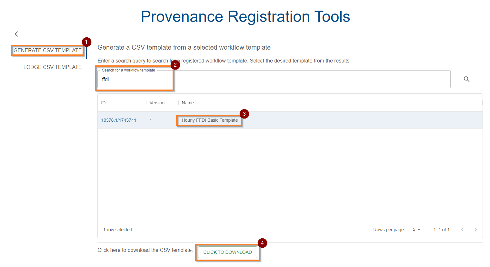
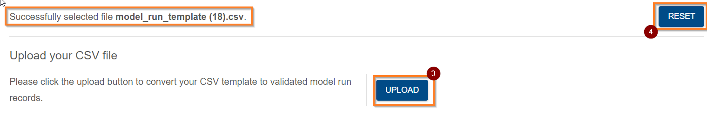
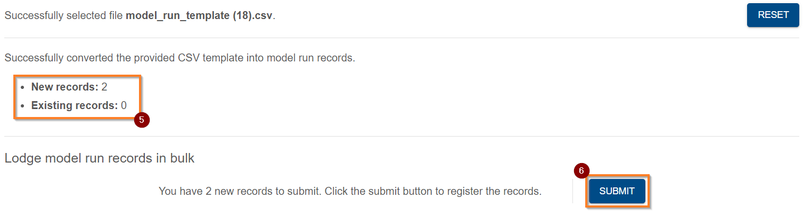
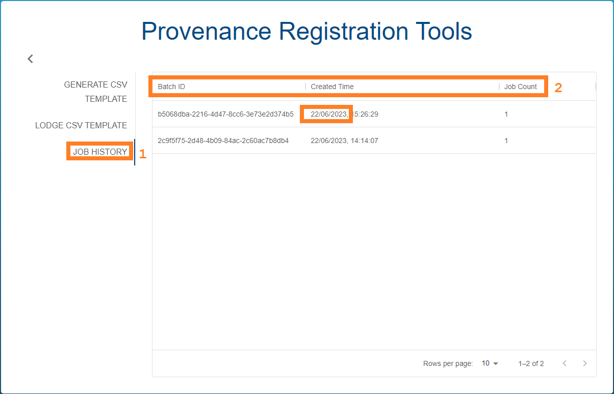

{: .no_toc }

  

    Table of contents
  

{: .text-delta }
* TOC
{:toc}
____

# Register model run records by CSV Templates

## Overview

The Provenance Store user interface facilitates the registration of provenance through the generation and ingestion of CSV templates. These CSV templates are autogenerated from a [Model Run Workflow Template](../model-workflow-configuration#model-run-workflow-template) defined in the entity registry.

## Prerequisites

### System Permission

To register model run records in the [Registry](../../../registry/overview), you must have Registry Write permission - see [requesting access](../../../getting-started-is/requesting-access-is) for more information.

## Reaching the Provenance Registration Tools

There is a "Provenance Registration Tools" button located on the Provenance Store's home page. You can also select Registration Tools located on the top horizontal bar next to the Contact Us button.

|                                             Accessing Provenance Tooling                                              |
| :-------------------------------------------------------------------------------------------------------------------: |
|  |

## How to register Provenance by CSV

### Identify or register a Model Run Workflow Template (Step 1)

The first step is to generate a CSV template. As the CSV templates are autogenerated from Model Run Workflow Template entities in the registry, you must first register a Model Run Workflow Template entity or identify your existing template. See [here](../model-workflow-configuration#model-run-workflow-template) for help registering a Model Run Workflow Template.

### Download the CSV template (Step 2)

Upon successfully creating a Model Run Workflow Template in the entity registry, it's corresponding CSV template will be searchable in the Provenance Registration Tool's "Generate CSV Template" tab (1). You can search for it using its associated ID or name (2). When you have found it, select it (3), and then select "click to download" (4) located at the bottom of the tool box.

|                                               Download CSV Template                                                |
| :----------------------------------------------------------------------------------------------------------------: |
|  |

### Fill in the CSV template (Step 3)

Opening the template, we see the fields to be filled in listed across the top as headers. Each row that is filled in corresponds to a single Model Run.

<td></td>

The following provides a brief description on the default fields required by the Provenance System:

-   **Display Name**: This name will be displayed in the Registry and other system views. Choose a short descriptive title for this model run.

-   **Description**: A brief description of the Model Run.

-   **Agent ID**: The ID of the agent responsible for running the model run. This is the ID of the person/organisation in the entity registry. To obtain an ID for a person, first try [searching](../../../registry/exploring_the_registry) for them in the registry, if they don't exist, they will need to be registered to create an ID for them. See [here](../establishing-required-entities.md#what-entities-are-required-to-register-provenance) for help on establishing the required entities and [How do I register a model run workflow template?](../../registering-model-runs/model-workflow-configuration#how-do-i-register-a-model-run-workflow-template).

-   **Study ID**: (Optional) The ID of the [Study](../establishing-required-entities#study) which informed or necessitated this Model Run. You can leave this field blank to exclude this link.

-   **Execution Start/End Time**: The respective start and end time of the model run execution.

<td>{% include notes.html content="The format for the start and end time is a profile of ISO8601 (called RFC 3339) in which a space is optionally allowed to separate the date and time instead of a \"T\". Additionally, the IS will also accept \"/\" in the date section, and will allow for the timezone and seconds to be omitted. If the timezone is omitted, UTC will be assumed by the system. If seconds, are omitted, the IS will record 00 for this value. E.g. inputting 2022-11-28 12:23 will go be assumed to equal 2022-11-28 12:23:00+00:00.

Some example formats (for which a 'T' can also be used to separate the date and time):

<ul>
<li>YYYY-MM-DD HH:MM:SS+HH:MM</li>
<li>YYYY/MM/DD HH:MM:SS+HH:MM</li>
<li>YYYY-MM-DD HH:MM:SS</li>
<li>YYYY/MM/DD HH:MM:SS</li>
<li>YYYY-MM-DD HH:MM</li>
<li>YYYY/MM/DD HH:MM</li>
</ul>
"%}</td>

-   **Input/Output Dataset ID for Template: (display name) XXXXX.X/XXXXXXX**: This refers to the ID of the Dataset being used to fill the template. This requires input and output datasets to be registered in the datastore to obtain an ID for them. See [registering a dataset](../../../data-store/registering-a-dataset) for help.

-   **Annotation: (annotation_key)**: A collection of required or optional annotation keys provided at model run time. See [model workflow configuration](../../registering-model-runs/model-workflow-configuration#model-run-workflow-template) for more info.

-   **Input/Output Resources**: This refers to the path to the deferred resource from within the dataset. E.g., "data/connectivity/file.txt". Please see [How do I register a dataset template?](../../registering-model-runs/model-workflow-configuration#how-do-i-register-a-dataset-template) for information on resources.

### Uploading the CSV (Step 4)

Once you have filled in one or more rows of the CSV template, you can upload this to the provenance store to "lodge" the run(s) and register its provenance. Each row in the CSV corresponds to a single model run record to lodge.

In the Provenance Registration Tools window, select the Lodge CSV Template (1) from the left side panel.
Select "Choose file" (2) to select the file to upload. Click upload (3) if you're happy with your selection, or Reset (4) if not. Click upload (3) and observe the number of new and existing records detected in the CSV (5). To finalise the upload, press "submit" (6) and the CSV will be lodged and the IS will begin to process the records.

|                                           Upload CSV Template (1-2)                                           |
| :-----------------------------------------------------------------------------------------------------------: |
|  |

|                                           Upload CSV Template (3-4)                                           |
| :-----------------------------------------------------------------------------------------------------------: |
|  |

|                                               Upload CSV Template (5-6)                                               |
| :-------------------------------------------------------------------------------------------------------------------: |
|  |

### Monitoring submission (Step 5)

Upon submission, the system will lodge a [job](../../../getting-started-is/jobs). This first job, with type "MODEL_RUN_BATCH_SUBMIT" will take some time to progress through the [job lifecycle](../../../getting-started-is/jobs#understanding-the-lifecycle-of-a-job). As shown below, the status (1) of the job is automatically monitored (2).

|                                                 Model Run Batch Submit Pending                                                  |
| :-----------------------------------------------------------------------------------------------------------------------------: |
|  |

After around 30-40 seconds, you should see the status transition to SUCCEEDED (1). Each row in your uploaded CSV template will correspond to a task in the following view. You can refresh the list by clicking Refresh (2). Once a job is succeeded (3), you can click on it to get further details.

|                                                 Model Run Batch Submit Completed                                                 |
| :------------------------------------------------------------------------------------------------------------------------------: |
|  |

Clicking on a job within the batch view above, shows the detailed view below.

You can see the status (1), metadata about the job, including the session and batch IDs (2), and the input (3) and output (4). You can return to the previous view with the back button (5). If an error occurred, the FAILED status will appear in the previous list view, and the details view will show the error information.

|                                                  Model Run Job Details                                                   |
| :----------------------------------------------------------------------------------------------------------------------: |
|  |

Expanding the output (4, above), shows the following details, which includes the Model Run Record's ID (1). Clicking this ID (1) will open the Registry entry for this model run record. To collapse the output, you can click Collapse (2).

### Re-downloading to get an updated template (Step 6)



After just uploading a CSV with model runs, re-download it using the button (1) below the list of its jobs. This is to obtain the template updated with the Job ID's of recorded runs so they are not duplicated in future submissions.

|                                  Re-downloading a lodged Template for future additions                                   |
| :----------------------------------------------------------------------------------------------------------------------: |
|  |

<!--

# TODO restore this feature and subsequent docs

You can also download the updated template using the Job History view (see below).

### Viewing Job History (Step 7)

The Job History Side tab (1) allows you to view your history of using the CSV ingestion tooling to register provenance records.

Evident is the batch ID, time stamp, and a Job Count (2). Job count represents the number of records that were created in that batch.

This will also allow you to download the template used for a particular batch of runs as well as view the status of the registration of its records.

|                                                Viewing Job History                                                 |
| :----------------------------------------------------------------------------------------------------------------: |
|  |

|                                       Downloading the template used by a previous job                                        |
| :--------------------------------------------------------------------------------------------------------------------------: |
|  |

-->
