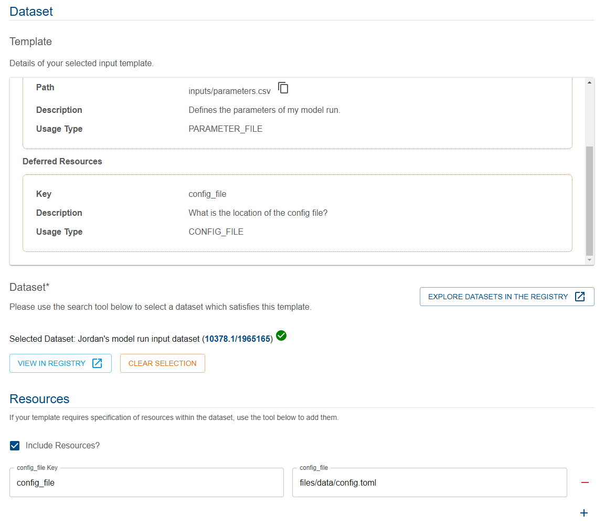

{: .no_toc }

  

    Table of contents
  

{: .text-delta }
* TOC
{:toc}
____

# Register model run records using a form

## Overview

The Provenance Store user interface facilitates the registration of provenance through the manual submission of data into a visual form. At a high level, these are the steps required to register provenance using this form

1. Select your [Model Run Workflow Template](../model-workflow-configuration#how-do-i-register-a-model-run-workflow-template)
2. Specify metadata such as descriptions, names and annotations
3. Specify associations such as people, organisations and studies
4. Specify input and output datasets which fulfil the [Dataset Templates](../model-workflow-configuration#dataset-template), including resources where required
5. Submit the job

## Prerequisites

### System Permission

To register model run records in the [Registry](../../../registry/overview), you must have Registry Write permission - see [requesting access](../../../getting-started-is/requesting-access-is) for more information.

## Reaching the Provenance Registration Tools

There is a "Provenance Registration Tools" button located on the Provenance Store's home page. You can also select Registration Tools located on the top horizontal bar next to the Contact Us button.

|                                             Accessing Provenance Tooling                                              |
| :-------------------------------------------------------------------------------------------------------------------: |
|  |

## How to register Provenance by CSV

### Identify or register a Model Run Workflow Template

The first step is to generate a CSV template. As the CSV templates are autogenerated from Model Run Workflow Template entities in the registry, you must first register a Model Run Workflow Template entity or identify your existing template. See [here](../model-workflow-configuration#model-run-workflow-template) for help registering a Model Run Workflow Template.

### Navigate to the Register tool

Move to the "Register model run" tool in the Provenance tools, as shown below.

|                                           Model run register tool                                           |
| :---------------------------------------------------------------------------------------------------------: |
|  |

### Select your template

You will now see the "Select a Workflow Template" tool. You can select a template using two approaches

**Search for your template**:

If you do not know the identifier, but you know other identifying words in the template such as it's name, you can enter search terms in to the Search Box (1), selecting a suitable result (2) when it appears.

|                                       Searching for a template                                       |
| :--------------------------------------------------------------------------------------------------: |
|  |

After selecting the template, if the selection was successful, you'll see a scrollable panel which shows the details of this template.

|                                         Successful selection                                          |
| :---------------------------------------------------------------------------------------------------: |
|  |

### Enter an identifier for the template

If, instead, you know the [identifier](../../digital-object-identifiers) of your record, you can enter it directly into the manual entry input box (1) then hit submit (2).

|                                      Direct entry of identifier                                      |
| :--------------------------------------------------------------------------------------------------: |
|  |

After selecting the template, if the selection was successful, you'll see a scrollable panel which shows the details of this template.

|                                         Successful selection                                          |
| :---------------------------------------------------------------------------------------------------: |
|  |

### Filling out model run details

Once you have selected a template, the resulting form is pre-filled with all of the information available from the template. This helps simplify the process of creating a valid model run record, however, it does mean some parts of the form work differently to other items in the [Registry](../../../registry/overview).

We'll provide a guided example below of how to fill out some typical fields in this form.

**Model run metadata**

The first fields in the form, ask you to provide some details about your model run. For more description of the intended values of those fields, see [here](./overview#model-run-record-fields).

Enter the following fields, as shown below

- **Display name** (1)
- **Description** (2)
- **Model version** (3)
- **Start/end time** - you can use the calendar icon (4) to select a specified date/time, or press (5) to indicate the current time. These times should refer to the start and end time of the modelling itself, not this registration of the modelling.

|                                              Metadata                                               |
| :-------------------------------------------------------------------------------------------------: |
|  |

**Associations**

Using search tools (similar to the tool you used to select your template in the first step), you can associate your model run with

- A **Study** (optionally)
- A **Modeller**
- An **Organisation** (optionally)

In the image below, you will see that the search tool is indicating successful selection with the green tick icon, as shown below.

|                                                Associations                                                |
| :--------------------------------------------------------------------------------------------------------: |
|  |

**Input and output datasets**

You will now specify the input and output dataset(s). You must specify one dataset which fulfils each specified input or output template in the workflow template.

To make this process easier, the form will show the details of the input/output dataset template as part of each Dataset item.

For each input/output dataset, you will see a scrollable details panel of the corresponding template (1).

The Dataset search/input tool (2) must be used to specify a dataset to fulfil this template.

If the template includes deferred resources, you must provide values (3) for each key. The keys are prepopulated. If you need more information, you can refer to the resources information in the template detail panel.

|                                                Datasets                                                |
| :----------------------------------------------------------------------------------------------------: |
|  |

A successfully filled out dataset, could look like the image below.

|                                             Completed dataset                                             |
| :-------------------------------------------------------------------------------------------------------: |
|  |

Ensure you complete **both your input and output dataset(s)**. For more information on registering datasets, see [registering a dataset](../../../data-store/registering-a-dataset).

**Model run annotations**

Model run annotations provide additional information for a model run. Optional and required annotations are specified in the template you selected. The form will prefill the _keys_ for these annotations, even if they are just optional.

You must fill out all required fields, but optional ones can be removed if you do not wish to provide a value, using the red minus icon (1).

|                                                Annotations                                                |
| :-------------------------------------------------------------------------------------------------------: |
|  |

### Submitting your completed model run

Once you have finished filling out the form fields, you can submit your model run using the Submit button in the bottom right of the form.

If you see an error like so, it may provide insights into the cause of the error

|                                                Error                                                |
| :-------------------------------------------------------------------------------------------------: |
|  |

In this case, the error is clearly stated "The provided dataset template with id 10378.1/1965150 and dataset id 10378.1/1965165 was missing deferred resource paths for the following required resource keys (config_file)..." - we didn't provide a value for the `config_file` deferred resource key, so let's add that and try again.

|                                     Adding missing config file                                      |
| :-------------------------------------------------------------------------------------------------: |
|  |

Now submit again.

If you see this error

|                                                Error status                                                |
| :--------------------------------------------------------------------------------------------------------: |
|  |

This indicates that the job is still working it's way through the system - hit the blue refresh button and you should see PENDING as the status, like so

|                                                Pending status                                                |
| :----------------------------------------------------------------------------------------------------------: |
|  |

It may take some time for the job to complete, see [job system](../../../getting-started-is/jobs) for more info.

Once complete, you will see an indication of the successful job completion:

|                                               Succeeded status                                               |
| :----------------------------------------------------------------------------------------------------------: |
|  |

Clicking on the green highlighted job will allow you to view the detailed results, including the [identifier](../../../digital-object-identifiers) of the model run record. To see this identifier, click on the output expand button (1), and you'll see the hyperlinked identifier (2).

|                                                Job output                                                |
| :------------------------------------------------------------------------------------------------------: |
|  |

To see more information, such as viewing errors in jobs, see [job system](../../../getting-started-is/jobs).

If you need to edit your model run record, see [editing model run records](../editing-model-runs).
