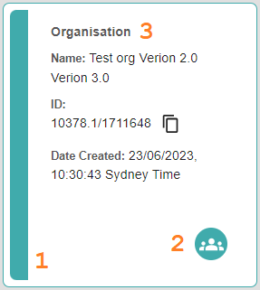
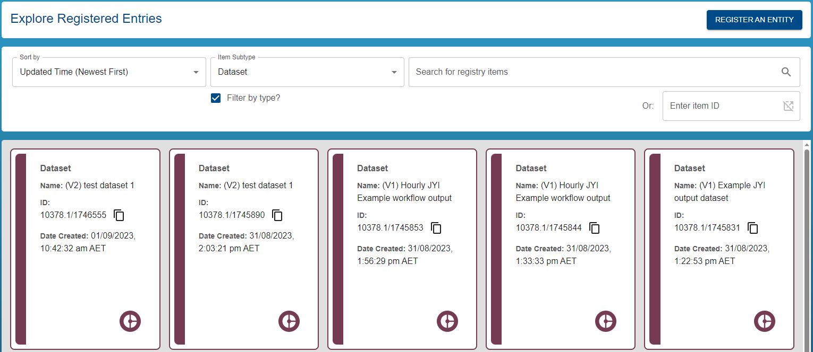
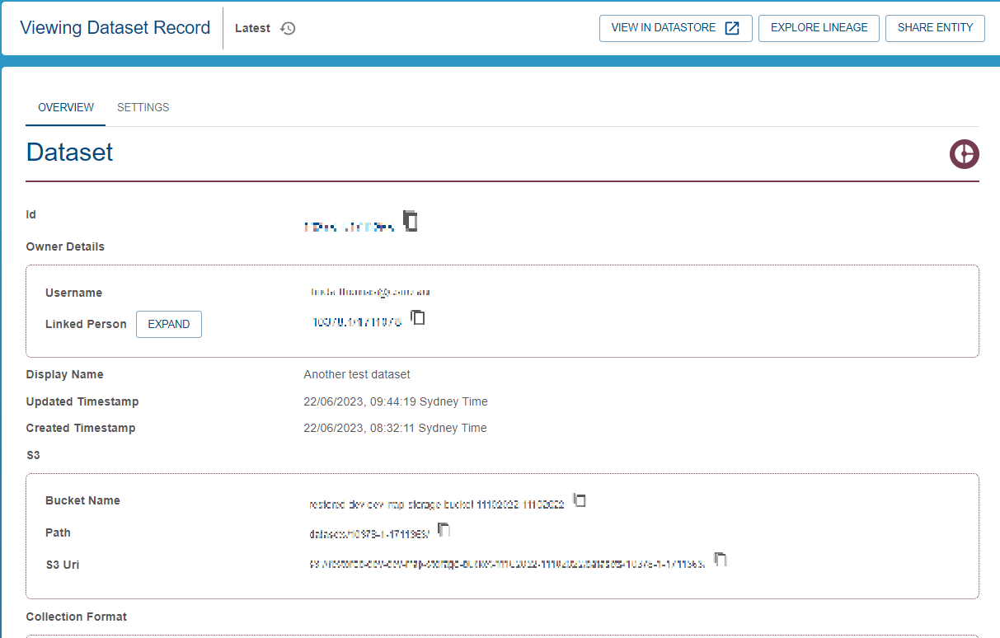

{: .no_toc }

  

    Table of contents
  

{: .text-delta }
* TOC
{:toc}
____

# Exploring the registry

## Required Permissions

-   Registry Read

## Finding records

### Listing, sorting and filtering entities

**Link**: [https://registry.mds.gbrrestoration.org/records](https://registry.mds.gbrrestoration.org/records)

This method of exploration is ideal for when you want to browse or filter a list
of registered entities. Various filtering and sorting options means you can
narrow the list to find relevant entities or get an idea of system activity.

Start by navigating to the above link. Once the registry list loads, you will see a scrollable list of entities.

Entities are distinguished in three ways. Their colour (1), icon (2) and type (3).

|                                  Record Display                                   |
| :-------------------------------------------------------------------------------: |
|  |

To view detailed information about a record, click on it's card in the grid.

You can refine the list of entities by using the sorting and filtering options. Shown below:

1. Sorting - click the dropdown and select from the sort options:
    - Created Time (Oldest First)
    - Created Time (Newest First)
    - Updated Time (Oldest First)
    - Updated Time (Newest First) (Default)
    - Display Name (A-Z)
    - Display Name (Z-A)
2. Filtering by item type - tick "Filter by type" then select the desired entity type in the dropdown above. To stop filtering by type, untick the box.

|                                 Sorting and filtering                                 |
| :-----------------------------------------------------------------------------------: |
|  |

### Searching the registry

**Link**: [https://registry.mds.gbrrestoration.org/records](https://registry.mds.gbrrestoration.org/records)

This method of exploration is ideal when you are looking for a specific entity in the registry. The search tool can quickly search the entire registry across multiple record fields to look the words in your search term. If results are found, they are ordered by the strength of the match.

Simply enter the search query, the search results will appear as you type. You can click on a result to view the detailed record information. To select a record, click on the record card.

You can also filter results by entity type by ticking the "Filter by subtype?" box and selecting an entity type.



Sort options are disabled while searching. To start searching, start typing. To stop searching, remove all input from the search box.

For example, the following search query "Moore" found datasets which referenced the "Moore Reef":

|                                         Searching                                         |
| :---------------------------------------------------------------------------------------: |
|  |

## Viewing records

Once you have discovered a record, possibly by:

- [Exploring the registry](#exploring-the-registry)
  - [Required Permissions](#required-permissions)
  - [Finding records](#finding-records)
    - [Listing, sorting and filtering entities](#listing-sorting-and-filtering-entities)
    - [Searching the registry](#searching-the-registry)
  - [Viewing records](#viewing-records)

You can view detailed information about the record by visiting it's details page.

If the record was shared with you, you will land on this page by default.

If you discovered the record yourself, simply clicking on the record will show you the record details.

Whenever you see a copy icon, as in the screenshot below, you can click to copy the [id](../../digital-object-identifiers.html) of the entity.

|                                   Record detailed view                                   |
| :--------------------------------------------------------------------------------------: |
|  |
