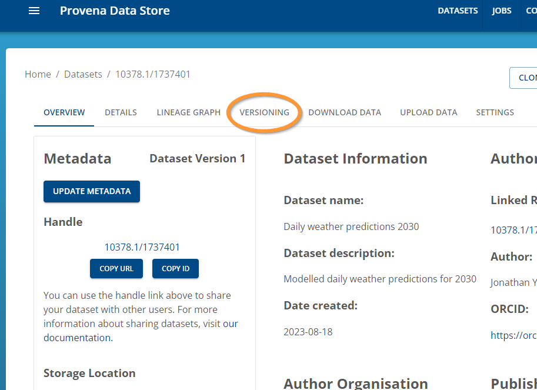
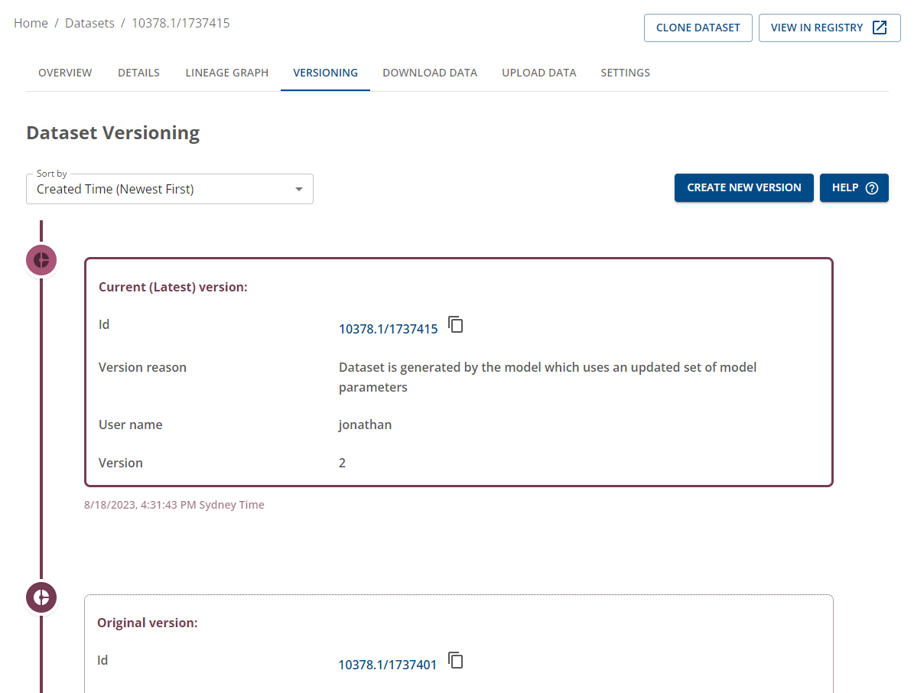

# How to create versions in the Data Store

## Step 1. Navigate to the dataset record in the Data Store

- Ensure you're logged in.
- Navigate to the dataset record
- Click on the "VERSIONING" tab as shown below

|                         Versioning Tab                                                                 |
| :----------------------------------------------------------------------------------------------------: |
|  |

## Step 2. Create a new version

- Click on the "Create New Version" button to create a new version of the dataset.

|               Click on the "Create new version" button                                                      |
| :----------------------------------------------------------------------------------------------------: |
|  |

## Step 3. Add a reason for the new version

|               Add details to the versioning action                                                      |
| :----------------------------------------------------------------------------------------------------: |
|  |

Upon clicking the "Submit" button, the new version of the dataset will be created. 
A set of jobs will be sent to be processed in order for the provenance graphs to be created and updated.

The page will be refreshed to the version of the dataset you just created.

## Step 5. View the version info

You now have a new version of the dataset. You can view the version history including the current and previous versions.

|               Updated versioning details                                                    |
| :----------------------------------------------------------------------------------------------------: |
|  |

If you would like to view the lineage graph of the dataset, click on the "LINEAGE GRAPH" tab to view the dataset lineage.

You will see the direct lineage of the dataset in the provenance graph viewer as shown below.

|             Dataset lineage graph including direct versioning info                                     |
| :----------------------------------------------------------------------------------------------------: |
|  |

To view previous versions, you can use your mouse to double-click on the dataset node. This will expand the nodes. 

If you continue expanding the nodes including the version activity node, and respective datasets, you will be able to trace the lineage of the dataset, its previous version in the provenance graph viewer as shown below.

|             Dataset lineage graph including expanded versioning info                                   |
| :----------------------------------------------------------------------------------------------------: |
|  |
