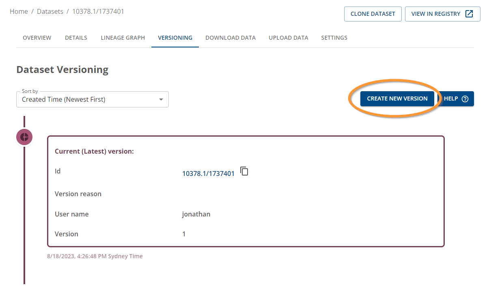
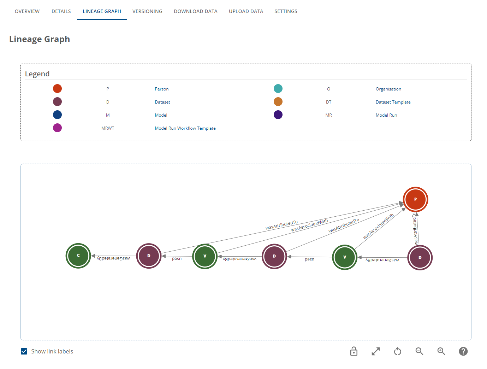

# How to create versions in the Data Store

## Pre-requisites

- Ensure you're logged in to Provena
- The logged in user has registry write permissions 
- The logged in user has ADMIN permissions for the Dataset

## Step 1. Navigate to the dataset record in the Data Store

- Navigate to the dataset record in the Data Store (ensure you're on the latest version of the dataset)
- Click on the "VERSIONING" tab as shown below

|                                    Versioning Tab                                     |
| :-----------------------------------------------------------------------------------: |
|  |

## Step 2. Create a new version

- To create a new version, ensure that you have navigated to the latest version of the dataset. 
- Once you're at the latest version of the item, you can click on the "Create New Version" button to create a new version of the dataset.

|                           Click on the "Create new version" button                           |
| :------------------------------------------------------------------------------------------: |
|  |

## Step 3. Add a reason for the new version

|                              Add details to the versioning action                               |
| :---------------------------------------------------------------------------------------------: |
|  |

Upon clicking the "Submit" button, the new version of the dataset will be created.
A set of jobs will be sent to be processed in order for the provenance graphs to be created and updated.

The page will be refreshed to the version of the dataset you just created.

In addition to this, when a new version is created for a Dataset and if users want to use the Provena data storage feature, a new storage location is created. This storage location will be empty for users to upload relevant data for that version.

Other things that happen when a version is created for a dataset:
- The new versioned dataset is linked to the previous version of the dataset
- A version activity is generated in the provenance graph linking the versioned dataset with each other
- Both versions of the dataset contain information in their metadata which the user can view to see the links to previous/next versions. Both are managed independently of each other

|                                   Updated versioning details                                    |
| :---------------------------------------------------------------------------------------------: |
|  |

## Step 5. View the version info

You now have a new version of the dataset. You can view the version history including the current and previous versions. If there are 3 or more versions, you can click on the icon with 3 dots in the versioning timeline to expand to display additional versions (shown below).

|                                   Expandable version details                                    |
| :---------------------------------------------------------------------------------------------: |
|  |

If you would like to view the lineage graph of the dataset, click on the "LINEAGE GRAPH" tab to view the dataset lineage.

You will see the direct lineage of the dataset in the provenance graph viewer as shown below.

|                      Dataset lineage graph including direct versioning info                      |
| :----------------------------------------------------------------------------------------------: |
|  |

To view previous versions, you can use your mouse to double-click on the dataset node. This will expand the nodes.

If you continue expanding the nodes including the version activity node, and respective datasets, you will be able to trace the lineage of the dataset, including any previous or subsequent versions, as shown in the provenance graph viewer below.

|                 Dataset lineage graph including expanded versioning info                  |
| :---------------------------------------------------------------------------------------: |
|  |

## Related resources

- [Versioning Overview](../versioning-overview.html)
- [Versioning FAQs](../faq.html#versioning)
