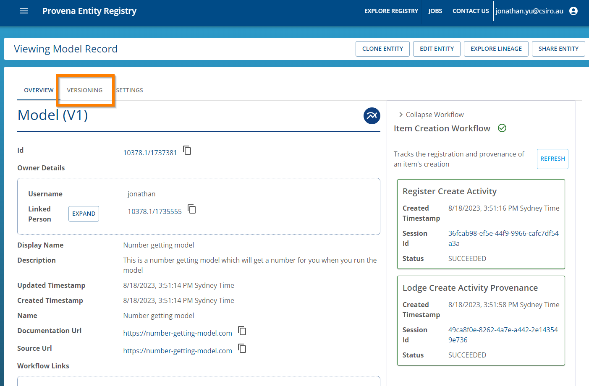
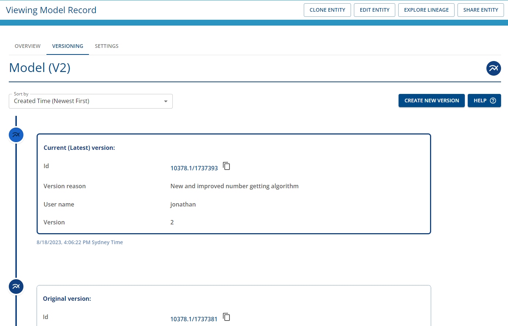
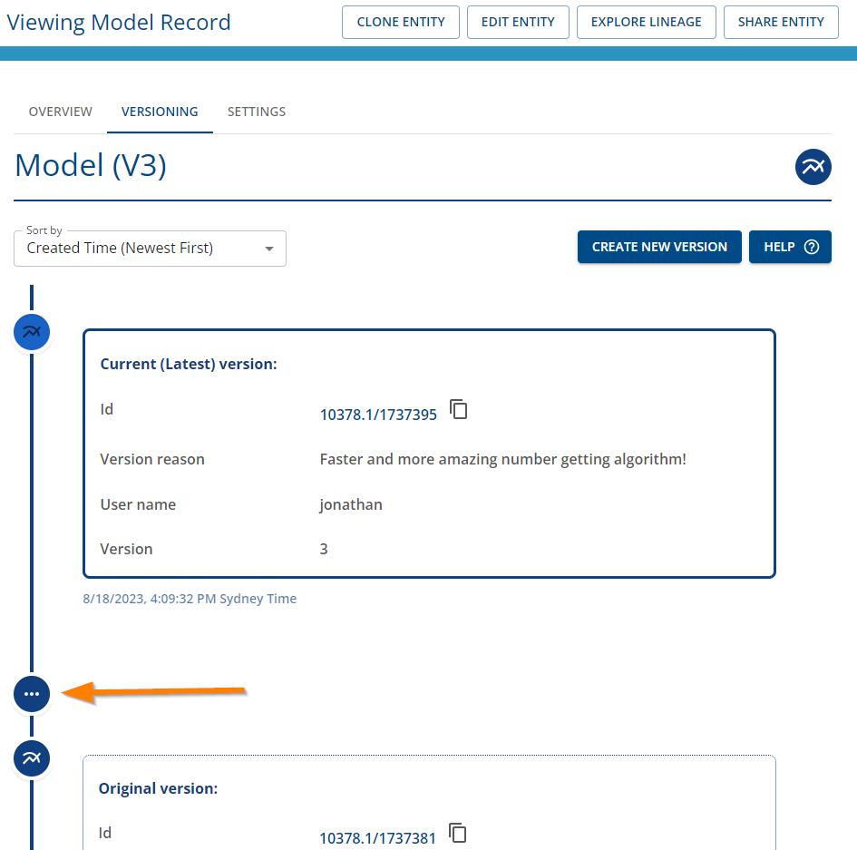

# How to create versions in the Registry

## Pre-requisites

- Ensure you're logged in to Provena
- The logged in user has registry write permissions 
- The logged in user has ADMIN permissions for the registry item

## Step 1. Navigate to the item record in the Registry

- Navigate to the item record in the Registry
- Click on the "VERSIONING" tab as shown below

|                         Versioning Tab                                                                 |
| :----------------------------------------------------------------------------------------------------: |
|  |

## Step 2. Create a new version

- To create a new version, ensure that you have navigated to the latest version of the item. 
- Once you're at the latest version of the item, you can click on the "Create New Version" button to create a new version of the item.

|               Click on the "Create new version" button                                                      |
| :----------------------------------------------------------------------------------------------------: |
|  |

## Step 3. Add a reason for the new version

|               Add details to the versioning action                                                      |
| :----------------------------------------------------------------------------------------------------: |
|  |

Upon clicking the "Submit" button, the new version of the item will be created.
A set of jobs will be sent to be processed in order for the provenance graphs to be created and updated.

The page will be refreshed to the version of the item you just created.

|               New version                                                   |
| :----------------------------------------------------------------------------------------------------: |
|  |

## Step 5. View the version info

You now have a new version of the item. You can view the version history including the current and previous versions.

If there are 3 or more versions, you can click on the icon with 3 dots in the versioning timeline to expand to display additional versions.

Sorting is available in the drop down menu.

Clicking on the link of the ID of the version will enable you to navigate to that particular version.

## Step 6. Explore version lineage

If you would like to view the lineage graph of the item, click on the "EXPLORE LINEAGE" button to view the lineage.

|             Select Explore Lineage button                                     |
| :----------------------------------------------------------------------------------------------------: |
| |

You will see the direct lineage of the item in the provenance graph viewer as shown below.

|              Explore Lineage in Provenance Store                                     |
| :----------------------------------------------------------------------------------------------------: |
| |

To view previous versions, you can use your mouse to double-click on the item node to expand other related nodes.

To view previous versions, you can use your mouse to double-click on the item node to expand other related nodes. If you continue expanding the nodes including the version activity node, and respective items, you will be able to trace its version lineage in the provenance graph viewer as shown below. 

In this example, the "Number getting model" was registered and 2 new versions of the mode were registered. A reason a user registers new versions of a model could be to to precisely describe which model version was used in a workflow. This can be useful for supporting repeating model runs or data reproducibility (i.e. re-running specific versions of a model software in a workflow specification).

|             Explore version provenance lineage graph                                     |
| :----------------------------------------------------------------------------------------------------: |
| |

|                             Explore version provenance lineage graph                              |
| :-----------------------------------------------------------------------------------------------: |
|  |

## Related resources

- [Versioning Overview](../versioning-overview.html)
- [Versioning FAQs](../faq.html#versioning)
