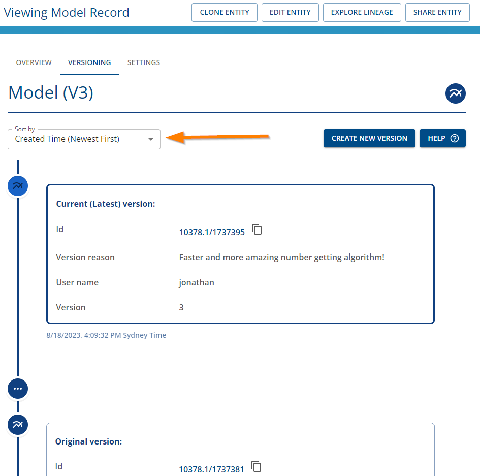

# How to view versions

## Viewing version info in the Registry

### Step 1. Navigate to Versioning tab in the item record in the Registry

-   Ensure you're logged in.
-   Navigate to the [Registry](../registry/overview).
-   Navigate to the item record - for help exploring the registry, see [exploring the registry](../registry/exploring_the_registry).
-   Click on the "VERSIONING" tab as shown below.

|                                              Versioning Tab                                               |
| :-------------------------------------------------------------------------------------------------------: |
|  |

You will be able to view the version history including the current and previous versions.

|                                            Updated versioning details                                            |
| :--------------------------------------------------------------------------------------------------------------: |
|  |

You can click on the icon with 3 dots in the versioning timeline to expand to display additional versions.

Sorting is available in the drop down menu.

Clicking on the link of the ID of the version will enable you to navigate to that particular version.

### Step 2. Viewing lineage

If you would like to view the lineage graph of the item, click on the "EXPLORE LINEAGE" button to view the lineage.

|                                      Select Explore Lineage button                                      |
| :-----------------------------------------------------------------------------------------------------: |
|  |

You will see the direct lineage of the item in the provenance graph viewer as shown below.

|                                    Explore Lineage in Provenance Store                                     |
| :--------------------------------------------------------------------------------------------------------: |
|  |

To view previous versions, you can use your mouse to double-click on the item node to expand other related nodes.

If you continue expanding the nodes including the version activity node, and respective items, you will be able to trace its version lineage in the provenance graph viewer as shown below.

|                             Explore version provenance lineage graph                              |
| :-----------------------------------------------------------------------------------------------: |
|  |

## Viewing version info in the Data Store

### Step 1. Navigate to Versioning tab in the dataset record in the Data Store

-   Ensure you're logged in.
-   Navigate to the data store.
-   Navigate to the dataset record.
-   Click on the "VERSIONING" tab as shown below.

|                                    Versioning Tab                                     |
| :-----------------------------------------------------------------------------------: |
|  |

You will be able to view the version history including the current and previous versions.

|                                   Updated versioning details                                    |
| :---------------------------------------------------------------------------------------------: |
|  |

You can click on the icon with 3 dots in the versioning timeline to expand to display additional versions.

Sorting is available in the drop down menu.

Clicking on the link of the ID of the version will enable you to navigate to that particular version.

### Step 2. Viewing lineage

If you would like to view the lineage graph of the dataset, click on the "LINEAGE GRAPH" tab to view the dataset lineage.

You will see the direct lineage of the dataset in the provenance graph viewer as shown below.

|             Dataset lineage graph including direct versioning info                                     |
| :----------------------------------------------------------------------------------------------------: |
|  |

To view previous versions, you can use your mouse to double-click on the dataset node. This will expand the nodes.

If you continue expanding the nodes including the version activity node, and respective datasets, you will be able to trace the lineage of the dataset, its previous version in the provenance graph viewer as shown below.

|             Dataset lineage graph including expanded versioning info                                   |
| :----------------------------------------------------------------------------------------------------: |
|  |

## Related resources

- [Versioning Overview](../versioning-overview.html)
- [Versioning FAQs](../faq.html#versioning)
