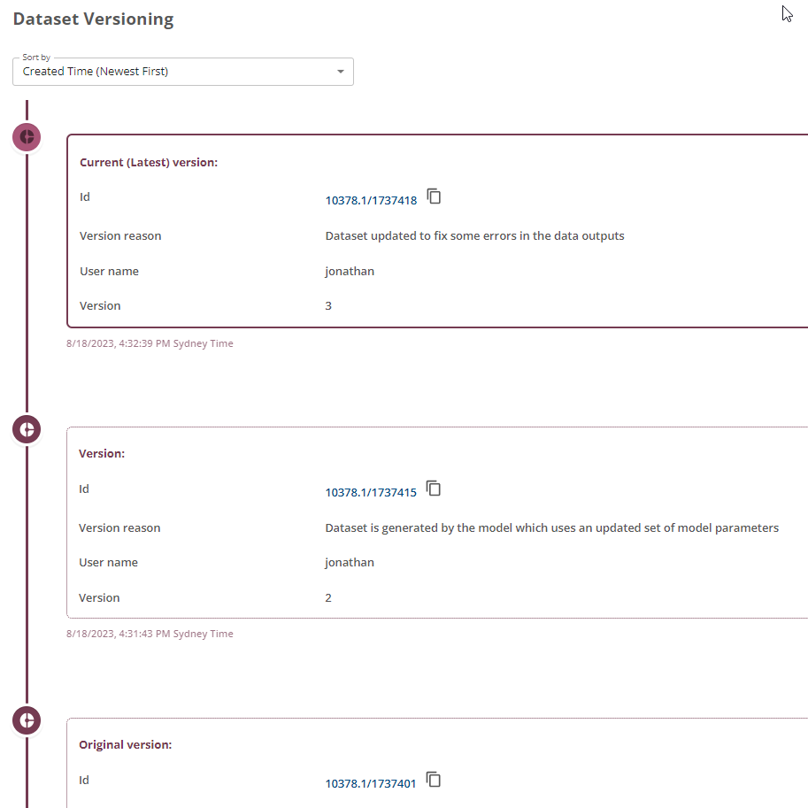

Provena provides capability for versioning of a relevant subset of entity types in the Registry, including datasets. The purpose of this feature is to allow users to create and manage versions of registered items in Provena. Each version is a distinct entity in the Provena Registry, so users can manage and refer to versions of an item as first class items. This allows users to accurately refer to components used in a provenance trail, e.g. version 1 of Dataset X uses a different configuration of a modelling software suite to version 2 of Dataset X.

Use cases include:
* Versioning items to mark items at a point in their development or release lifecycle
* Creating a version of the item as the item is now deprecated or erroneous
* Maintaining two versions of items that are valid but have different lineages and uses

The screenshot below shows an example set of versions created for a dataset.

|                 Example dataset version info                  |
| :---------------------------------------------------------------------------------------: |
|  |

## What can be versioned?

All registered items which are in the _Entity_ category, can be versioned. For more information about the categories of registered items, see the [provenance overview](../provenance/overview/what-are-entities).

This includes:

-   Dataset
-   Model
-   Dataset Template
-   Model Run Workflow Template

## What cannot be versioned?

_Agents_ and _Activities_ cannot be versioned, this includes:

-   Person
-   Organisation
-   Model Run

## What happens when an item is versioned

1. A new [persistent identifier](../digital-object-identifiers) is minted for each version (i.e. a new Handle ID)
2. A versioned item is timestamped
3. A new activity is created in the Registry. This activity is of type _Version_. If you explore the [Provenance Graph](../provenance/exploring-provenance/Explore%20Graph) you will see that the _Version_ activity links the previous item, to the new item, and associates it with the _Agent_ that created the version.
4. The new item is assigned a version number, determined by incrementing the previous item's version number by 1
5. Versioned items shall link to the previous revision. Users should be able to navigate back to other versions (previous and later versions)
6. A versioned item is a separate entity to other versioned items. Users should be able to view a versioned item independently of previous versions
7. Provena provides functionality to navigate to the current version and previous versions distinctly
8. When a new version is created for a Dataset and if users want to use the Provena data storage feature, a new storage location is created. This storage location will be empty for users to upload relevant data for that version.

## Next steps

-   [Versioning FAQs](../faq.html#versioning)
-   [How to create versions in the Registry](./how-to-version.html)
-   [How to create versions in the Data Store](./how-to-version-in-data-store.html)
-   [How to view version information and lineage](./how-to-view-versions.html)
